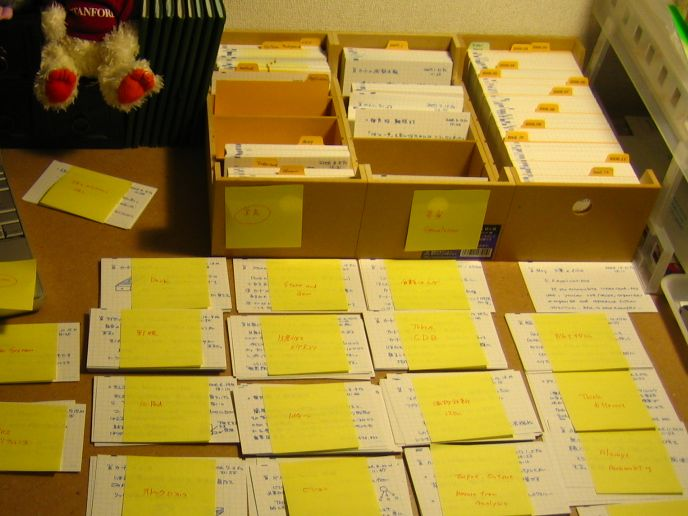

## Summary
[[ChristianTietze]] presents [[ZettelkastenMethod]] as more than note storage: a sufficiently large, interconnected system can become a communication partner that answers queries with useful and sometimes surprising associations. Drawing on [[NiklasLuhmann]], the article argues that writing clarifies thought, while stable note identities, direct links, keywords, loose filing, and growing internal complexity make later retrieval support [[LearningByWriting]] and a non-AI form of [[SecondBrain]].

## Key Claims
- Writing thoughts down forces a point and its development into a more coherent, retrievable form while preserving what the writer believed before hindsight reshapes it.
- A note system becomes more like a communication partner when retrieval can produce irritation or surprise, recognizable information, and responses shaped by the system's own internal complexity.
- Internal complexity grows through both elements and relations: many notes alone are insufficient unless notes also point to one another meaningfully.
- Loose filing avoids premature category hierarchies and allows personally important topic clusters to emerge from actual note-making activity.
- Stable note identifiers enable direct references in either paper or digital systems, while keywords or tags provide an indirect retrieval path through shared attributes.
- Paper and digital Zettelkasten follow the same core principles even though digital editing, hypertext, and full-text search remove some physical-card constraints.
- Heavy interconnection is intended to create serendipitous rediscovery, but the article does not measure whether the proposed design improves thinking, memory, creativity, or output.

## Key Quotes
> "You ask, your notes answer. Ideally, both learn." - on treating the note system as an interactive partner rather than a passive bucket.

> "So connect your notes. Then let them surprise you." - on interconnection and serendipitous retrieval as the method's practical aim.

## Connections
- [[ChristianTietze]] - author of the 2013 practitioner essay.
- [[NiklasLuhmann]] - source of the communication-with-slip-boxes model and the article's main historical reference.
- [[ZettelkastenMethod]] - the article defines the method through small notes, stable identity, loose filing, direct links, keywords, and emergent clusters.
- [[LearningByWriting]] - writing is presented as a way to make thought coherent, sequential, memorable, and historically inspectable.
- [[SecondBrain]] - the slip-box is framed as an external memory that can return unexpected associations without AI mediation.
- [[PersonalKnowledgeManagement]] - the proposed system organizes personal notes for retrieval, connection, and later creative work.

## Contradictions
- No direct contradiction with existing wiki content. The source strengthens the networked-note account of [[ZettelkastenMethod]], while its advice not to sort should be read as opposition to fixed, premature hierarchy rather than a ban on identifiers, keywords, topic clusters, or entry points, all of which it also endorses.
- The article is a conceptual practitioner essay derived partly from Luhmann and analogy, not a comparative study. Its memory, creativity, productivity, brain-network, and communication claims do not establish effect sizes or show that dense linking is universally better than search, folders, outlines, or project-specific organization.
