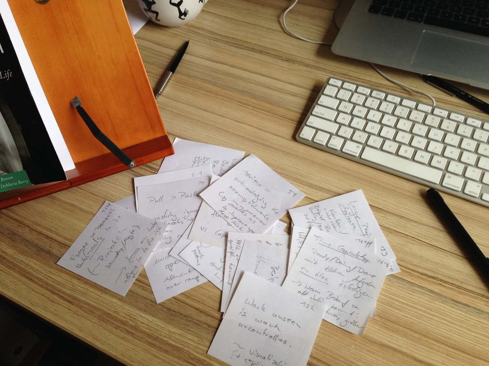
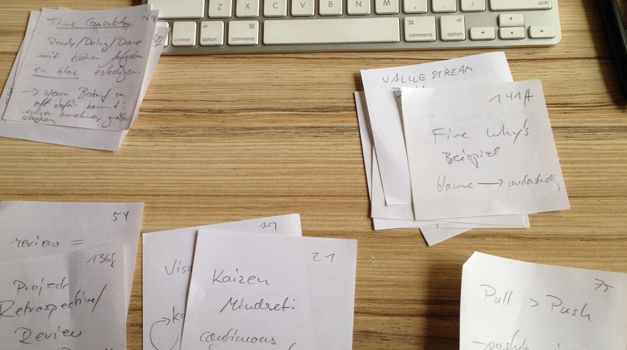
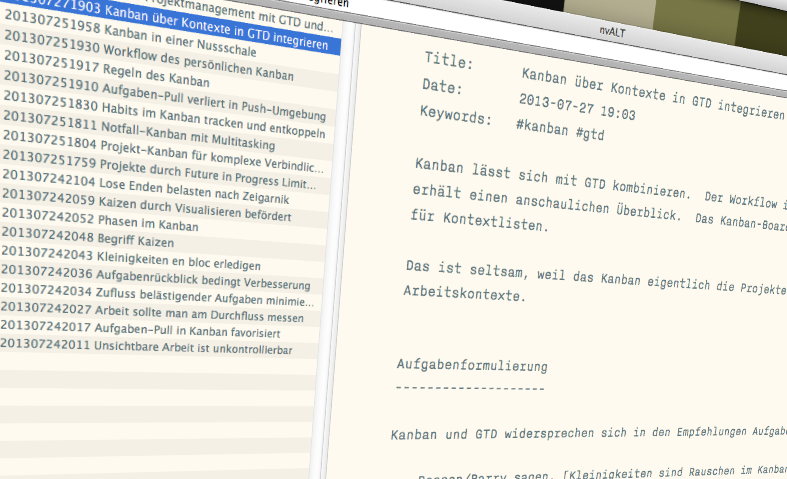

## Summary
[[ChristianTietze]] describes a three-phase [[ReadingNoteWorkflow]] for turning paper reading notes into linked Zettel: pull the slips from the book, cluster them around the reader's purpose rather than the book's sequence, then write a general note for each cluster and branch into linked detail notes where needed. The workflow sharpens [[ZettelkastenMethod]] by treating [[NoteGranularity|atomicity]] as separation of concerns that makes arguments and concepts reusable, while overview notes preserve the larger architecture and feed later discoveries back into the synthesis.

## Key Claims
- Separating capture from processing can protect reading focus, but paper capture creates an inbox that must later be interpreted and transferred.
- Reading notes should be clustered before transcription so the reader can recover the source's architecture and act on the original reading intent.
- Clusters should be orthogonal to page and section order: definitions, examples, arguments, or topics can be regrouped around the reader's purpose.
- Writing can begin with one general note per cluster, then split prerequisites, assumptions, arguments, and conclusions into linked detail notes where their concerns differ.
- Atomicity means keeping together what belongs together while separating reusable concerns; it is not a rule that every note must be maximally small.
- Overview and detail notes should link in both directions, and insights discovered while writing details should be fed back into the overview.
- Connecting new Kanban notes with older Getting Things Done notes illustrates how processed reading can reinterpret prior knowledge and generate new combinations.

## Key Quotes
> "What was your reading intent and how can you capture it best?" - on planning the processing stage around purpose.

> "Put things which belong together in a Zettel, but try to separate concerns from one another." - on the source's original formulation of atomicity.

## Connections
- [[ChristianTietze]] - author demonstrating his paper-to-digital reading workflow with notes from *Personal Kanban*.
- [[ReadingNoteWorkflow]] - the article's collect, cluster, and write sequence turns transient reading notes into durable linked material.
- [[ZettelkastenMethod]] - clusters become overview and detail Zettel that connect with older notes.
- [[NoteGranularity]] - atomicity is framed as concern separation and reuse rather than uniform note length.
- [[PersonalKnowledgeManagement]] - physical capture, processing queues, overviews, and cross-linking form a concrete personal knowledge pipeline.

## Contradictions
- No direct contradiction with existing wiki content. The source qualifies simplistic "one idea per file" readings of atomicity by allowing overview notes, linked detail branches, and note boundaries based on reusable concerns.
- The workflow is one practitioner's 2013 account, demonstrated with a short, clearly focused book read in one sitting; it does not compare paper and digital capture, measure learning or creativity, or show how well the same clustering process scales to denser material.
