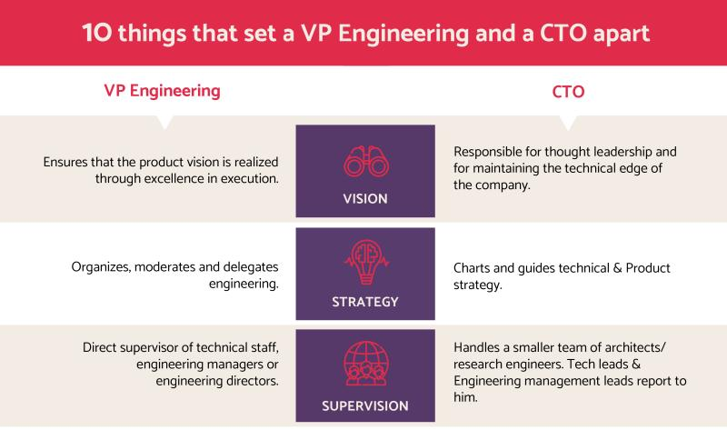

## Summary
This [[IvyExec]] article distinguishes a startup CTO's technology-facing work from a VP of Engineering's organization-and-delivery work while emphasizing that the roles overlap and change with company scale. The CTO maintains technical edge, explores new technology, contributes external thought leadership, supports intellectual-property strategy, and co-develops technical direction; the VP Engineering turns product vision into execution through people, programs, roadmaps, cross-functional planning, and engineering budgets. The source proposes roughly 15–20 total employees as a point when a hands-on founder-CTO may begin to need a dedicated engineering leader, but offers that number as practitioner guidance rather than measured evidence.

## Key Claims
- CTO and VP Engineering are complementary roles rather than competing names for the top technical leader.
- The CTO is primarily responsible for technical thought leadership, protected technical advantage, advanced exploration, external representation, patent strategy, and technical due diligence.
- The VP Engineering is primarily responsible for personnel management, program execution, technical roadmaps, cross-functional strategy, and the engineering budget.
- The VP Engineering's management layer changes with scale: direct supervision for a small team, management through engineering managers above roughly 10 technical staff, and management through directors above roughly 100.
- CTO and VP Engineering jointly shape technical strategy, so the boundary is differentiated ownership with deliberate overlap rather than isolation.
- A founder-CTO who is increasingly consumed by people and project management may need to transfer engineering execution to a VP Engineering in order to preserve technology-focused work.

## Key Quotes
> "These are very different roles, and the roles themselves change and evolve as the startup grows." - on rejecting a simple title hierarchy.

> "Both are important for the business to scale." - on the roles' complementary value.

## Connections
- [[IvyExec]] - publisher of the practitioner article.
- [[TechnicalLeadershipRoleDesign]] - role-boundary model separating technology direction from engineering execution.
- [[StartupCTORoleEvolution]] - growth changes which responsibilities a founder-CTO can continue to own directly.
- [[StartupScaling]] - organizational growth creates additional management layers and coordination work.
- [[ExecutiveHiring]] - a VP Engineering hire transfers people, program, and budget ownership rather than merely adding technical capacity.
- [[ProductManagement]] - the VP Engineering is expected to realize product vision through coordinated engineering execution.
- [[MarkSuster]] - cited as the author of a related CTO, VP Engineering, and program-manager framework.

## Contradictions
- The article's stable distinction between a technology-oriented CTO and an execution-oriented VP Engineering qualifies [[StartupCTORoleEvolution]], where one founder-CTO temporarily owned infrastructure, recruiting, product management, customer strategy, and organizational design before transferring those functions.
- The suggested 15–20-employee trigger is a dated rule of thumb from one practitioner article. Business model, engineering-team size, regulation, hardware, product complexity, and the founder's own strengths can move the need for dedicated engineering management earlier or later.
- The source reports no comparative delivery, innovation, retention, budget, or company-performance outcomes, and its fixed title model may not transfer to organizations using Head of Engineering, Chief Architect, CPO, or combined technology-and-engineering leadership.
