## Summary
[[CiJianDeShanLin|此间的山林（庄晓舟）]] argues that production agents replace human-paced, mostly deterministic request/response work with machine-scale autonomous, probabilistic, long-running, stateful execution. The resulting bottleneck moves from writing code to verifying and operating it, so [[ProductionAgentInfrastructure]] must industrialize verification while combining speed, infrastructure-enforced isolation, and elastic response to unpredictable fan-out and ad-hoc queries. The deepest claim is that infrastructure supplies external reality checks and auditability that models cannot supply for themselves, turning [[ServiceObservability]] into [[AccountabilityInfrastructure]].

## Key Claims
- Production-agent infrastructure begins from two shifts: the acting subject changes from a person to an autonomous machine-speed agent, and system behavior changes from deterministic requests toward probabilistic, long-running, stateful execution.

- Coding agents reduce implementation cost but move complexity into build, test, validation, deployment, and operation; because intent cannot simply be trusted, behavior must be verified at much higher volume.

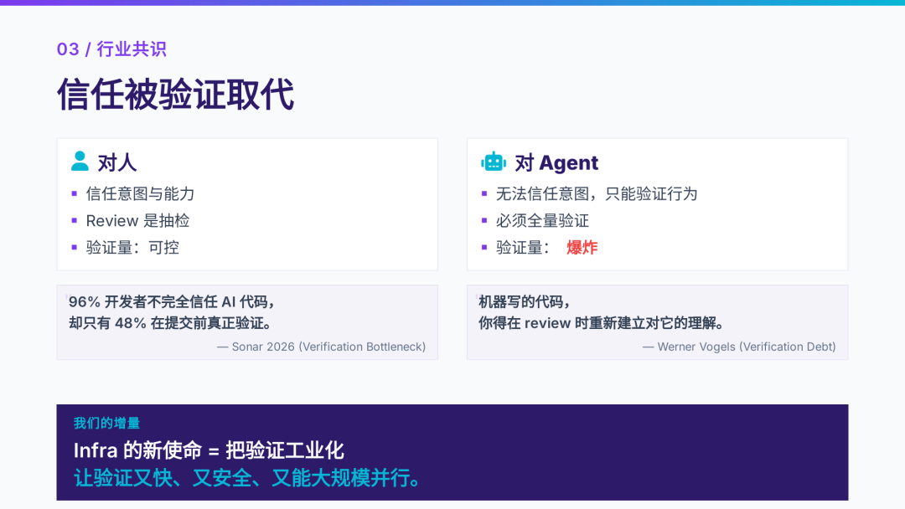

- Infrastructure is the execution-feedback component of an agent loop with the LLM, harness, and knowledge layer. It is necessary but should be judged by business outcomes such as faster, safer, and cheaper task delivery rather than treated as the value layer itself.

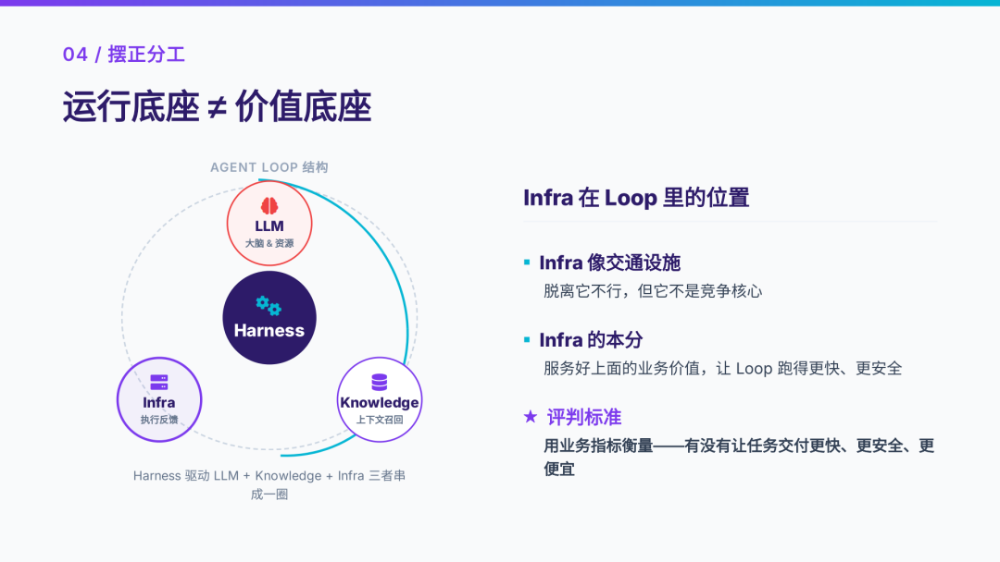

- The gap between an ideal agent and physical reality maps to infrastructure responsibilities: limited knowledge needs storage and retrieval, scarce compute needs elastic scheduling, finite context needs memory and persistence, unsafe execution needs sandboxing and hard boundaries, and an unpredictable world needs fault tolerance and ad-hoc response.

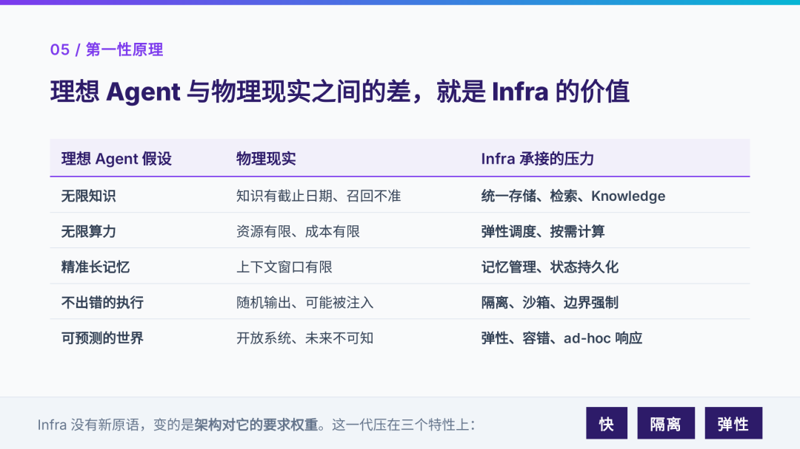

- “Fast” has three layers: rapid startup and resource delivery; system unification that removes hops, latency, tokens, and failure points; and familiar open standards plus introspection that make systems legible and predictable to agents.

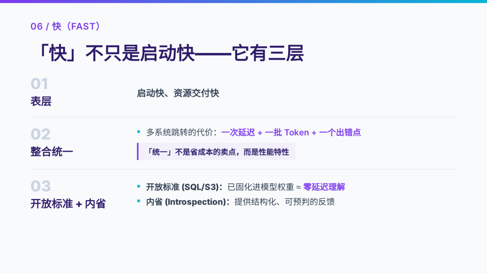

- Isolation must be enforced outside the model because prompt injection, mistaken deletion, and overreach make the executor only partially trusted. Edge execution becomes important where credentials or private data cannot cross the physical trust boundary.

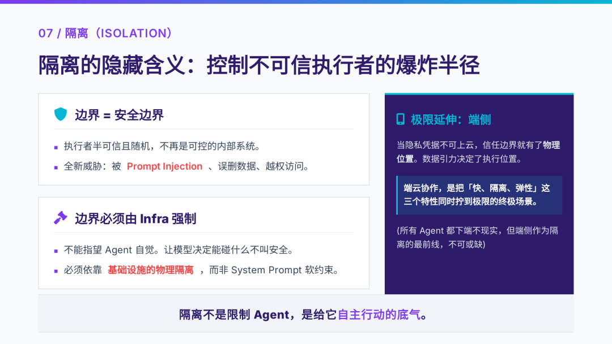

- Elasticity must absorb load whose unit is agent calls rather than people: one agent can fan out dozens of attempts, and ad-hoc questions prevent complete precomputation. The proposed direction is storage-compute separation, on-demand compute, and automatic materialization of hot work.

- Speed, isolation, and elasticity historically pulled toward shared warm processes, fresh independent environments, and scale-to-zero respectively; microVMs, snapshots, copy-on-write forks, and V8 isolates lower this engineering cost curve rather than solving a literal impossibility theorem.

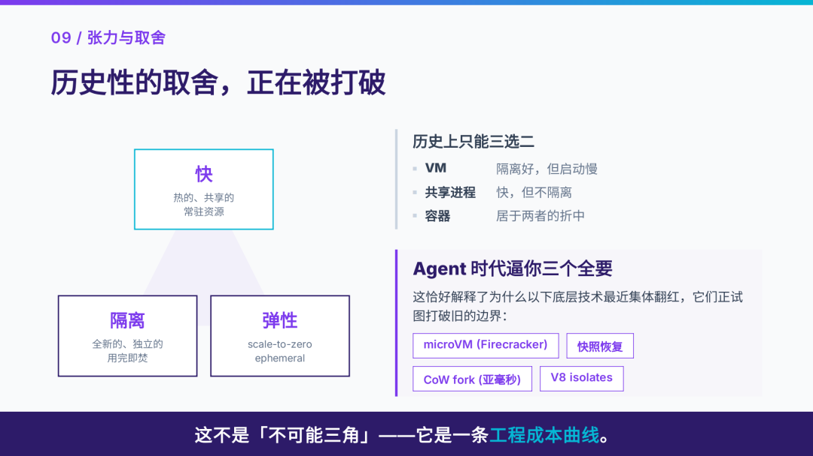

- Infrastructure value that compensates for current model limits may be transitional, while coordination, shared state, adversaries, and unforeseeable demand are structural constraints that remain even if model capability improves.

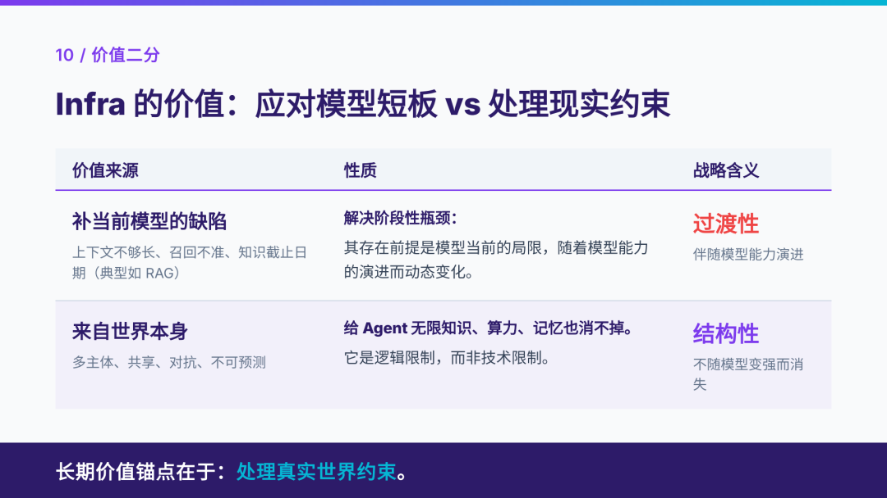

- The article's funding map places public examples across inference, continual learning, reinforcement-learning platforms, harness/evaluation/observability/security, and world models; it is offered as a directional signal rather than a complete market census.

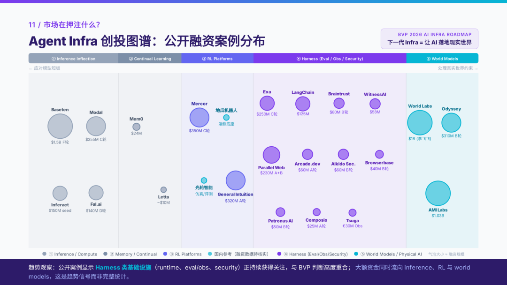

- Even an idealized all-knowing agent still needs distributed coordination for shared state, hard boundaries against hostile input, and on-demand response to future questions that cannot be known in advance.

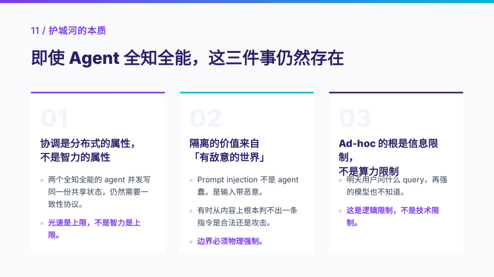

- Infrastructure acts as an epistemic anchor: compilers, theorem checkers, databases, rules, and real-world feedback can judge claims outside the model's self-consistent reasoning.

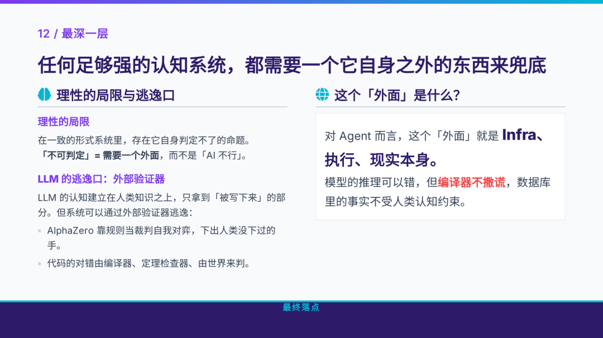

- As human review stops scaling, verification must combine heterogeneous error sources, non-model reality anchors, and complete auditability. Observability therefore expands from operational diagnosis into accountability for proving, attributing, and learning from agent errors.

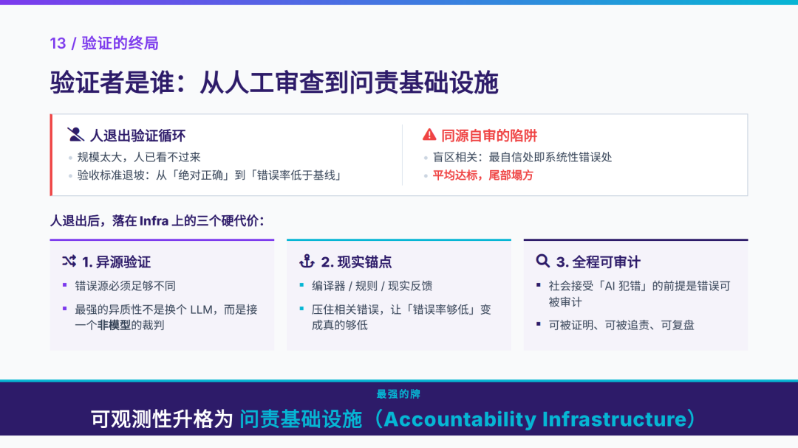

## Key Quotes
> “复杂度从「写」平移到「验证和运行」。” — on the delivery bottleneck after code generation becomes cheap.

> “隔离不是限制 Agent，是给它自主行动的底气。” — on hard boundaries as an enabler of autonomy.

> “Infra 不只是管道，它是模型的认识论锚点。” — on external execution and reality as validators.

## Connections
- [[CiJianDeShanLin]] — authorial identity; the retained title slide identifies the speaker as 庄晓舟, Greptime co-founder and CEO.
- [[ProductionAgentInfrastructure]] — central infrastructure model organized around fast delivery, hard isolation, elasticity, and external verification.
- [[SoftwareVerification]] — receives the complexity displaced by cheaper code generation and must scale beyond sampled human review.
- [[AgentSecurityLayering]] — supports the claim that security boundaries must be enforced below the model rather than through system-prompt compliance.
- [[ServiceObservability]] — expands from operational visibility into evidence for audit, attribution, and institutional accountability.
- [[AccountabilityInfrastructure]] — proposed end state for verification after humans can no longer inspect every agent action.
- [[DistributedConsensus]] — coordination remains necessary even when participating agents are individually capable.
- [[Firecracker]] — cited as a microVM technique for lowering the cost curve among startup speed, isolation, and elasticity.
- [[GreptimeDB]] — product affiliation shown on the presentation title slide through its Greptime branding.

## Contradictions
- No direct contradiction was found. The source strengthens existing claims that production agents require hard capability boundaries and heterogeneous verification, while adding speed, elasticity, epistemic grounding, and accountability as first-class infrastructure concerns.
- The Sonar percentages, Werner Vogels attribution, financing amounts, BVP category mapping, and company placement are presentation claims without citations in the supplied Markdown; they should not be treated as independently verified statistics.
- The speed/isolation/elasticity triangle is explicitly an engineering cost curve, not a formal impossibility result, and the article provides no comparative latency, density, cost, failure-rate, or security measurements for the named runtime techniques.
