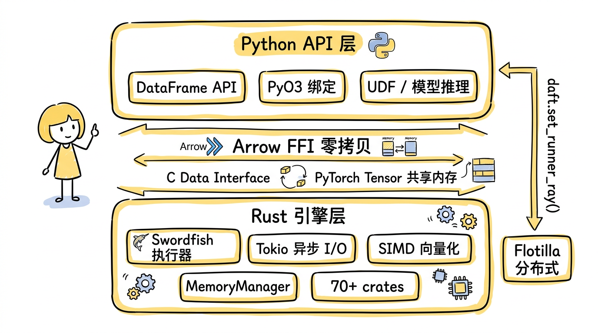
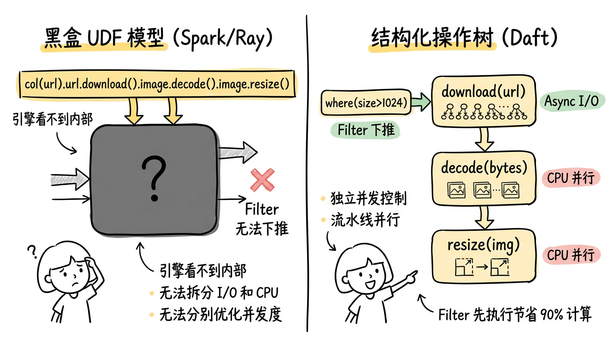
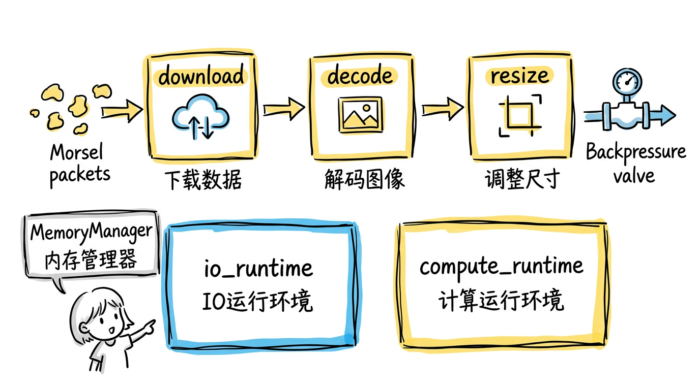
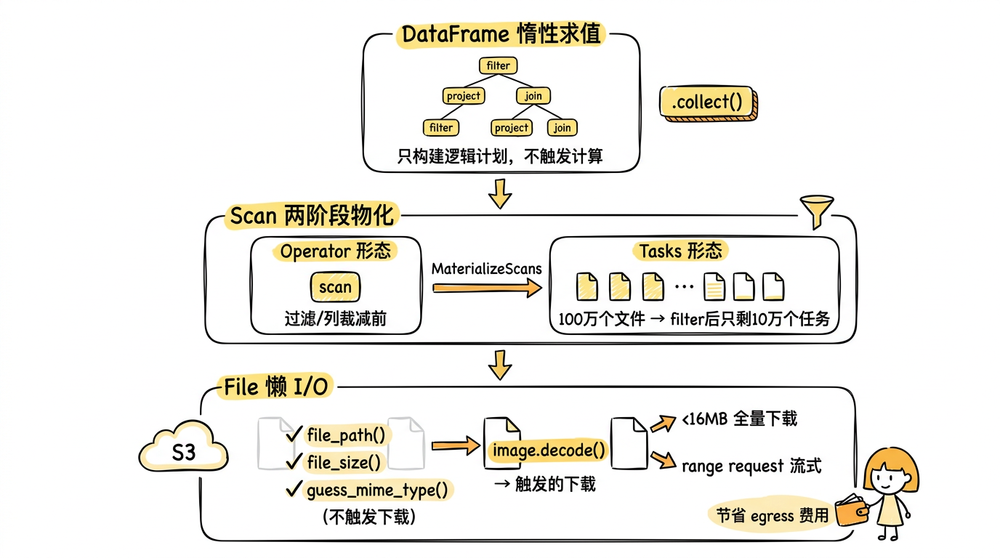
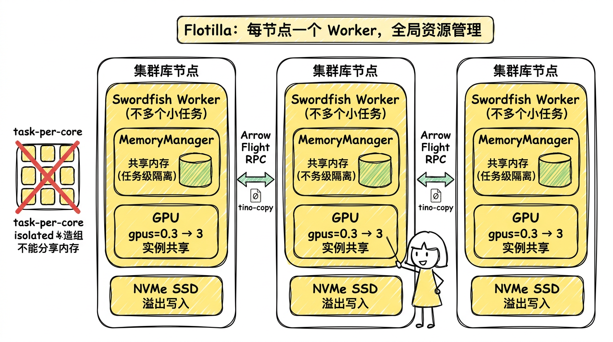

## Summary
The article presents [[Daft]] as a Python-facing, Rust-backed DataFrame engine built for [[MultimodalDataPipelines]] whose expensive steps mix network I/O, CPU decoding, GPU inference, and distributed storage. Its core claim is that downloads, decoding, resizing, embedding, and inference should be visible query operators rather than opaque UDF internals, allowing filter pushdown, stage-specific concurrency, lazy I/O, streaming backpressure, and node-level resource sharing. The reported architecture and benchmarks are detailed but remain a practitioner account rather than independently reproduced evidence.

## Key Claims
- Daft exposes a Python DataFrame API while using PyO3 and Apache Arrow's C Data Interface to exchange memory with a Rust engine that contains Swordfish, Tokio-based I/O, SIMD operations, and the Flotilla distributed path.

- Making `download`, `decode`, and `resize` visible in an expression tree lets the optimizer split I/O-bound and CPU-bound stages, control their concurrency separately, pipeline different batches, and push filters ahead of expensive work.

- Native Image, FixedShapeImage, Tensor, Embedding, and File types allow the engine to reason about layout and operations; resizing fixed-mode images can produce contiguous tensor-compatible storage, while copy-on-write buffers avoid copying until pixels change.
- Swordfish uses push-based morsels connected by asynchronous channels, separates I/O and compute runtimes, and combines channel pressure with permit-based global memory control so slow downstream work pauses upstream allocation.

- Daft's optimizer runs filter and projection pushdown before rules that split granular UDFs; the article also describes a vLLM-specific node that groups shared prompt prefixes to reuse KV cache.
- Laziness spans logical-plan construction, post-pushdown scan-task materialization, and file-level I/O, so metadata filtering can precede downloads and large files can use range requests instead of full reads.

- Flotilla assigns one Swordfish worker to each cluster node so memory and fractional GPU capacity can be managed across operations at node scope; Arrow Flight carries inter-node exchange and NVMe provides spill storage.

- The article reports workload-specific gains over Ray Data and Spark, production use at large data volumes, and a 60-to-24-second improvement after replacing a monolithic Python UDF with visible native expressions.

## Key Quotes
> “三者的本质区别不在语法繁简，而在于引擎能看见多少。” — on structured operations as an optimization boundary.

> “多模态数据管道不应该比 SQL 查询更难写。” — the article's statement of Daft's design objective.

## Connections
- [[Daft]] - the engine and architecture evaluated by the article.
- [[MultimodalDataPipelines]] - workload class joining files, decoding, inference, and elastic execution.
- [[AdaptiveBackpressure]] - related control mechanism used here for bounded channels and memory permits inside an execution pipeline.
- [[DataIntensiveSystems]] - broader systems context for storage, execution, resource scheduling, and distributed exchange.
- [[DistributedProgramming]] - cluster execution model that Flotilla implements through node-level workers.
- [[Python]] - user-facing API and flexible UDF or model-inference layer.
- [[ApacheParquet]] - columnar input and output format used in examples and reported deployments.

## Contradictions
- The article calls Daft the first engine to treat multimodal operations as optimizable query operators, but it does not define the comparison set or provide evidence sufficient to establish priority.
- Comparisons with Pandas, Polars, Spark, DuckDB, and Ray Data simplify their capabilities and do not demonstrate that every competing implementation necessarily has the described limitation.
- The 2–7× and 4–18× benchmark ranges, production savings, token counts, reliability claims, and “zero bug” statement are reported without workload definitions, configurations, raw results, or independent reproduction in the supplied source.
- Values such as 128K-row morsels, a 16 MB download threshold, 64 concurrent connections, and particular optimizer rules are implementation- and version-specific rather than permanent properties of the architecture.
- Zero-copy paths depend on compatible layouts and ownership; transformations such as resize still allocate, and distributed movement, spilling, Python UDFs, and model boundaries can introduce copies or serialization not quantified here.
