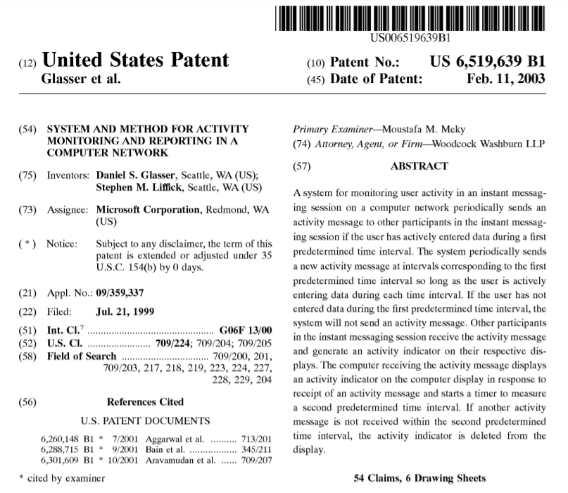
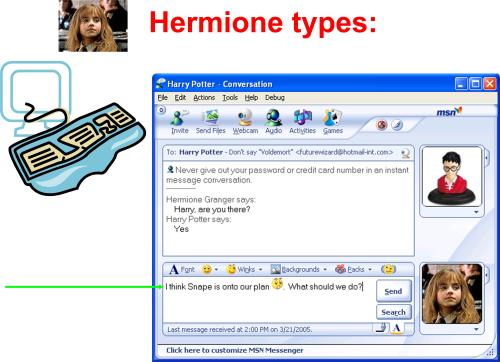
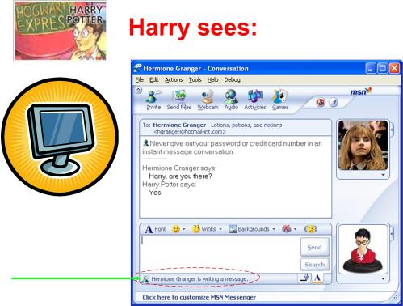

## Summary
[[DannyGlasser]] recounts conceiving and coding the detection and communication mechanism behind the [[TypingIndicator]], which debuted in [[MSNMessenger]] 1.0 in 1999 and later became standard across messaging products. The design occupied a middle ground between giving no response signal and transmitting every keystroke: it supplied lightweight real-time feedback while limiting network traffic and preserving unfinished text. Glasser also separates patent inventorship from total product contribution, crediting others for the polished interface that shipped.

## Key Claims
- The typing indicator was designed for three coupled goals: conversational feedback, network efficiency, and some privacy for drafts, mistakes, and abandoned thoughts.
- [[DannyGlasser]] designed and coded the activity-detection and communication mechanism, then built a rough proof-of-concept interface.
- Internal self-hosting established that the mechanism worked before David Auerbach and other collaborators designed and implemented the polished [[MSNMessenger]] 1.0 interface.
- US patent 6,519,639 covers detecting and communicating typing activity rather than the visible interface, so its inventor list does not represent every product contributor.
- The patent image specifies periodic activity messages while input continues and a receiver-side timer that removes the indicator when updates stop.
- The feature spread far beyond MSN Messenger into products such as Facebook Messenger, iMessage, WhatsApp, Skype, and web support chat.
- Patent status was not simple on the filing's twentieth anniversary because continuation patents and cross-licensing could affect practical coverage even though Microsoft had not, to Glasser's knowledge, pursued infringement claims.

The paired classroom mock-ups make the interaction boundary explicit: the sender sees their unsent draft, while the recipient sees only an activity state.

## Key Quotes
> "something that would give you real-time feedback" - the user-facing design goal.

> "a semblance of privacy with their thoughts and typos" - the contrast with character-by-character transmission.

## Connections
- [[DannyGlasser]] - author, initial designer, and implementer of the patented activity mechanism.
- [[TypingIndicator]] - feature and protocol behavior whose origin the article explains.
- [[MSNMessenger]] - product in which the feature first shipped in 1999.
- [[Microsoft]] - employer, patent assignee, and operator of the original Messenger product.
- [[PrototypeFirstProductDiscovery]] - a rough coded UI and internal self-hosting preceded the polished shipping interface.
- [[BillGates]] - co-inventor on unrelated forward-patenting work that Glasser uses to distinguish nominal patent association from substantive contribution.
- [[FacebookMessenger]] - one of the later messaging products Glasser names as adopting the interaction pattern.

## Contradictions
- No direct contradiction found. The source qualifies patent-centered histories by distinguishing the patented communication mechanism, the initial proof of concept, and the collaborative design and implementation of the shipping interface.
- The article does not establish the exact 2019 legal status or claim coverage of the patent family; Glasser explicitly notes continuation patents, cross-licenses, and uncertainty about later implementations.
