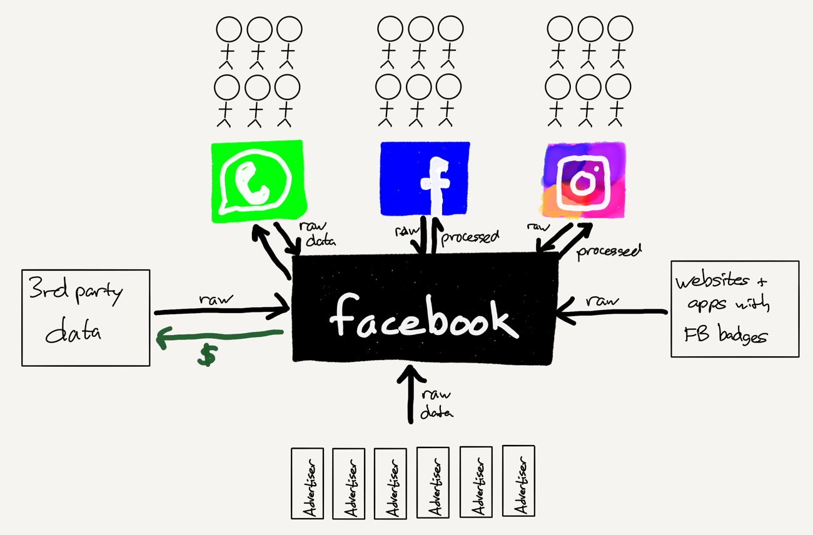

## Summary
[[BenThompson]] argues that [[Facebook]] and [[Google]] should be understood as [[DataFactories]] layered on top of their aggregator and advertising businesses. Users, content providers, advertisers, third-party brokers, and embedded web integrations supply raw data; the companies combine those inputs into recommendations, distribution, targeting, and inferred user profiles whose processed form remains largely hidden. Thompson therefore proposes output transparency—letting people inspect the profile produced about them—as a competition-friendlier regulatory lever than rules that mainly expose submitted inputs or impose broad compliance burdens.

## Key Claims
- [[AggregationTheory]] makes “users are the product” incomplete: aggregators control demand and must keep users engaged, while advertisers buy access to user attention.
- Facebook is simultaneously a collection of consumer networks, an advertising seller, and a data-processing system that turns heterogeneous raw inputs into valuable outputs.
- Users provide declared information and behavior; content and advertisements generate further behavior; advertisers and third parties upload customer and offline data; embedded Facebook controls collect activity from outside sites.
- The processed output is more consequential than any one input because combined data can create a targetable profile containing attributes or contact information the user did not knowingly provide for advertising.
- Existing download and dashboard tools chiefly expose raw inputs, not the inferred, matched, and processed profile used by the platform.
- Requiring disclosure of processed profiles could make data practices legible to users and let demand discipline aggregators without forbidding personalized advertising.
- A standardized output-transparency duty may burden challengers less than rules designed around incumbents, but the proposal assumes meaningful user agency and does not solve the unequal cost of privacy self-defense.

## Key Quotes
> “Data comes in from anywhere, and value — also in the form of data — flows out, transformed by the data factory.” — on the operating model

> “Give users the ability to see not simply what they put in ... but also what comes out after all of the inputs are mixed and matched.” — on the proposed disclosure rule

## Connections
- [[BenThompson]] - author applying an incentive, aggregation, and competition lens to privacy regulation.
- [[Facebook]] - primary data-factory example spanning Facebook, Instagram, WhatsApp, advertisers, and third-party inputs.
- [[Google]] - second super-aggregator to which the data-factory and disclosure arguments are said to apply.
- [[DataFactories]] - model of transforming many raw data streams into product, distribution, advertising, and profile outputs.
- [[AggregationTheory]] - explains why user demand is the source of power even while advertisers pay for access to attention.
- [[DataMonetization]] - processed profiles and targeting make attention inventory more valuable.
- [[PrivacyPovertyDivide]] - qualifies the claim that users can regulate privacy through informed market choice.
- [[PrivacyProtectionResourceInequality]] - makes the cost of inspecting and acting on disclosed profiles uneven.

## Contradictions
- The article's claim that most users do not care about privacy, especially when free services save money, conflicts in emphasis with [[PrivacyPovertyDivide]], which reports high privacy concern among low-income users and shows that apparent consent may reflect necessity rather than indifference.
- Its recommendation that regulators trust users to protect their own privacy is qualified by [[PrivacyProtectionResourceInequality]]: time, skills, advice, legal support, and the ability to leave a service are unevenly distributed.
- The Nike analogy illustrates factory opacity and accountability, but the source itself notes that the pictured soccer-ball scene was staged; it supports the rhetorical comparison rather than independently proving Facebook's data practices.
- The article is a 2018 strategic argument, not an audit of Facebook's or Google's complete data systems, a usability test of profile disclosure, or evidence that transparency alone changes behavior or competition.

## Image Notes
Both unique local images were opened and retained. The data-flow diagram supplies architecture and directionality not fully captured by the surrounding prose; the soccer-ball photograph is retained at the factory-opacity analogy with its staging qualification. The photograph's second source occurrence was omitted as an exact duplicate.
