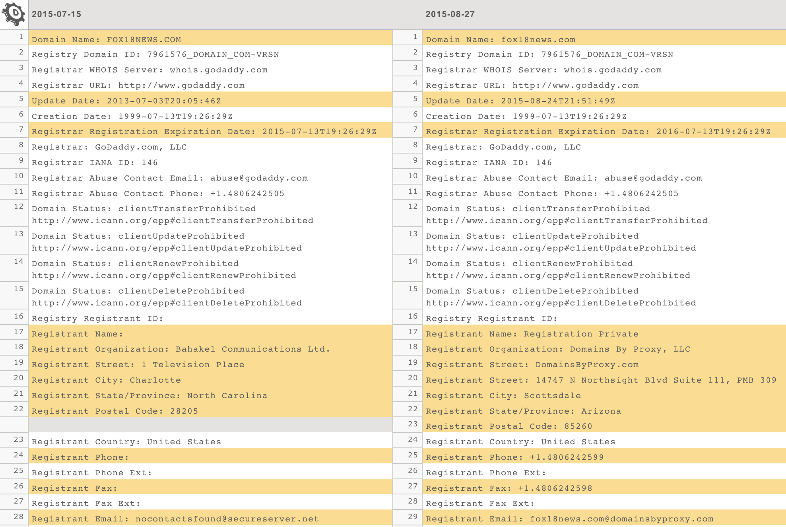
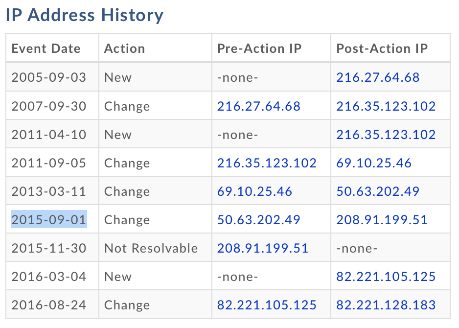
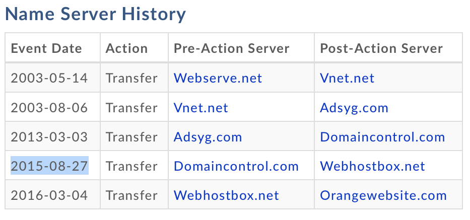
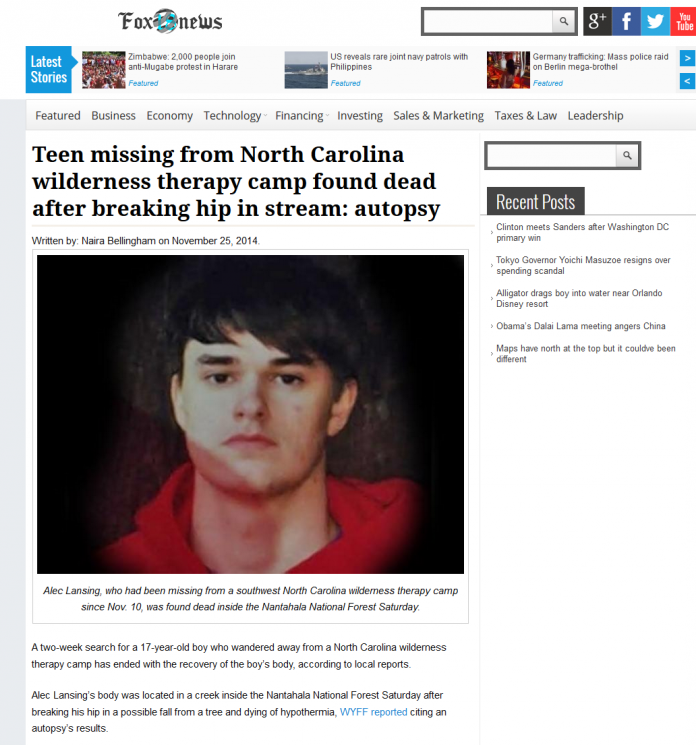
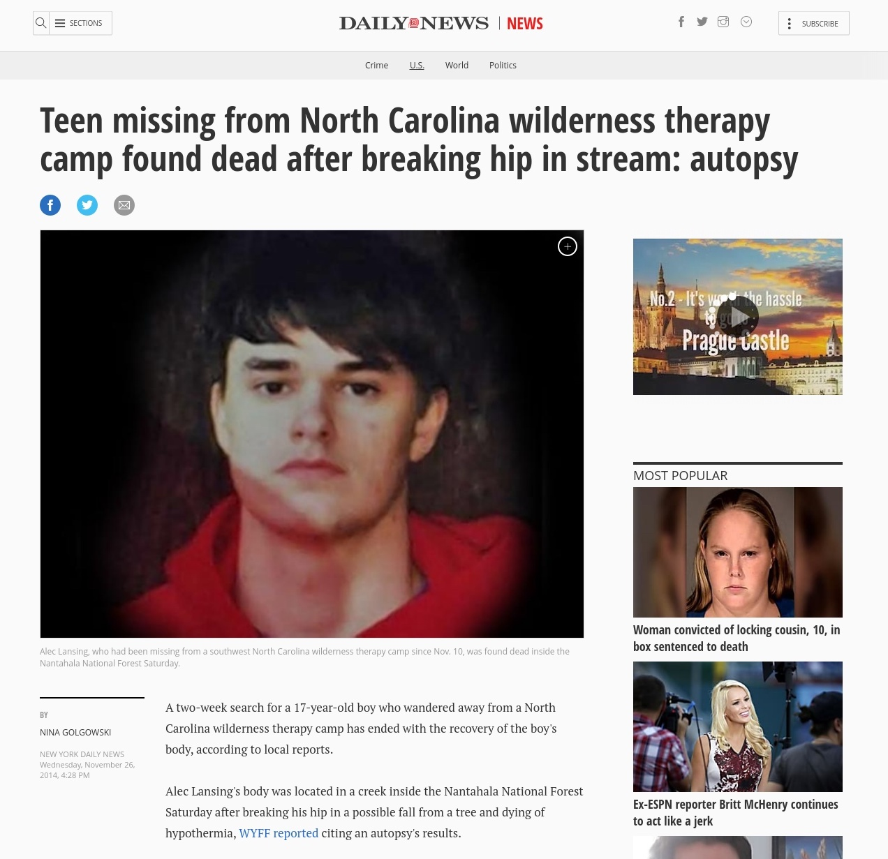
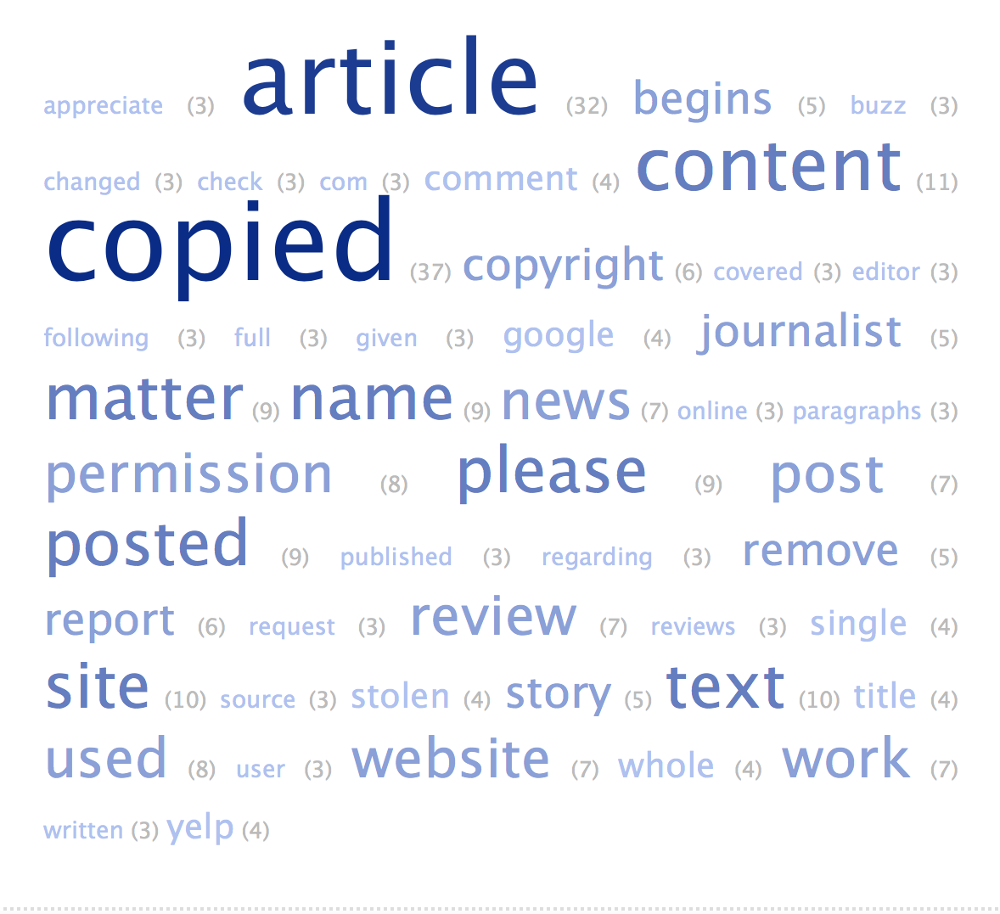
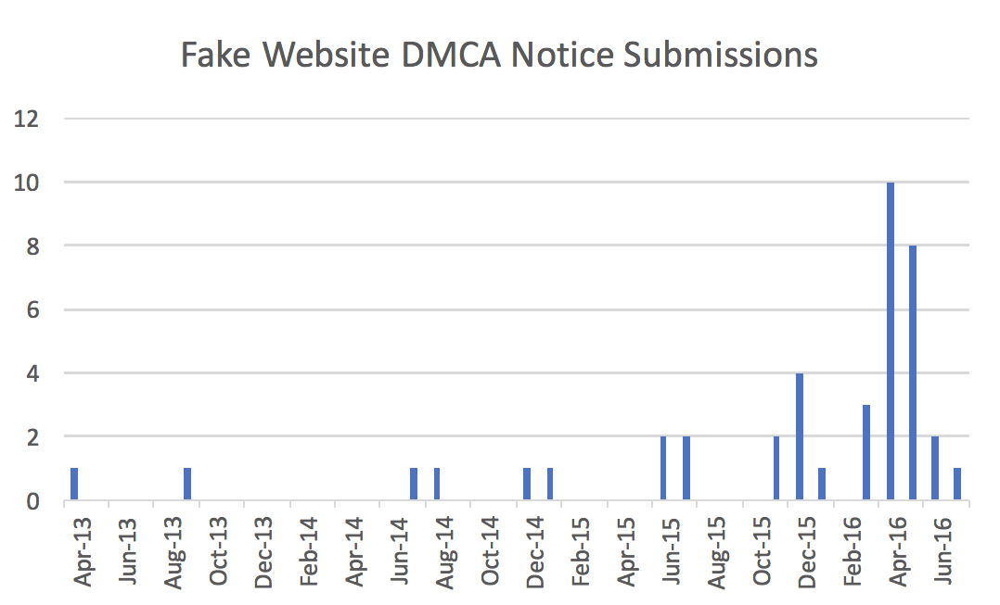

## Summary
[[MostafaElManzalawy]] analyzes 42 suspicious copyright notices in the [[LumenDatabase]] that targeted 52 URLs through the [[StolenArticleScam]]: an operator copied unwanted reporting onto a fake news site, backdated the copy, and then alleged that the genuine article infringed it. Domain-registration and archive evidence undermined the claimed chronology, while repeated language, punctuation, and registration details suggested coordinated use by reputation-management operators. In this preliminary sample, [[Google]] approved 16 of the 52 requested removals, showing how [[DMCATakedownAbuse]] could convert weakly checked copyright claims into search-result censorship.

## Key Claims
- The scam reverses authorship evidence: an unwanted article is copied to a fake publication, assigned an earlier display date, and presented in a DMCA notice as the work that was stolen.
- The Fox18News.com case illustrates a stronger chronology test than visible article dates. A New York Daily News article appeared on November 26, 2014, while WHOIS, name-server, IP, and archive evidence places the fake site's relevant operation in 2015-2016 despite its displayed November 25, 2014 date.

- Archived pages show the suspicious Fox18 News copy labeled November 25, 2014 and the New York Daily News article labeled November 26, 2014, even though the domain and archive history indicates that the supposed original appeared much later.

- Eleven of 42 notices used the same unusual space-before-punctuation style across unrelated subjects and nominal senders; several domains also shared a Scottsdale registration address, supporting but not proving common coordination.

- The dataset contained 28 unique fake websites, including 10 registered in Scottsdale, three in Faisalabad, and many with protected or unavailable registration data.
- Google approved 16 of the 52 requested URL removals as of August 15, 2017, an approximately 30% observed success rate that excludes URLs later restored after publicity.
- The visible trend rose from two sampled notices in 2013 and three in 2014 to 11 in 2015 and 18 in 2016, excluding similar notices aimed at the same content.

- For observations with the required dates, fake articles were backdated by an average of 72 days and a median of eight days; fake sites were obtained an average of 682 days and a median of 341 days after the targeted article; notices followed site acquisition by an average of 121 days and a median of 100 days.
- The method combines notice text, Google removal records, historical WHOIS, IP and name-server changes, web archives, and press reports; no single signal alone establishes fraud.

## Key Quotes
> “the domain name was likely acquired ... nine months after the New York Daily News article was written” - on external chronology contradicting the displayed publication date.

> “approximately 30 percent ... were successful in censoring content from Google’s search results” - on the preliminary sample's observed outcome.

## Connections
- [[MostafaElManzalawy]] - author and investigator who assembled and analyzed the preliminary dataset.
- [[LumenDatabase]] - notice archive used to discover suspicious claims and compare senders, wording, targets, and outcomes.
- [[StolenArticleScam]] - the fake-site and backdating mechanism documented by the source.
- [[DMCATakedownAbuse]] - broader misuse of copyright-removal procedures to suppress criticism or negative reporting.
- [[Google]] - recipient and decision-maker for the sampled search-removal requests.

## Contradictions
- The article's evidence strongly challenges the alleged publication chronology in its worked example, but the full 42-notice classification remains the author's investigated judgment rather than a court finding for every notice.
- The approximately 30% rate describes a small, purposively selected sample of likely fraudulent notices, not the prevalence or success rate of all DMCA requests.
- Shared punctuation and Scottsdale registration details suggest coordination but do not identify one operator conclusively; privacy-proxy addresses can also group unrelated registrants.
- The source is a 2017 work in progress. It does not measure later enforcement changes, counter-notice outcomes, complete re-indexing history, client knowledge, or the total scale of the tactic.

## Image Notes
All seven effective image references were opened and retained at their semantic positions. The three domain-history screenshots record the WHOIS, IP, and name-server timeline; the paired article screenshots expose the claimed publication order; the word cloud summarizes repeated notice vocabulary; and the monthly chart shows the sampled rise and 2016 concentration. None was treated as independent proof outside the article's combined investigative method.
