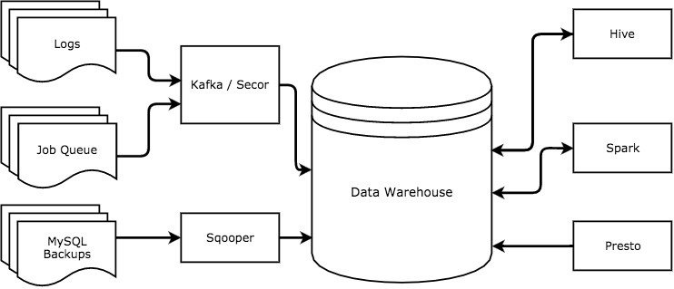
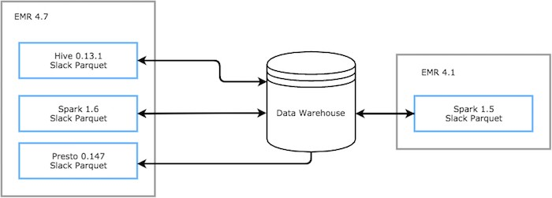

## Summary
[[RonnieChen]] and [[DianaPojar]] describe [[Slack]]'s 2016 data platform, where Hive, Presto, and Spark shared an S3 warehouse, [[ApacheParquet]] files, and Hive Metastore schemas while serving different analytical workloads. Their central lesson is that nominal support for one format does not guarantee [[DataFormatInteroperability]]: library versions, null handling, nested structures, column ordering, partition schemas, and upgrades can produce crashes or silently incorrect data. Slack responded with input sanitization, flatter append-oriented schemas, compatibility testing, and owned Hive input and Parquet output formats that pinned serialization behavior.

## Key Claims
- A shared warehouse can support workload-specific engines: Presto for interactive exploration, Hive for large fault-tolerant SQL pipelines, and Spark for expressive batch, aggregation, and deduplication work.
- Slack sent server, client, and queue events through Kafka and Secor to S3, while its Sqooper tool exported daily MySQL backups into the same warehouse.
- Thrift schemas, Parquet storage, and the Hive Metastore created a common logical foundation, but each engine's bundled Parquet implementation behaved differently.
- Nulls and null-valued complex structures could fail differently across Hive and Presto because fixes and dependency versions were not aligned, so Slack sanitized data before writing it.
- Schema evolution had to reconcile the file, table, and partition schemas; Slack avoided repeated full rewrites by flattening custom structures and appending new fields as columns.
- Column-position reads in Presto could silently swap values where Hive's name-based reads appeared correct, making semantic corruption more dangerous than visible job failure.
- Slack reduced upgrade and cross-engine risk by owning version-pinned Hive input and Parquet output formats that incorporated selected fixes across builds.

## Key Quotes
> "these tiny differences can make big trouble" - on apparently shared Parquet support hiding incompatible implementations.

> "building only for the shared subset of features" - on the capability cost of preserving multi-engine access.

## Connections
- [[RonnieChen]] - coauthor of the first-party Slack engineering account.
- [[DianaPojar]] - coauthor of the first-party Slack engineering account.
- [[Slack]] - company and data-platform operating context.
- [[ApacheParquet]] - shared columnar format whose differing implementations created the core compatibility failures.
- [[DataFormatInteroperability]] - central problem of preserving the same data meaning across engines, schemas, and versions.
- [[APIBackwardCompatibility]] - related compatibility discipline applied here to persisted files and readers rather than only service interfaces.
- [[ChangeSafety]] - upgrades and schema changes require cross-version tests, controlled rollout, and recoverable compatibility decisions.

## Contradictions
- The source contradicts the simplifying assumption that a common file format and metadata catalog are sufficient for interchangeable readers and writers; implementation versions and read semantics remain part of the effective contract.
- It qualifies schema-evolution advice based only on logical table definitions: old file and partition schemas, column identity rules, and backfill cost can constrain otherwise valid changes.
- The account is a first-party 2016 snapshot rather than current Slack architecture or a comparative benchmark. It gives examples of failures and mitigations but no incident frequencies, validation results, operating costs, or independent evidence that the custom formats eliminated all corruption paths.

## Image Notes
All three local image references were opened. The lead photograph of letter tiles spelling “DATA” was omitted as decorative. The two source-local diagram files were only 60 pixels wide, so their full-resolution equivalents were recovered from Slack's canonical publication, inspected, and retained at their semantic positions. The first records ingestion routes and bidirectional warehouse access; the second records the EMR boundaries, engine versions, shared warehouse, and Slack-owned Parquet compatibility formats.
