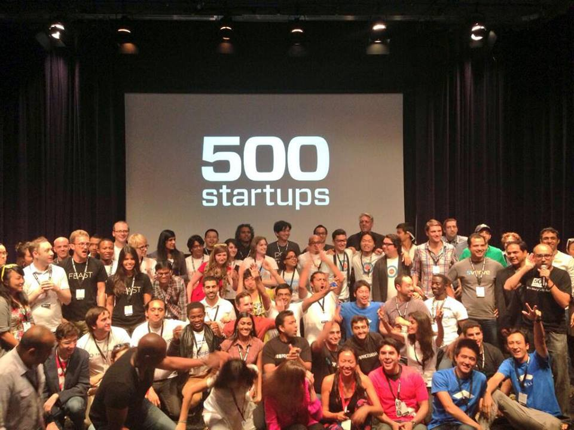

## Summary
[[DavidSpinks]] contrasts [[Feast]]'s accelerator-driven fundraising effort with [[CMX]]'s customer-funded growth to argue that outside capital should be a strategic choice rather than a startup default. His central claim is that venture funding narrows a company's acceptable outcomes toward rapid growth and a large exit, while bootstrapping can preserve freedom, focus, profitability, and a mission-sized definition of success at the cost of slower hiring, founder financial exposure, and intense workload.

## Key Claims
- Feast's attempt to become fundable inverted the proper order of company building; Spinks says value appeared only after the team focused on what it wanted to build.
- CMX sold out its first summit in five weeks, was cash-flow positive from ticket sales, and expanded into publishing, training, research, and an online professional community without outside funding.
- Venture funding usually requires a rapid-growth, large-exit path, so accepting it can make a durable, useful, non-unicorn company look like failure.
- Bootstrapping forced CMX to prioritize aggressively, hire slowly, align revenue with community needs, and retain control over company direction.
- The same constraint imposed real costs: a tiny team carried heavy workloads, Spinks went without salary for two years, and he risked substantial personal money.
- Funding is not inherently wrong; the source argues it should follow a deliberate fit between capital and business strategy rather than ecosystem convention.
- Alternative financing experiments and more public discussion are needed for companies whose worthwhile outcomes do not match traditional venture expectations.

## Key Quotes
> "Not all problems worth solving are unicorn problems." - The source's distinction between social or customer value and venture-scale valuation.

> "Everyone is drinking capital in situations where they don't really need it." - Spinks's analogy for fundraising as a socially reinforced default.

## Connections
- [[DavidSpinks]] - author comparing his experiences building Feast and CMX.
- [[Feast]] - accelerator-backed company whose failed fundraising effort shaped the argument.
- [[CMX]] - customer-funded company used as the central bootstrapping case.
- [[500Startups]] - accelerator whose Batch 6 prepared Feast to raise venture funding.
- [[BootstrappedCompanyBuilding]] - central strategy of funding operations through customers and constrained internal resources.
- [[MissionAlignedCapital]] - financing should fit the company's mission, pace, and intended outcome.
- [[VentureCapitalFundStructure]] - fund economics help explain investor demand for rare, very large exits.
- [[StartupFocus]] - scarce cash can force prioritization, while fundraising can displace attention from customer value.
- [[StartupRunway]] - bootstrapping replaces investor-funded runway with revenue, founder sacrifice, and direct downside exposure.
- [[ZebraCompanies]] - later framework for durable, profitable, mission-oriented companies outside unicorn logic.

## Contradictions
- The retained second photograph visibly shows a founder cohort under a "500 Startups" screen, while the source caption identifies it as CMX Summit West 2015; the image evidence therefore supports the accelerator context but not that caption.
- The article's 0.07% startup-to-unicorn figure and [[99-vc-problems-but-a-batch-aint-one-why-portfolio-size-matters-for-returns]]'s 1-2% investment-to-unicorn estimate use unspecified and likely different denominators, so they should not be treated as directly comparable rates.
