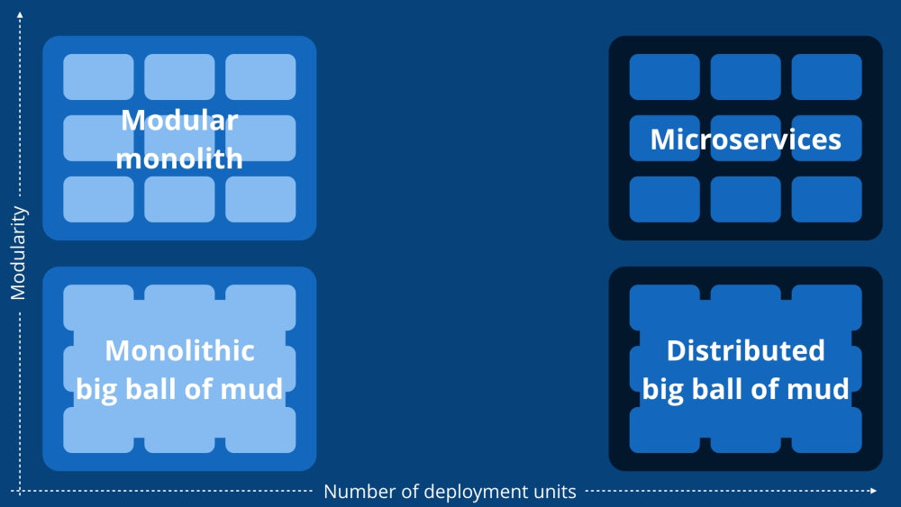
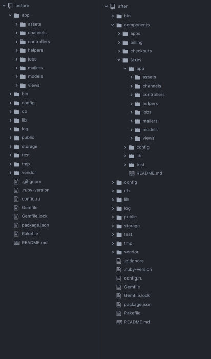
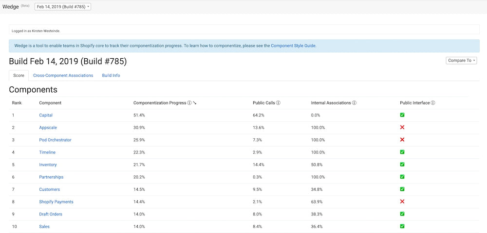

## Summary
[[KirstenWesteinde]] explains why [[Shopify]] kept one Ruby on Rails codebase and deployment unit while reorganizing it into a [[ModularMonolith]] with explicit business-domain boundaries. The 2019 account presents componentization as a staged response to coupling, fragile tests, slow CI, and overwhelming onboarding context: reorganize code by real-world domains, define public interfaces and data ownership, measure violations with [[Wedge]], and eventually enforce declared dependencies. It treats monoliths, modular monoliths, and services as context-dependent choices rather than a universal maturity ladder.

## Key Claims
- Modularity and deployment-unit count are separate design dimensions: the inspected matrix distinguishes a modular monolith from both a tightly coupled monolith and independently deployed microservices.
- A single codebase, database, pipeline, and deployment can reduce infrastructure, API-versioning, network-latency, and coordination costs, but unbounded cross-domain access eventually creates fragility and cognitive load.
- Shopify chose a modular monolith because it needed domain isolation without multiplying repositories, pipelines, services, and network calls.
- Componentization began with a developer survey and a business-domain map, then moved roughly 6,000 Ruby classes in one automated pull request from technical-layer folders into domain components.
- The inspected directory comparison shows `app/models`, `app/controllers`, and similar layers becoming component-local structures under domains such as apps, billing, checkouts, and taxes.

- Isolation required each component to own its data and expose a dedicated public interface; cross-component associations were violations, and calls were allowed only through explicitly public APIs.
- [[Wedge]] combined CI tracepoint call graphs with static information about ActiveRecord associations and inheritance, then scored components and listed boundary violations.

- Boundary enforcement and dependency-graph cleanup were ongoing work, but enough isolation had already been achieved to replace Shopify's legacy tax engine with a new calculation system.
- Architecture should evolve after observed delivery pain and domain learning; prematurely starting with microservices can add distributed-system complexity before useful boundaries are understood.

## Key Quotes
> "A modular monolith is a system where all of the code powers a single application and there are strictly enforced boundaries between different domains." - the article's architectural definition.

> "The best time to refactor and re-architect is as late as possible" - the author's timing heuristic, qualified by the need to respond once delivery slows and coupling becomes costly.

## Connections
- [[KirstenWesteinde]] - Shopify engineer and author of the 2019 account.
- [[Shopify]] - large Rails application and organization undertaking the componentization work.
- [[ModularMonolith]] - chosen architecture: one deployment unit with explicit internal domain boundaries.
- [[CDComponentization]] - related practice of dividing a large codebase into owned modules to improve feedback and changeability.
- [[Wedge]] - internal tool for measuring calls, associations, inheritance, public interfaces, and component isolation progress.
- [[MicroserviceOperationalOverhead]] - repositories, pipelines, infrastructure, latency, and coordinated refactors were costs Shopify sought to avoid.
- [[BoundedContext]] - related domain-modeling principle behind organizing software around business concepts rather than technical layers.
- [[DistributedSystemRestraint]] - supports delaying distributed boundaries until domain understanding and operational need justify them.
- [[RubyOnRails]] - framework and codebase context whose application-global accessibility made an unbounded monolith easy to grow.

## Contradictions
- No direct contradiction was found. The source complements [[alexandra-noonan-goodbye-microservices-from-100s-of-problem-children-to-1-superstar]] by showing a different one-deployment response to service overhead, while [[architecting-for-continuous-delivery-thoughtworks]] qualifies it by showing that independently deployable services can improve delivery when organizational maturity and boundaries support them.
- This is a 2019 progress account, not a finished-state evaluation. Boundary enforcement, inheritance checks, score trends, and complete domain isolation were still planned or incomplete, so the tax-engine replacement is an illustrative outcome rather than comparative proof.
