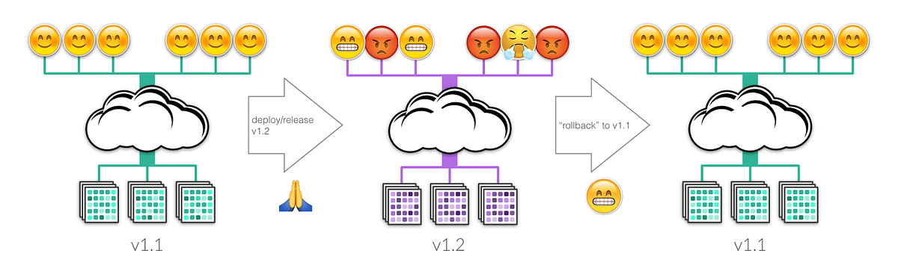
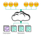
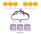
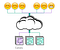

## Summary
[[TurbineLabs]] distinguishes shipping as the full build-test-deploy-release process, deployment as installing a runnable version on production infrastructure, and release as moving production traffic to that version. The distinction supports [[DeploymentReleaseSeparation]]: an unexposed deployment can carry little customer risk, while release concentrates traffic and behavior risk; release-in-place collapses the two phases and exposes customers to startup failures as well as application defects. The article frames rollback as another deployment and release under pressure, not a guaranteed restoration of the former system state.

## Key Claims
- Shipping comprises build, test, deploy, and release rather than treating deployment as the whole production-change process.
- Deployment means a new version is running on production infrastructure and has passed startup and health checks, but it need not receive production traffic.

- Release means directing production traffic to the new version; outages and user-visible defects arise when traffic encounters it, so deployment and release have different risk boundaries.

- Release-in-place restarts a server on the new version and therefore makes deployment and release simultaneous, directly exposing customers to startup failure and then to defects on every switched instance.
- A canary release-in-place limits exposure in proportion to the share of instances running the new version, but still exposes that traffic to both deployment and release risk.

- Rollback is a pressured redeploy-and-release of a known version into an environment that may have changed; the old version can fail to start or may not restore the prior state.

## Key Quotes
> "Deployment need not expose customers to a new version of your service." - the article's central distinction.

> "Rollback is just another deploy and release" - on why recovery uses the same fallible mechanism under worse conditions.

## Connections
- [[TurbineLabs]] - company whose release-engineering terminology and risk model the article presents.
- [[DeploymentReleaseSeparation]] - central distinction between installing a version and exposing production traffic to it.
- [[DeploymentAutomation]] - release systems need separate mechanisms for installation, traffic movement, observation, and recovery.
- [[ChangeSafety]] - canary exposure and separation of deploy risk from release risk bound customer impact.
- [[ContinuousDelivery]] - the four-stage shipping model situates deployment and release inside a broader delivery capability.

## Contradictions
- No direct contradiction found. The article agrees with [[you-cant-have-a-rollback-button-skyliner]] that rollback cannot guarantee restoration because the environment may have changed, although Turbine Labs describes re-releasing a known version more positively as the typical rollback mechanism.
