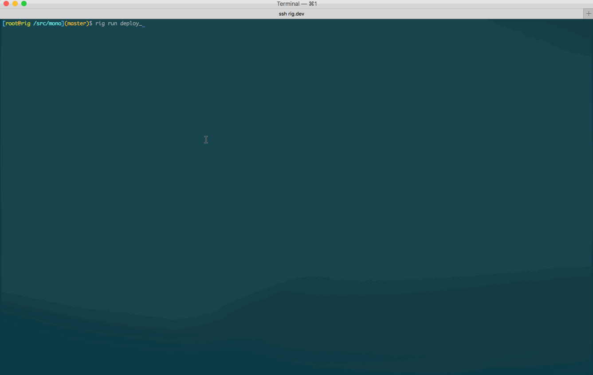

## Summary
[[Buzzfeed]] describes how its infrastructure team built [[Rig]] as an opinionated internal platform after large monolith releases, ticket queues, manual provisioning, and weak observability stopped scaling with engineering growth. Rig combined a Python CLI, service conventions, Docker packaging, Jenkins-based CI, AWS ECS deployment, Terraform-provisioned clusters, and default logging, metrics, and monitoring; BuzzFeed reports that the system supported 227 production services and about 150 deployments per day by February 2017. The retrospective treats developer autonomy and production ownership as platform outcomes while acknowledging unresolved Terraform and secret-management friction.

## Key Claims
- Large, infrequent releases and weak observability made production failures difficult to isolate and could stretch release deployment and validation across days.
- A standard service contract—service metadata, a Dockerfile, plain configuration, encrypted environment secrets, stateless execution, environment-based configuration, stdout or stderr logs, fast lifecycle behavior, and HTTP health checks—let platform tooling automate more of the path to production.
- [[Rig]] gave developers a consistent VM and CLI workflow for running services and dependencies, executing tests, building images in CI, and selecting a versioned image and cluster for deployment.

- The production platform deliberately composed existing systems—AWS EC2, ELB, ECS, Terraform, Docker, Jenkins, Papertrail, DataDog, and Nagios—behind a cohesive higher-level interface rather than building a scheduler or observability stack from scratch.
- Operational risk was reduced through repeatable cluster provisioning, failure and network tests, default logging and metrics, automatic monitoring discovery, and migration of low-risk workloads before critical systems.
- BuzzFeed reports 227 production services by February 2017 and 18,228 deployments since June 2016, averaging roughly 150 deployments per day, alongside higher infrastructure utilization and broader service ownership.
- Treating infrastructure as an internal product required support channels, office hours, talks, interviews, and surveys; the same feedback exposed difficult Terraform workflows and unfriendly, hard-to-audit GPG secret handling.

## Key Quotes
> "Creating and deploying a new service should require no coordination." — the platform's autonomy goal.

> "Rig is that glue" — on composing existing infrastructure behind one developer experience.

## Connections
- [[Rig]] - BuzzFeed's opinionated internal platform and the central subject of the retrospective.
- [[Buzzfeed]] - company whose engineering and infrastructure teams built and operated Rig.
- [[InternalDeveloperPlatform]] - Rig packages development, CI, deployment, observability, and service conventions into a self-service paved path.
- [[DeveloperExperience]] - the article defines engineering experience through the availability, ergonomics, reliability, and effectiveness of development and operations workflows.
- [[InfrastructureAsCode]] - Terraform made Rig clusters repeatable and reviewable while later becoming a source of scaling friction.
- [[DeploymentAutomation]] - versioned images, CI checks, ECS scheduling, load balancer setup, TLS, and DNS form the deployment path.
- [[ServiceObservability]] - distributed logs, metrics, service discovery, alerts, Slack, and PagerDuty are built into the platform.
- [[SecretManagement]] - per-cluster GPG secrets worked but remained difficult to use, audit, and rotate.
- [[Docker]] - containers provide the service packaging and local-development boundary.
- [[AWS]] - EC2, ELB, ECS, RDS, ElastiCache, VPCs, security groups, and auto-scaling groups form the underlying infrastructure.

## Contradictions
- The deployment and service counts are company-reported adoption measures, not independent evidence that Rig alone caused faster delivery, lower failure rates, better recovery, or lower total cost.
- The source presents standards as enabling autonomy, but every required convention also narrows application design; it does not measure migration cost, exceptions, platform-team load, or long-term maintenance.
- Terraform's declarative and repeatable model improved infrastructure experiments and review, yet BuzzFeed also reports that Terraform workflows became difficult at scale.
- GPG-encrypted repository secrets reduced plaintext exposure but conflicted with the platform's low-friction onboarding goal and did not make auditing or rotation easy.
