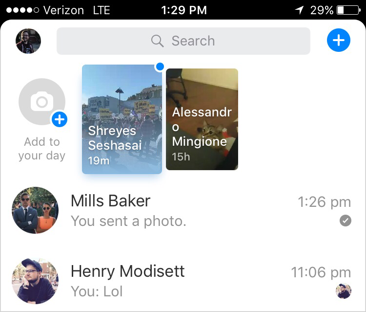
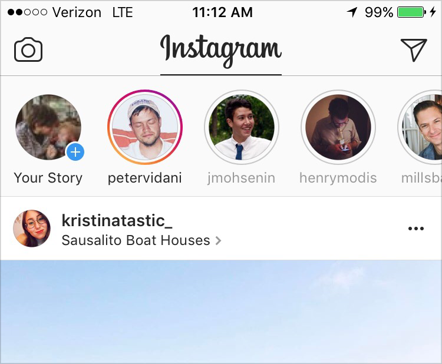

## Summary
This Quora Design essay argues that [[MessengerDay]] felt more intrusive than the nearly identical [[Instagram]] Stories format because the feature conflicted with its host product at several levels. Large preview cards disrupted a text-heavy [[FacebookMessenger]] inbox, unread-first ordering could surface weak ties, broadcast sharing clashed with private-conversation expectations, and an unranked feature exposed a heterogeneous [[Facebook]] graph that had expanded under ranked News Feed mediation. The comparison motivates [[ProductContextAlignment]]: interface, ranking logic, audience norms, graph structure, and company strategy need to reinforce rather than undermine one another.

The inspected Messenger screenshot shows two large, content-preview cards above rows of comparatively thin conversation text. Names wrap over the previews, while the feature occupies much more vertical and visual attention than the surrounding inbox.

The inspected Instagram screenshot shows a shallower row of familiar circular avatars above a large photographic feed item. This supports the essay's contrast in visual balance and identity recognition without establishing how representative either captured account was.

## Key Claims
- Interface intrusion is contextual: Messenger Day's preview cards compete with a text-heavy inbox, while Instagram's smaller avatar row is visually balanced by the photo feed below it.
- Familiar avatars make relevance easier to assess than content previews with awkwardly wrapped names, according to the source's interface reading.
- Unread-first ordering can become anti-personalized when posts from weaker ties remain unread and therefore keep receiving priority, especially when early posting volume is sparse.
- Broadcasting a story to an entire graph conflicts with Messenger's private-conversation mental model more than with Instagram's established one-to-many posting model.
- A broad Facebook friend graph works differently when News Feed ranks and filters it than when Messenger Day exposes every poster in an unranked row.
- Facebook's strategically valuable graph expansion can become a product liability for low-stakes self-expression, the use case the essay says [[Snapchat]] exploited.
- Strong product design depends on alignment among interface choices, engineering and ranking logic, community norms, graph composition, and strategy rather than pixel polish alone.

## Key Quotes
> "they're taking a graph built for a ranked and filtered context and using it in an unranked and unfiltered context." - on why the Facebook friend graph behaves differently inside Messenger Day.

> "our work is much more likely to be made or broken by the compatibility between these different levels of product and organization." - on design as cross-layer alignment.

## Connections
- [[MessengerDay]] - central case of a Stories-format feature conflicting with its host product.
- [[FacebookMessenger]] - private, text-heavy product context into which Day was inserted.
- [[Instagram]] - comparison case where Stories better matched the feed, audience model, and graph.
- [[Snapchat]] - originator of the Stories format and beneficiary of lower-stakes self-expression norms in the essay's strategic account.
- [[Facebook]] - owner of the broad friend graph whose ranked-feed history shapes the argument.
- [[ProductContextAlignment]] - synthesis of the essay's interface, ranking, norm, graph, and strategy layers.
- [[MentalModels]] - Messenger's private-conversation model conflicts with graph-wide broadcasting.
- [[MobilePlatformDiscovery]] - ordering and ranking decide which people and content become visible.

## Contradictions
- The source's claim that Instagram's graph was largely built without ranking is time-bound and qualified by its own footnote that Instagram had introduced feed ranking in 2016; the stronger claim is relative fit, not that Instagram was permanently unranked.
- The essay reports negative early impressions and infers causes from product structure, but it provides no adoption, retention, ranking, graph-composition, or user-research data that isolates those causes.
- Sparse early activity is presented both as a cause of weak relevance and as a condition that more usage might alleviate, leaving open whether the observed conflict was structural or partly a cold-start effect.

## Image Notes
All four effective local image references were opened. The two full-size UI screenshots were retained at their comparison points; the two 60-pixel-wide files are duplicate thumbnails of those screenshots, and the full Messenger screenshot was itself embedded twice, so those duplicate occurrences were omitted.
