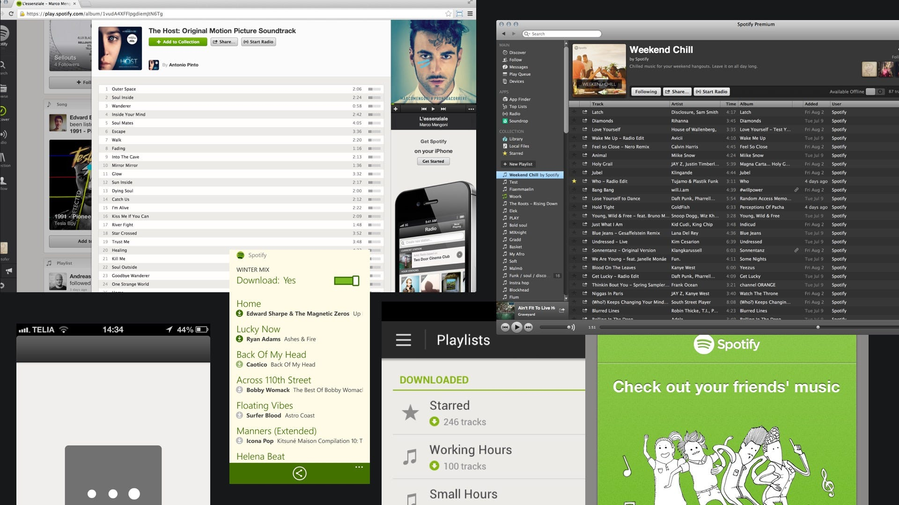

## Summary
[[StanleyWood]] describes how [[Spotify]] responded to fragmented interfaces and a distributed design organization with a layered coordination system: domain-specific principles, the [[GLUE]] design language and implementation team, a cross-mission guild, and release-oriented design QA. The account argues that design can scale when a company invests in shared judgment, reusable components, continuing context exchange, and an explicit quality definition rather than expecting a one-time redesign to preserve coherence. It is a first-person 2016 practitioner retrospective without comparative delivery, defect, adoption, or customer-outcome measures.

## Key Claims
- Product inconsistency reflected organizational fragmentation across projects, time zones, objectives, and schedules; a redesign alone did not remove the coordination problem.
- Music-specific principles tied to business goals gave design critiques a shared basis beyond personal taste and helped non-designers participate in the rationale.
- [[GLUE]] documented styles, components, and patterns, supplied matching design-tool kits, and created a shared vocabulary between design specifications and code.
- Turning GLUE into a dedicated designer-engineer team allowed core building blocks to be implemented across iOS, Android, and desktop rather than remaining documentation only.
- A weekly guild with representatives from each product mission helped the central team retain local context, surface consequential work, and resolve conflicting directions.
- Global design QA connected principles and guidelines to release practice, supported device testing and Jira-based defect handling, and made deviations accountable to affected teams or frameworks.
- The TUNE prompt broadened quality beyond interface consistency to tone, usability and accessibility, necessity, and emotional experience.

## Key Quotes
> "Design Doesn't Scale" - the initial diagnosis that the article ultimately revises.

> "when you invest in aligning and co-ordinating designers, design does scale" - the article's closing judgment.

## Connections
- [[StanleyWood]] - author and Spotify designer who led the reported search for a scaling model.
- [[Spotify]] - company context for the principles, GLUE, guild, and global design-QA practices.
- [[DesignOperations]] - operating discipline that connects shared principles, reusable assets, technical implementation, governance, and quality assurance.
- [[GLUE]] - Spotify's documented design language and later dedicated cross-functional team.
- [[ScalingCommunication]] - the guild and critique practices distribute consequential context across missions and locations.
- [[WorkplaceCollaboration]] - shared vocabulary and recurring forums coordinate designers and engineers without eliminating local product work.

## Contradictions
- No direct contradiction found. The article strengthens [[DesignOperations]] by adding governance and quality loops to the existing tooling-and-standards synthesis.
- The account is authored by a participant, reports practices rather than controlled outcomes, and does not quantify whether GLUE, the guild, or design QA independently improved consistency, efficiency, accessibility, defect rates, or customer experience.
- Central systems can lose local context or become obsolete; the guild is presented as a mitigation, not evidence that the risk disappeared.
