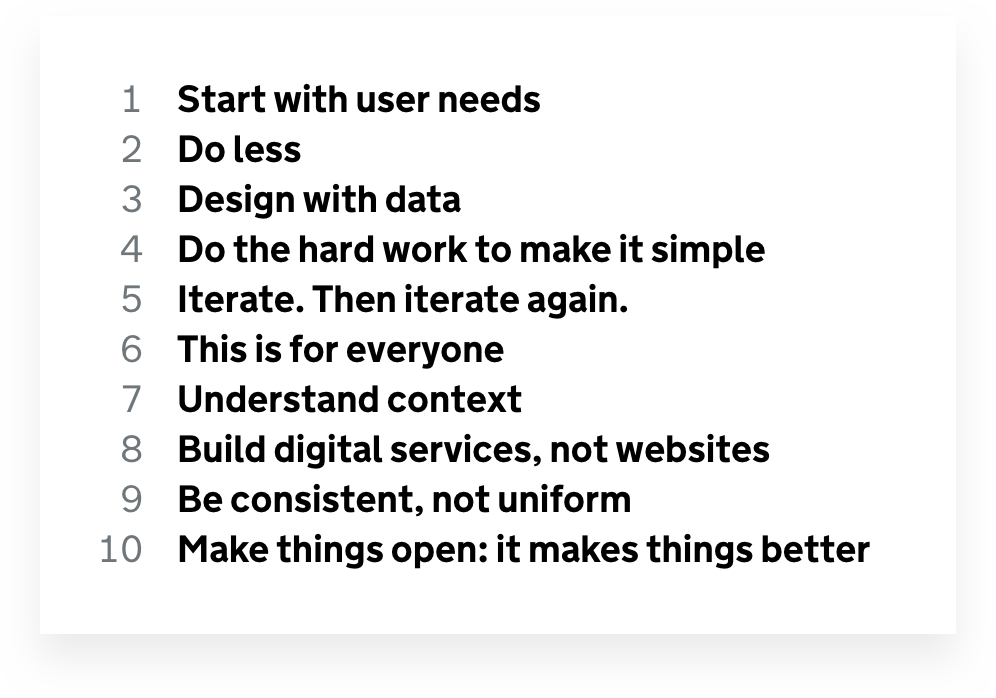

## Summary
This 2017 Muzli article distinguishes general design rules, design-process principles, product-specific principles, and design-system principles before compiling examples from Airbnb, Facebook, Apple, Google, Microsoft, Medium, Firefox, Salesforce, IBM, Bing, BBC, Pinterest, Lyft, Foursquare, and Asana. Its durable argument is that useful [[ProductDesignPrinciples]] should express a product's distinctive priorities and resolve hard tradeoffs, rather than restating baseline expectations such as clarity or usability. The collection repeatedly emphasizes inclusion, user control, understandable feedback, consistency, speed, reversibility, focus, trust, and recognizable brand character, but supplies no comparative outcome evidence.

## Key Claims
- Design principles occupy different scopes: graphic-design rules describe good composition, process principles guide how teams work, product principles define a product's intended character and tradeoffs, and system principles unify experiences across platforms.
- Strong [[ProductDesignPrinciples]] are simple, grounded in real examples, useful in contested decisions, and expressive of the brand rather than generic professional hygiene.
- Principles help teams share a vision, save discussion time, and justify difficult choices, but do not compensate for weak execution.
- Cross-platform products may need both product principles and a [[DesignOperations|design-system operating layer]]: the former differentiates the product, while the latter preserves coherence across touchpoints.
- The compiled examples repeatedly balance consistency with contextual appropriateness, simplicity with user agency, automation with control, speed with accuracy, and delight with clarity.
- Inclusion is treated as a product commitment rather than a finishing check: GOV.UK, Facebook, Microsoft, Firefox, and BBC all frame universal or global use as a design direction.
- Several examples make trust operational through transparency, feedback, reversibility, predictable behavior, privacy, and visible user control.

## Key Quotes
> "Guide design decisions" - one of the article's four tests for useful principles.

> "Trust takes effort" - Airbnb's framing of trust as reciprocal behavior rather than a purely visual quality.

## Connections
- [[ProductDesignPrinciples]] - central distinction and synthesis drawn from the compiled principle sets.
- [[DesignOperations]] - design-system principles and shared language can carry coherence across products, devices, and teams.
- [[MaterialDesign]] - Google example built around tactile metaphor, intentional graphic hierarchy, and meaningful motion.
- [[Usability]] - clarity, learnability, feedback, efficiency, error recovery, and satisfaction recur across the examples.
- [[CognitiveOverheadInProductDesign]] - direction, familiarity, progressive discoverability, and visible control can reduce comprehension burden.
- [[Airbnb]] - example connecting a unified visual language with expectation-setting and marketplace trust.
- [[Firefox]] - example combining privacy, agency, global fit, craft, responsiveness, and a distinctive point of view.

## Contradictions
- No direct contradiction found. The article qualifies generic simplicity and consistency by showing that they are useful only when tied to a product-specific judgment; Medium explicitly prefers contextual appropriateness over consistency, while Firefox treats simplicity as a means to agency rather than the end.
- The source is a curator's 2017 selection of organization-authored statements. It does not show that the principles were consistently practiced, remained current, or caused product quality or business results.
