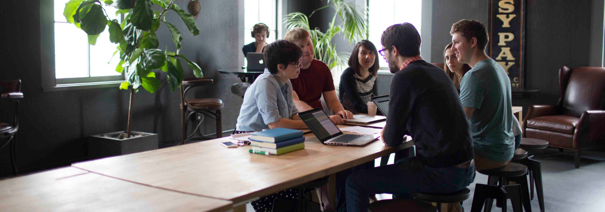

## Summary
In this 2016 interview, Stripe creative director [[LudwigPettersson]] presents design as an amplifier that works only when a valuable product and sound fundamentals already exist. He argues that [[Stripe]] gained leverage by involving designers from the beginning, giving individual designers broad ownership, and adding only the smallest coordination mechanisms needed as informal sharing stopped scaling. The account is a company-insider retrospective rather than comparative evidence that these practices caused Stripe's product quality or market success.

## Key Claims
- Early investment let design influence product direction and implementation rather than arrive as late-stage visual polish.
- Design can amplify a product, launch, or service, but cannot compensate for weak demand, unclear value, or failure to solve the intended problem.
- Strong product details tend to emerge through sustained individual experimentation and implementation, not only from formal brainstorming sessions.
- Stripe's design model combined broad individual ownership with frequent visibility, feedback, and team support.
- As the team grew, lightweight mechanisms such as scheduled critiques and a shared work-in-progress feed replaced sharing habits that no longer happened naturally.
- Work-in-progress sharing needs psychological safety so designers can expose rough ideas early instead of presenting only polished outcomes.
- Digital designers should seek ideas beyond their immediate field because imitation within a narrow professional echo chamber makes products converge.

## Key Quotes
> "design as something that amplifies things that already exist" - Pettersson on design's organizational value.

> "the smallest tweak we can make" - on restoring lost coordination without over-engineering process.

## Connections
- [[LudwigPettersson]] - interview subject and Stripe's first designer and creative director.
- [[Stripe]] - company case for early design investment and lightweight coordination during growth.
- [[CrossFunctionalProductTeams]] - designers participate from product inception through implementation.
- [[WorkplaceCollaboration]] - autonomy is paired with visibility, critique, and support.
- [[DesignOperations]] - scheduled critique and shared work feeds are lightweight operating mechanisms for a growing design team.
- [[ProductDesignPrinciples]] - design judgment remains subordinate to product value and sound fundamentals.

## Contradictions
- No direct contradiction found. The source complements formal design-operations cases by arguing that process should be introduced only when growth removes a previously useful behavior.
- The source qualifies design-centered narratives: design is an amplifier, not a substitute for a wanted product or correct problem definition.
- The evidence is a 2016 first-person account from Stripe's creative director; it provides no independent comparison, outcome measures, or proof that design practices rather than product, engineering, timing, capital, or market conditions produced the reported advantage.
