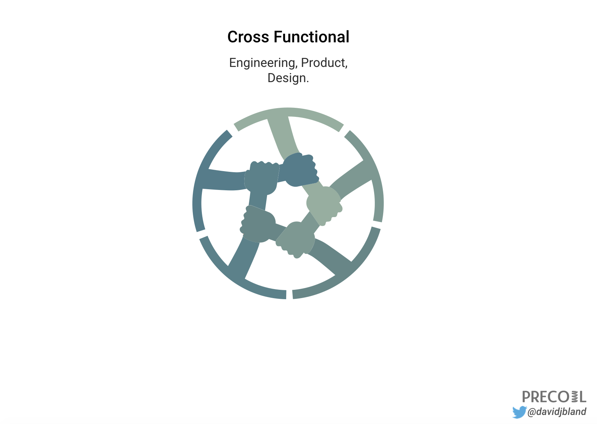

## Summary
[[DavidBland]] presents [[ModernProductTeamDesign]] as five coupled conditions for new-product work: cross-functional participation, full dedication, data-influenced judgment, continuous customer contact, and diversity. The model assigns desirability, viability, and feasibility to design, product, and engineering while allowing additional roles when the experiment requires them; it then shifts accountability from feature output toward evidence of business outcomes. The article is a concise practitioner prescription rather than a measured comparison, so its causal and universal claims remain untested.

## Key Claims
- [[CrossFunctionalProductTeams]] should include product, design, and engineering to cover viability, desirability, and feasibility, with marketing, finance, or data specialists added when the test depends on their work.
- [[TeamFocus]] improves when members are fully dedicated instead of splitting attention across unrelated initiatives and maintenance queues.
- A [[DataInformedCulture]] balances quantitative evidence about what happened with qualitative evidence about why, and evaluates outcomes rather than completed feature output.
- [[CustomerLedProductDevelopment]] should continue after launch through interviews, purchase and abandonment questions, pricing-page feedback, and attention to the customer job behind each feature.
- Team diversity and an environment safe for different viewpoints can expose product assumptions that a homogeneous team may otherwise encode as defaults.
- Healthy conflict across different perspectives is presented as a product-quality input, not a failure of team alignment.

The retained diagram makes the core trio explicit and depicts their work as interdependent rather than sequential handoffs.

## Key Quotes
> "Modern teams do not have to be data driven, but they need to be data influenced." - on evidence informing rather than mechanically dictating decisions.

> "The culture of your team makes it into your product." - on team composition shaping product assumptions and blind spots.

> "Customer discovery never stops." - on maintaining direct contact after a product has been built and purchased.

## Connections
- [[DavidBland]] - author and Precoil practitioner presenting the five-part model.
- [[ModernProductTeamDesign]] - integrated framework synthesized from the article.
- [[CrossFunctionalProductTeams]] - product, design, and engineering form the minimum core, with other specialties added by need.
- [[TeamFocus]] - full dedication is proposed as protection against context switching and divided accountability.
- [[DataInformedCulture]] - quantitative and qualitative evidence should shape outcome judgments without replacing judgment.
- [[CustomerLedProductDevelopment]] - discovery continues through customer behavior and conversation after launch.
- [[InclusiveHiring]] - the article extends diversity from candidate pipelines into perspective, leadership, safety, and product-bias concerns.

## Contradictions
- The article says an MVP that does not generate data is "just a prototype," while broader [[MinimumViableProduct]] material allows non-product experiments; this is best read as a narrower instrumented-product definition rather than a universal terminology rule.
- Full dedication may reduce context switching, but the article provides no comparative data and does not address scarce specialist sharing, incident response, small companies, or portfolio work.
- The link from demographic diversity to fewer product blind spots is plausible but illustrated through selected examples rather than measured outcomes; representation alone does not guarantee influence, safety, ethical judgment, or inclusive product quality.
