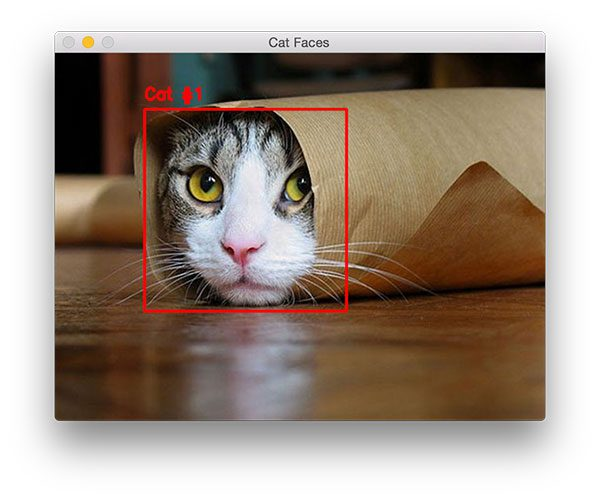
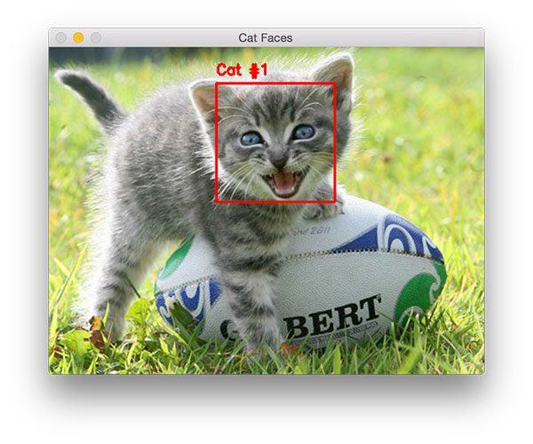
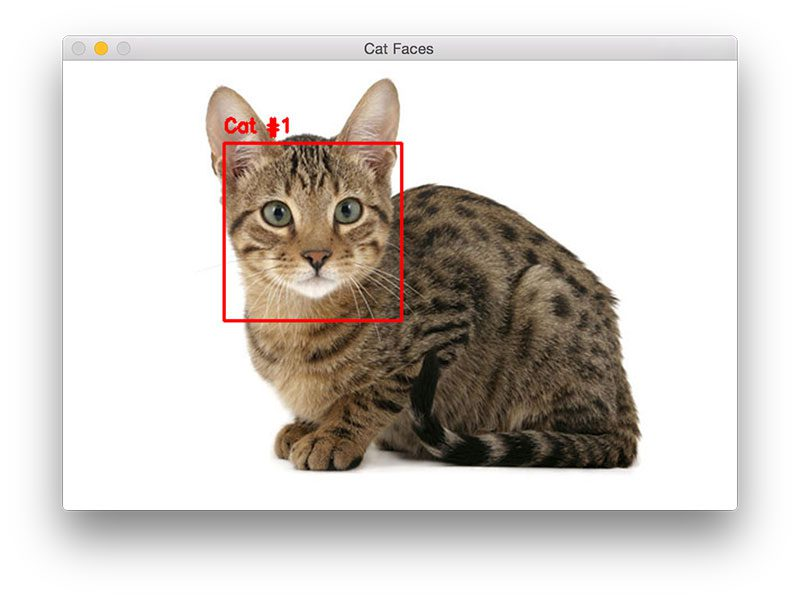
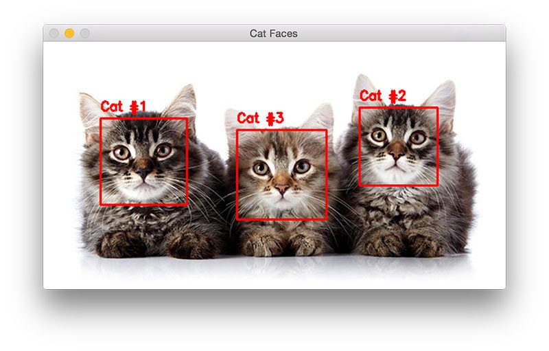

## Summary
[[AdrianRosebrock]] demonstrates how [[OpenCV]]'s pretrained frontal-cat-face cascades can detect one or more cat faces in still images and can be applied to video streams. The tutorial explains the grayscale-and-`detectMultiScale` workflow, shows detections across occlusion and pose variation, and emphasizes that `scaleFactor` and `minNeighbors` trade speed and recall against false positives. It recommends [[HOGLinearSVMObjectDetection]] when easier tuning and fewer false positives matter more than straightforward real-time performance.

## Key Claims
- OpenCV includes pretrained frontal-cat-face and extended frontal-cat-face Haar cascades contributed by [[JosephHowse]].
- A typical workflow loads an image, converts it to grayscale, constructs `cv2.CascadeClassifier`, calls `detectMultiScale`, and draws the returned `(x, y, width, height)` rectangles.
- Larger `scaleFactor` values evaluate fewer image-pyramid layers and run faster but can miss intermediate object sizes; smaller values search more scales but cost time and increase false positives.
- `minNeighbors` rejects weak candidate regions, while `minSize` excludes detections below a chosen bounding-box size.
- Cat cascades can mistake human faces for cat faces; running both detectors and discarding overlapping cat boxes is proposed as a mitigation.
- Detection results can be correct despite partial body occlusion, facial-expression variation, full-body context, and multiple subjects, but returned box order is not necessarily spatial.
- The extended Haar cascade uses diagonal-sensitive features, while an LBP cat cascade is described as faster but less accurate; HOG plus a linear SVM is presented as easier to tune with fewer false positives but harder to run in real time.

## Key Quotes
> "The biggest problem with Haar cascades is getting the detectMultiScale parameters right" — the tutorial's central qualification about operational reliability.

## Connections
- [[OpenCV]] — supplies the classifier API and pretrained cat-face cascades used by the tutorial.
- [[AdrianRosebrock]] — writes the tutorial and interprets the detector's tuning and accuracy tradeoffs.
- [[JosephHowse]] — trained and contributed the cat-face cascades described by the article.
- [[HaarCascadeObjectDetection]] — the fast multiscale detection method used for the worked example.
- [[HOGLinearSVMObjectDetection]] — the recommended alternative when false-positive control and easier tuning outweigh real-time speed.

## Visual Evidence
The screenshots below are outputs of the tutorial's detector rather than generic cat photographs.

The detector encloses the visible face even though the cat's body is hidden by a paper sleeve.

The detector finds the face despite the kitten's open mouth and altered expression.

The square detection remains localized to the face even when the full body occupies much of the frame.

All three faces are enclosed, while the left-to-right labels read 1, 3, 2, illustrating that callers must sort rectangles when presentation order matters.

## Contradictions
- No direct contradiction with an existing wiki page was found. The article qualifies its own favorable examples by documenting human-face false positives, per-image parameter sensitivity, and compatibility differences between cascade files.
