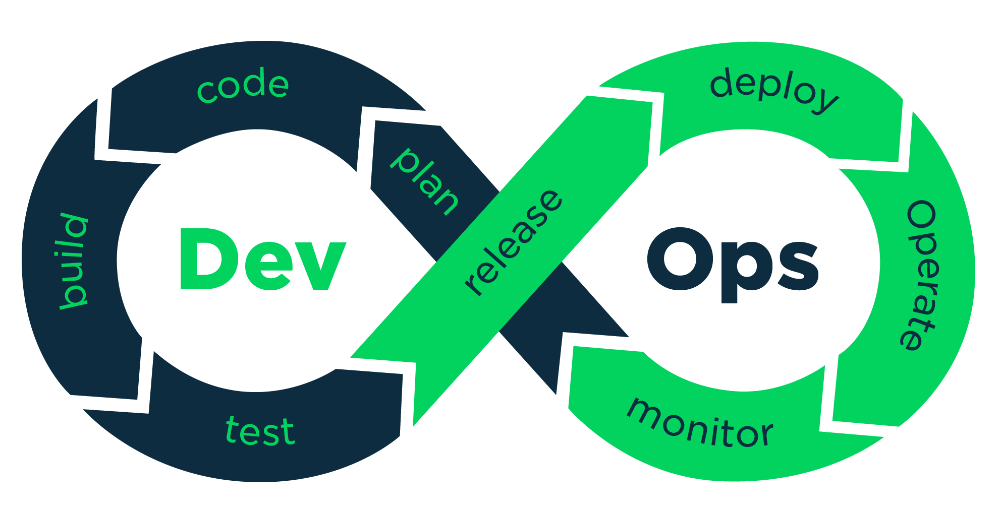

## Summary
[[IrmaKornilova]] presents [[DevOpsCulture]] as company-wide collaboration around faster, safer, and more reliable software delivery rather than a job title or a handoff between development and operations. Drawing on [[Puppet]] transformation guidance and a [[Raytheon]] automation case, the article combines leadership sponsorship, shared goals and tools, early stakeholder involvement, continuous learning, and small measurable pilots with [[ContinuousDelivery]] practices.

## Key Claims
- [[DevOpsCulture]] requires senior-leadership backing and participation from everyone with a stake in the product, not a specialist role assigned only to development and operations.
- Shared agile processes, version control for application and infrastructure code, automated configuration, tests and deployment, and continuous integration shorten feedback loops and reduce release risk.
- A credible transformation case starts with why faster delivery matters now and reframes developers and operators around shared speed, reliability, and security outcomes rather than opposing incentives.
- Developer-facing progress can be measured through change lead time, deployment frequency, reduced ticket handoffs, and easier releases.
- Operations-facing progress can be measured through uptime, downtime, change failure rate, and mean time to recover.
- Small pilots can create visible evidence and internal advocates before an organization attempts a broader cultural change.
- The source reports that build automation let one [[Raytheon]] team move from two integration procedures per month to 27 in one night.

## Key Quotes
> "DevOps is a culture, not a role!" - [[MikeDilworth]] on why the whole company must participate.

> "Start small and grow from early successes." - on using bounded projects to build evidence and organizational support.

## Connections
- [[IrmaKornilova]] - author of the article.
- [[DevOpsCulture]] - the article's central organizational model.
- [[ContinuousDelivery]] - frequent integration, automated delivery, and short feedback loops operationalize the culture.
- [[DeploymentAutomation]] - automated testing, builds, configuration, and deployment are enabling practices rather than the whole transformation.
- [[ConfigurationManagement]] - application and infrastructure automation are included in the shared delivery toolchain.
- [[Puppet]] - source of the high-performing IT-team guidance discussed by Kornilova.
- [[MikeDilworth]] - transformation leader quoted for the article's central claim.
- [[TerriPotts]] - practitioner whose small-pilot guidance and automation case are cited.
- [[Raytheon]] - organizational setting for the reported integration-frequency improvement.

## Contradictions
- No direct contradiction found. The source complements [[ContinuousDelivery]] by adding leadership, incentives, and stakeholder participation, while qualifying any tooling-only account of delivery improvement.
