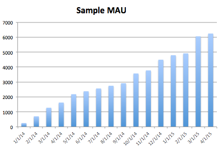
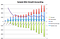
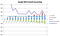

## Summary
[[JonathanHsu]] presents [[SocialCapital]]'s method for looking beneath a rising monthly-active-user line when assessing consumer-product traction and [[ProductMarketFit]]. [[UserGrowthAccounting]] separates current users into new, retained, and resurrected users, while separating the prior period into retained and churned users; this exposes whether growth rests on durable retention or continuous replacement of users who leave. The three retained charts show that the same roughly 12% monthly MAU growth can arise from materially different retention, churn, and quick-ratio profiles.

## Key Claims
- Cumulative registered users are a vanity metric when registration does not imply current product value; even MAU needs decomposition before it can support a product-market-fit judgment.
- Current MAU is the mutually exclusive sum of new, retained, and resurrected users, while prior-period MAU is the sum of retained and churned users.
- Net MAU change therefore equals new users plus resurrected users minus churned users.
- The user-growth quick ratio, `(new + resurrected) / churned`, must exceed one for the active-user base to grow; the author distinguishes it from the finance liquidity ratio with the same name.
- Identical topline MAU growth can conceal very different businesses: the stronger fictional case combines higher retention with a roughly 1.5-2.0 quick ratio, while the weaker case continually replaces heavy churn at roughly 1.0-1.5.
- Improving retention should generally precede aggressive top-of-funnel acquisition because acquired users add little durable value when the product quickly loses them.
- Teams should choose a measurement window that matches product cadence; rolling 28-day periods remove day-of-week effects, while weekly or daily accounting becomes useful only for sufficiently frequent products.

## Key Quotes
> "It's easier to fill the top of funnel than it is to fix some underlying churn problem." - on sequencing retention before acquisition.

## Connections
- [[JonathanHsu]] - author presenting the diligence framework.
- [[SocialCapital]] - investment firm where the framework was used for diligence and portfolio-company operations.
- [[UserGrowthAccounting]] - decomposition of active-user growth into new, retained, resurrected, and churned users.
- [[ProductMarketFit]] - the intended judgment that raw or rising user totals cannot establish alone.
- [[ProductLedRetention]] - stronger retention creates a better base on which to increase acquisition.
- [[VanityMetrics]] - cumulative registered users, and unexamined topline MAU, can obscure whether users continue receiving value.
- [[ProductMetricLadder]] - the appropriate activity definition and time window depend on the product's actual value cadence.

## Contradictions
- No direct contradiction found. The source qualifies simple user-growth and fit narratives by showing that identical MAU curves can conceal materially different churn burdens.
- The framework is a 2015 investor-practitioner heuristic illustrated with fictional companies, not a validated universal benchmark. Its “so-so” and “very good” consumer quick-ratio ranges do not establish thresholds for enterprise, episodic, seasonal, paid, marketplace, or naturally infrequent products.
