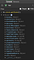
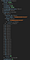
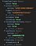

## Summary
This reverse-engineering note uses browser developer tools to inspect the 2017 mobile [[Twitter]] application's [[Redux]] store. It finds tweet payloads in a normalized entity table, a separate home-timeline array that orders tweet IDs, top and bottom cursors and fetch timestamps for incremental loading, and parallel fetch-status tables that may coordinate loading and rendering. Five DevTools screenshots corroborate the observed shape, but the author explicitly labels the behavioral interpretation as educated guesswork rather than an official architecture account.

## Key Claims
- Twitter's mobile web application used React and Redux, with the Redux state reachable from the selected root component through `$r.store.getState()` in React Developer Tools.
- Detailed tweet objects were stored once under `entities/tweets/entities`, keyed by tweet ID, rather than duplicated inside every timeline.
- `homeTimelines/timeline` preserved display order as an array of records whose tweet IDs referenced the normalized entity table.
- The timeline separated newer and older loading boundaries as `top` and `bottom`, with corresponding cursors and `lastFetch` timestamps supporting refresh and downward pagination.
- The `tweets`, `cards`, `lists`, and `users` entity slices shared a similar table structure and separate `fetchStatus` maps.
- The author infers that fetch status could suppress duplicate requests and let timeline structure render before every detailed entity payload arrives, but did not observe a non-loaded state.

## Key Quotes
> "All observations are from me poking around in Chrome devtools" - the author's evidence boundary for the reconstruction.

> "This is pretty much normalizing state shape 101" - on separating ordered timeline references from detailed tweet entities.

## Connections
- [[Twitter]] - application whose 2017 mobile-web client state is inspected.
- [[Redux]] - state container organizing entities, timelines, cursors, and request status.
- [[ClientStateNormalization]] - tweet records are stored once by ID and referenced from ordered timeline structures.
- [[DeveloperExperience]] - React Developer Tools exposes a practical route for inspecting a live application's state model.
- [[SystemArchitecturePrinciples]] - the observed store separates canonical records, ordering, pagination boundaries, and loading state.

## Contradictions
- No direct contradiction with existing wiki pages. The source adds a historical implementation detail to [[Twitter]], but its behavioral explanations are reverse-engineered guesses from one 2017 client snapshot, not an official or current architecture description.
