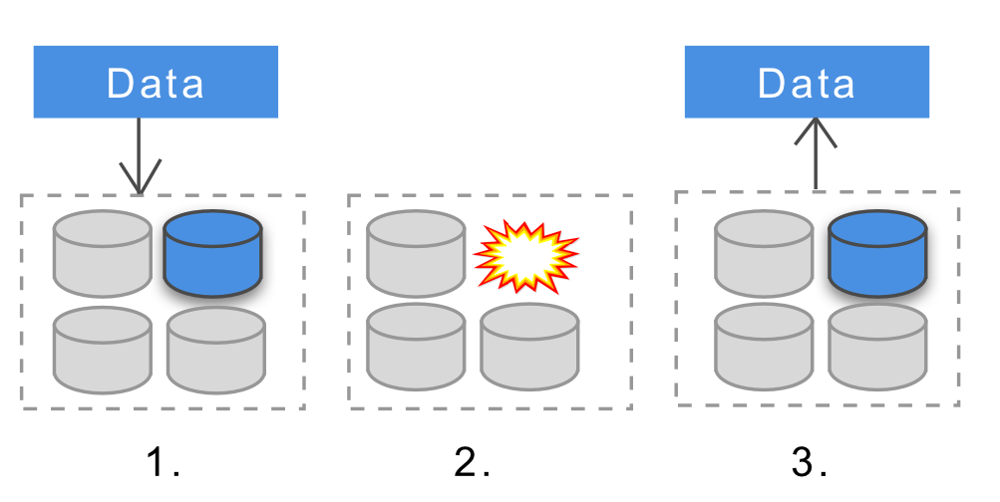
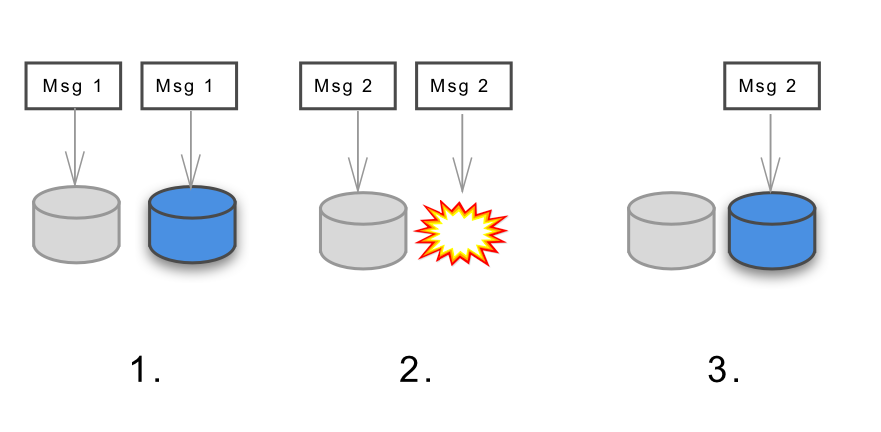

## Summary
This practitioner retrospective describes the architecture concepts the author learned while helping rebuild Uber's high-scale payments system: measurable service targets, horizontal scaling, consistency choices, durable data and messaging, idempotency, sharding, quorum, the actor model, and reactive architecture. Its central design pattern is to derive technical choices from payment invariants: accepted transactions and payment-intent messages must not be lost, retries must not double-charge or double-refund, and consistency strength can vary by operation. The two retained diagrams reinforce the source's failure model by showing replicated data and a queued message surviving the loss of one storage node; the decorative Earth-at-night header photograph was omitted.

## Key Claims
- Health should be expressed through measurable availability, accuracy, capacity, and latency targets before architecture is chosen, although the article groups service-level indicators and objectives under the broader label "SLA."
- A payment platform already handling thousands of requests per second favored horizontal scaling because one larger machine was not expected to meet present and future load economically.
- Consistency should match the operation: payment initiation required a strongly consistent record, while a recent-transactions view could accept eventual consistency for lower latency or resource cost.
- Completed payment data required cluster-level durability so a node crash or corruption would not erase an acknowledged transaction.
- A durable Kafka-based messaging path with at-least-once delivery avoided message loss but required every consumer to tolerate duplicate delivery.
- Payment and refund operations used versioning, optimistic locking, and a strongly consistent store to make retries idempotent and prevent duplicate financial effects.
- Sharding, quorum, the actor model, Akka, and reactive principles supplied scaling and coordination patterns, but the source presents them as one team's practitioner choices rather than universal requirements.

The data diagram shows one record replicated to two nodes, one node failing, and the surviving replica returning the record. It illustrates node-failure tolerance through replication but does not specify replica count, acknowledgement policy, consistency level, recovery timing, or correlated-failure behavior.

The messaging diagram shows the same message written to two queue nodes, one node failing, and the surviving copy remaining available for delivery. It supports the persistence argument but does not by itself prove end-to-end losslessness, exactly-once processing, ordering, acknowledgement, or consumer idempotency.

## Key Quotes
> "For some parts of the system, only strongly consistent data would do." - on matching consistency strength to payment criticality

> "Most importantly: to avoid double charges or double refunds." - on the purpose of idempotent payment handling

> "We decided to implement a durable messaging system with at least once delivery" - on preferring recoverable duplicate delivery to message loss

## Connections
- [[Uber]] - the company whose payments platform supplies the source's production case.
- [[DistributedPaymentArchitecture]] - combines measurable reliability targets, selective consistency, replication, scaling, and failure-aware design around payment invariants.
- [[IdempotentPaymentProcessing]] - prevents retries or duplicate deliveries from producing duplicate charges or refunds.
- [[DurableMessaging]] - persists and replicates payment-intent messages so node failures do not silently erase work.
- [[DataDurability]] - preserves acknowledged payment records across storage-node failure.
- [[DistributedSystemRestraint]] - provides the stage-sensitive counterpoint: this source describes scale and criticality that can justify distributed complexity.

## Contradictions
- The article calls availability, accuracy, capacity, and latency measures "SLAs" without separating service-level indicators, objectives, and contractual agreements; the wiki preserves the useful measurable-target principle while treating the terminology as loose.
- The statement that the lossless bus needed every message "delivered once" is qualified by the architecture the team actually chose: at-least-once delivery can duplicate messages, so correctness depends on idempotent processing rather than transport-level exactly-once effects.
- The article says idempotency requires some distributed locking strategy, then cites database constraints and describes optimistic version checks; this is better read as a need for atomic deduplication or concurrency control, not necessarily a distributed lock service.
