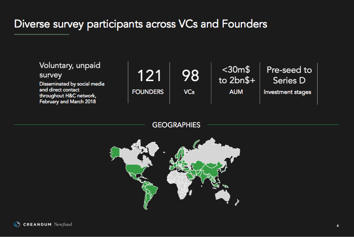

## Summary
[[CarlFritjofsson]], [[HenriDeshays]], and [[OwenReynolds]] report an unmatched survey of 121 founders and 98 venture capitalists that finds a persistent perception gap: VCs rated their own portfolio impact at 7/10 while founders rated it 5.3/10, and investors reported weekly contact almost three times as often as founders did. The respondents agreed that personal relationship and chemistry mattered most when choosing a financing partner, but founders placed more weight on decision speed than VCs expected, while VCs overestimated the importance of their brand and the use or value of operational services. The article argues that investors can compete more effectively through chemistry, speed, terms, and context-specific help, while treating its geography and stage comparisons as survey findings rather than universal rules.

## Key Claims
- VCs assessed their average portfolio impact at 7/10, compared with founders' 5.3/10 assessment, a reported 32% gap.
- VCs reported weekly founder contact almost three times as frequently as founders reported receiving it, suggesting that activity and impact are perceived differently by the two sides.
- Both groups ranked personal relationship and chemistry as the most important partnership criterion, making [[FounderInvestorFit]] central to fundraising rather than incidental.
- Founders ranked investment-decision speed third, while VCs ranked it last; the authors argue that fast, attractive terms can beat a stronger investor brand.
- More than 60% of VCs said they offered recruiting and sales or business-development help, yet fewer than half of portfolio companies used either service, leaving quality, awareness, need, and measurement as unresolved explanations.
- European founders placed relatively more weight on deal terms, while US founders placed relatively more weight on investor experience, operational support, and brand.
- Early-stage founders emphasized speed and industry networks more than later-stage founders, who placed greater weight on investor experience and track record.

## Key Quotes
> “Personal chemistry between the founder and VC matters the most, and the tangible value-add VCs think they provide is discounted by founders.” — the authors' closing interpretation of the survey.

## Connections
- [[CarlFritjofsson]] — coauthor and VC framing the survey as a test of investors' “value-added” self-image.
- [[HenriDeshays]] — coauthor and Newfund investor who conducted the study with Fritjofsson.
- [[OwenReynolds]] — University of Chicago researcher credited with supporting the survey and analysis.
- [[VentureCapitalValueAdd]] — central concept distinguishing investor claims of activity from founder-perceived usefulness and uptake.
- [[FounderInvestorFit]] — chemistry, speed, terms, brand, experience, and stage-specific needs shape partner selection.
- [[FounderInvestorRelations]] — contact frequency and operational support are recurring post-investment relationship behaviors.

## Contradictions
- The survey qualifies investor marketing that presents operational services as broadly valuable: reported availability substantially exceeded portfolio-company use, and founders discounted VC impact relative to investors' self-ratings.
- The findings do not show that services caused company outcomes or explain the perception gaps. The founder and VC samples were separate rather than matched pairs, voluntary and unpaid, recruited through social media and direct contacts, and the article gives no response rate, sampling frame, uncertainty estimates, question wording, or subgroup sizes.
- The geographic and financing-stage results are descriptive comparisons that may reflect sample composition, market conditions, or respondent interpretation; they should not be treated as stable causal rules.
- Four effective local image references were opened. The participant-profile slide was retained because it adds recruitment period, fund-size range, stage coverage, and geographic scope. The duplicated “I’m helping” illustration, a reaction GIF, and the study cover were omitted as decorative or duplicative.
