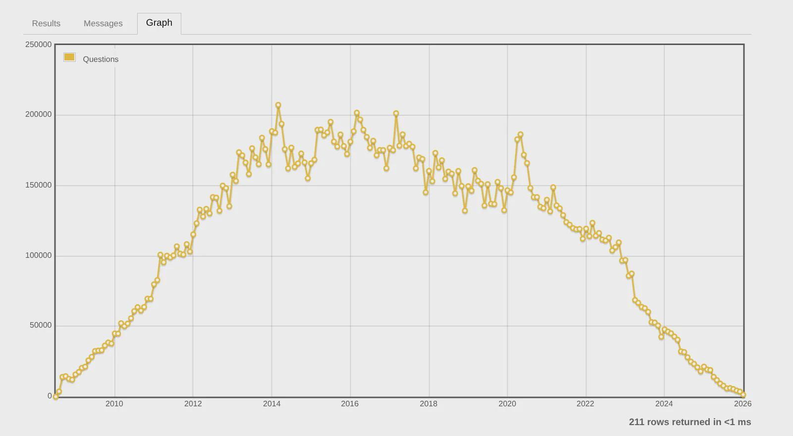
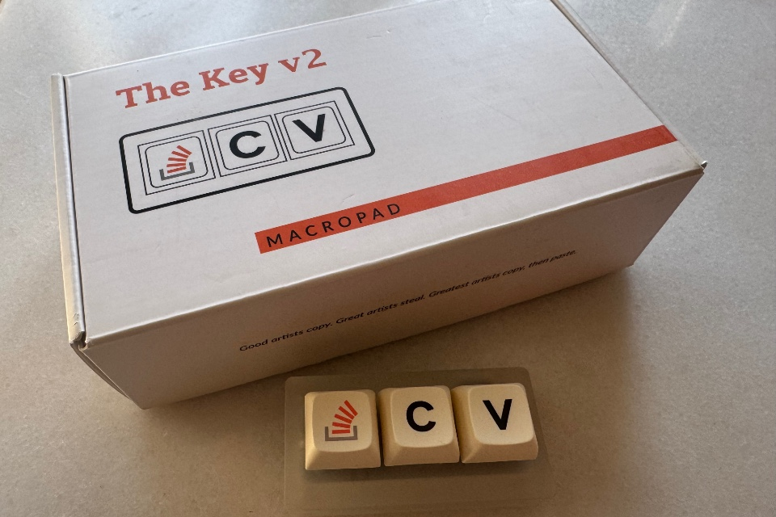

## Summary
[[Croxx]] argues that generative AI changes the division of labor around technical blogs rather than making them obsolete: an assistant can answer immediate questions and fill gaps while a long-form post preserves a coherent knowledge path, verified experience, and a public artifact. The essay also treats blogging as [[LearningByWriting]], a correction channel for specialized hallucinations, and a form of intrinsically rewarding sharing, while its [[StackOverflow]] chart offers only descriptive—not causal—evidence of declining public question volume.

## Key Claims
- Generative AI has displaced some search and short-form lookup because a learner can ask a question directly instead of assembling an answer from many pages.
- AI can make difficult long-form technical posts easier to read by explaining unfamiliar details on demand without replacing the post's full narrative.
- A technical blog can record practitioner-verified knowledge that corrects plausible but unreliable model answers on specialized topics.
- Writing converts a branched, backtracking sequence of AI questions and answers into a continuous line of reasoning whose value may exceed the final answer alone.
- Public sharing retains social and intrinsic value even when AI can generate or explain content; the author includes shared AI conversations among the newer things people can publish.
- The retained chart shows Stack Overflow monthly question counts rising from 2008, peaking near 200,000 in the mid-2010s, and falling sharply through 2025, but it does not establish that GenAI caused the decline.
- Note-taking persists across paper, digital devices, blogs, and AI conversations even as its medium and immediate purpose change.

The chart is visually consistent with a major long-run decline, but its final near-zero 2026 point appears to cover an incomplete month and should not be compared directly with completed months.

The author's photograph of The Key v2 documents personal identification with the Stack Overflow community rather than platform health.

The mobile screenshot shows an AI-generated technical conclusion being shared with another person, supporting the essay's narrower claim that AI conversations have become shareable knowledge material.

## Key Quotes
> "The need for note-taking has never disappeared; only the form and purpose have changed." - the essay's thesis about continuity beneath changing media.

> "Writing a blog helps us capture this as a continuous line of thinking." - on reconstructing branched AI inquiry into a coherent artifact.

## Connections
- [[Croxx]] - blogger arguing from their own changed reading, lookup, writing, and sharing habits.
- [[AIKnowledgeAssistant]] - on-demand explanation can fill gaps while a learner follows a longer technical argument.
- [[LearningByWriting]] - composition turns branching questions, backtracking, and verification into a coherent reasoning path.
- [[PublicKnowledgeCommons]] - public posts and questions create reusable artifacts that private AI conversations do not automatically replenish.
- [[StackOverflow]] - the essay's chart and keyboard anecdote make declining question production personally and visually salient.
- [[AIAssistedWriting]] - AI conversations can become source material, but the writer still verifies, organizes, and publishes the reasoning.

## Contradictions
- The claim that “most developers” now ask AI first is based on personal observation and an unspecified news item, not representative developer-behavior data.
- The Stack Overflow chart does not label its query, aggregation method, exclusions, or data freshness. Its final 2026 point is likely partial, and Stack Overflow launched in 2008, so “lowest level in 20 years” is imprecise.
- Falling question counts do not by themselves identify GenAI as the cause; archive maturity, duplicate policy, moderation, community norms, search behavior, platform changes, and other channels may also contribute.
- Blogs can preserve verified practitioner knowledge, but publication alone does not guarantee accuracy, evidence quality, correction, licensing, discoverability, or durable maintenance.

## Image Notes
All five remote images were opened. The generic laptop-and-tablet hero was omitted as decorative, and the translated social-media comment was omitted because the adjacent prose reproduces its full informational content. The Stack Overflow question chart, The Key v2 photograph, and shared-AI-chat screenshot were retained at their semantic positions.
