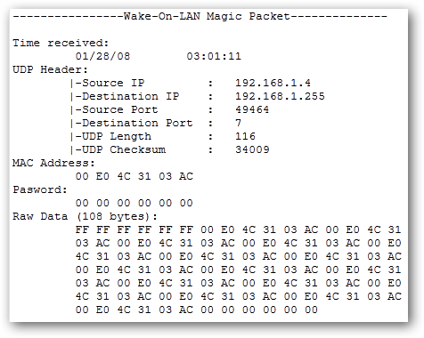

## Summary
David Postill explains that Wake-on-LAN normally sends a UDP magic packet to a LAN broadcast address, where the target network interface recognizes its repeated MAC address. Reaching that broadcast domain from the internet generally requires a firewall rule and router support for forwarding the packet, commonly on UDP port 7 or 9; the questioner's follow-up reports that a static ARP binding between the sleeping computer's IP and MAC address solved the practical problem. The answer is a useful configuration sketch rather than a complete or universally applicable Wake-on-WAN procedure.

## Key Claims
- A Wake-on-LAN magic packet is normally broadcast across the local network rather than addressed only to the sleeping host.
- The target machine is identified by its network interface's MAC address encoded in the magic-packet payload.
- UDP ports 7 and 9 are conventional carriers for Wake-on-LAN traffic, but the wake signal is the payload pattern rather than an application listening on one mandatory port.
- A packet arriving from the WAN must pass the network firewall and reach the target LAN, which commonly requires a port-forwarding or router relay rule.
- Router behavior is decisive: some routers allow forwarding to a LAN broadcast address, while others deliberately refuse directed broadcasts.
- The questioner's reported fix was to bind the computer's IP address to its MAC address in the router's ARP configuration, keeping the forwarding target resolvable while the host slept.

The retained packet-capture screenshot shows a packet from `192.168.1.4:49464` to broadcast address `192.168.1.255` on UDP port 7. Its payload begins with six `FF` bytes and then repeats target MAC address `00 E0 4C 31 03 AC`, visually grounding both the broadcast path and MAC-based target selection.

## Key Quotes
> "The MAC address is used to identify the particular host that should \"Wake Up\"" - on target selection inside a broadcast packet.

> "Some routers do not support this as they will not forward broadcast packets." - on the router-dependent boundary of Wake-on-WAN.

## Connections
- [[WakeOnLAN]] - supplies the source's core explanation of magic packets and the conditions for relaying them from a WAN.
- [[NATTraversal]] - Wake-on-WAN is another case where traffic must cross a private-network boundary, although it may require broadcast or static-ARP behavior rather than a tunnel.
- [[DefensivePortTriage]] - an inbound UDP rule should be treated as an intentional exposure and scoped to the minimum necessary path.
- [[DavidPostill]] - author of the accepted Super User answer summarized here.

## Contradictions
- The answer says a Wake-on-LAN-enabled computer listens on UDP ports 7 or 9. More precisely, these are conventions used to carry the magic payload; firmware or the network interface detects the magic pattern, and implementations can use another UDP port.
- Forwarding to the sleeping computer's ordinary IP address can fail after the router's dynamic ARP entry expires. The questioner's static ARP binding is a reported workaround, while forwarding to a subnet broadcast address is router-dependent and often blocked.
- The answer does not cover carrier-grade NAT, changing public IP addresses, router-specific forwarding syntax, Wi-Fi and hardware limitations, authentication, source filtering, or the security implications of exposing a UDP relay to the internet.
- The packet screenshot demonstrates one LAN capture using UDP/7 and `192.168.1.255`; it does not establish that the same addressing or port works across every router or subnet.
