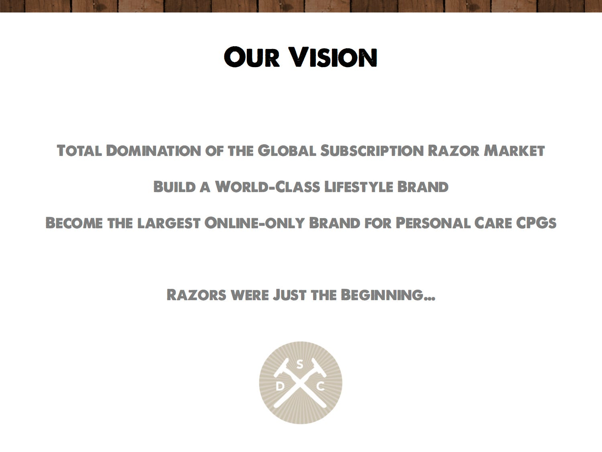
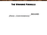

## Summary
This investor retrospective presents [[DollarShaveClub]] as a direct-to-consumer consumer-products company whose advantage combined subscription economics, founder-led content, customer data, convenience, value, and an expanding trusted brand. It credits [[MichaelDubin]] and his team with growing reported revenue from $7 million in year one to more than $150 million in year four, reaching more than three million customers and over 15% of U.S. men's razor-cartridge share before [[Unilever]] acquired the company. The article generalizes the case into [[FullStackConsumerBrands]], while remaining an enthusiastic, financially interested account rather than independent outcome analysis.

## Key Claims
- Direct customer relationships let a consumer brand learn from customer and usage data instead of depending entirely on retailers and broadcast advertising.
- Subscription works only for suitable categories and requires very low churn; the author gives a practitioner threshold of well under 5% monthly for success at scale.
- Founder-led content and conversation can create asymmetric marketing against incumbents whose customer knowledge and media mix are indirect.
- Dollar Shave Club aimed beyond razors from the outset: its pictured vision joins global subscription-razor leadership to a world-class, online-only personal-care lifestyle brand.
- The author reports revenue growing from $7 million to $20 million, $60 million, and more than $150 million over the first four years, alongside more than three million customers and over 15% U.S. men's razor-cartridge share.
- The proposed investment screen favors differentiated high-margin products, zero-sum replacement categories, retailer-dependent and broadcast-dependent incumbents, leaders unlikely to cannibalize their legacy model, and products that generate usable customer data.
- Team execution—not the launch video alone—is credited for operations, creative conversion, marketing, customer service, new-product adoption, software reliability, and margin expansion.

## Key Quotes
> "Razors were just the beginning" - the retained vision slide's statement of category-expansion intent.

> "We didn't see DSC as an 'e-commerce' company, but instead as a model for new full-stack consumer products companies." - the author's investment framing.

## Connections
- [[DollarShaveClub]] - central company case, reported growth trajectory, and full-stack consumer-brand model.
- [[MichaelDubin]] - founder credited with the initial vision, content instincts, ambition, and company leadership.
- [[Venrock]] - investor that led Dollar Shave Club's Series A and Series B rounds.
- [[Unilever]] - acquirer presented as supplying resources for global expansion.
- [[FullStackConsumerBrands]] - framework generalized from Dollar Shave Club's owned customer relationship, brand, products, data, and software.
- [[ContentLedAcquisition]] - the launch video and continuing conversation are treated as an asymmetric alternative to incumbent broadcast advertising.
- [[MicroBrandCommerce]] - related direct-to-consumer model, although this source emphasizes scaled category share rather than a long tail of narrow brands.
- [[CustomerLifetimeValue]] - low churn, repeat purchase, margin expansion, and product adoption determine whether subscription acquisition can compound.

## Contradictions
- No direct contradiction was found. The earlier growth-hacking source calls the company “One Dollar Shave Club” and reports a $600 million business within three years; this ingest normalizes the company name, while treating that figure as an unclear valuation or business-size claim rather than revenue because the present source reports $60 million of year-three revenue.
- The source's figures and causal interpretation come from an investor who led two financing rounds and benefited from the acquisition; it supplies no audited statements, cohort retention data, acquisition cost, acquisition price, or comparison against failed direct-to-consumer brands.
