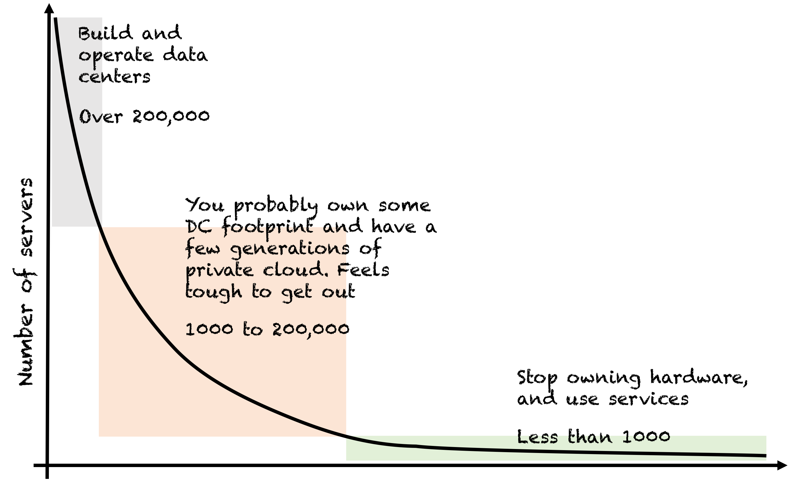

## Summary
This 2016 practitioner essay argues that most enterprises should leave owned data centers for public cloud rather than spend years building a private-cloud approximation. Its central mechanism is sequencing: private-cloud construction consumes engineering attention before stateless migration, difficult stateful modernization, and cloud-native cultural change, while incomplete total-cost comparisons hide that delay. A retained conceptual chart divides organizations by server count, but the thresholds are the author's unsupported strategic heuristic rather than measured breakpoints.

## Key Claims
- Enterprises should own and automate data centers only when exceptional scale or industry-specific infrastructure needs justify the capability; the essay proposes more than 200,000 servers as a rough threshold.
- Public cloud offers a growing portfolio of managed services, distributed-systems experience, and resiliency mechanisms that typical enterprise IT groups cannot reproduce quickly by combining infrastructure vendors.
- A private-cloud program can become a local optimum because it puts infrastructure construction ahead of workload migration, stateful-system modernization, and organizational change.
- Simple server-versus-VM price comparisons omit cloud engineering, network automation, procurement delay, lost agility, and opportunities deferred while an enterprise builds its own platform.
- Infrastructure shapes organizational behavior: programmable self-service environments can support autonomous iteration, while ticket-driven infrastructure can reinforce centralization, dependency, and control.
- The essay's TLS example claims that a cross-layer security change may take weeks or months through on-premises coordination but less than a week for an empowered public-cloud team.

## Key Quotes
> "You may be shooting for a local optimum with your private cloud strategy" - the essay's warning about optimizing the intermediate platform instead of the business outcome.

> "The state of infrastructure influences your organizational culture." - the link the author draws between operating environment and team behavior.

## Connections
- [[PrivateCloudStrategy]] - captures the build-versus-exit decision, migration sequence, total-cost boundary, and cultural effects argued in the essay.
- [[EnterpriseCloudMigration]] - treats departure from on-premises infrastructure as a workload and operating-model transition rather than only a hosting move.
- [[CloudCostOptimization]] - connects direct infrastructure prices to engineering labor, delay, agility, and opportunity cost.
- [[TechnologyTransitionStrategy]] - private cloud is presented as a potentially permanent bridge that delays commitment to the destination architecture.
- [[DevOpsCulture]] - the source argues that programmable self-service infrastructure and ticket-driven infrastructure create different autonomy and coordination conditions.

## Contradictions
- The 200,000-server and 1,000-server boundaries are asserted without a dataset, workload model, or sensitivity analysis; the retained image is a conceptual segmentation with an unlabeled horizontal axis, not empirical evidence.
- The claim that public cloud can handle nearly every use case is a 2016 strategic position. Regulation, sovereignty, latency, disconnected operation, specialized hardware, predictable utilization, concentration risk, sunk assets, and migration constraints can justify private or hybrid infrastructure.
- The cost comparison uses illustrative server and monthly VM prices but supplies no matched configuration, utilization, discount, depreciation, staffing, transfer, compliance, reliability, or migration model.
- The cultural and TLS-cycle-time claims are plausible first-person observations rather than controlled comparisons; public cloud does not by itself create autonomy, good architecture, security, or reliable delivery.
- Three embeds depict the same server-count chart at different resolutions, so only the highest-resolution copy was retained. Two other embedded files are just 60×31 and 60×4 pixels; their labels and meaning cannot be recovered reliably, so they were omitted and the source is not treated as a complete visual ingest.
