## Summary
[[AndreasKlinger]] describes a personal [[Gmail]] workflow that turns special stars into explicit email states—action needed, awaiting reply, delegated, and scheduled—and exposes those states in search-backed side panels while the ordinary inbox is archived to zero. The method combines rapid triage, follow-up visibility, bulk archiving, filters, keyboard shortcuts, auto-advance, undo send, and account consolidation, but its screenshots document an older Gmail interface and some named settings or extensions may no longer exist in the same form.

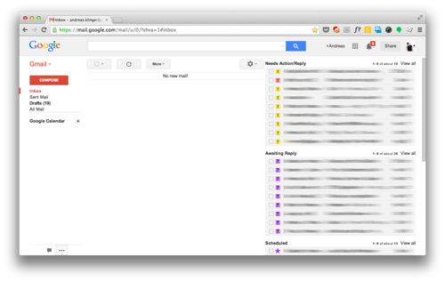

## Key Claims
- [[EmailTaskManagement]] can move actionable messages out of the inbox without losing them by assigning each thread a visible state and surfacing that state through saved searches or multiple inbox panels.
- The daily loop is: handle short messages immediately, mark deferred work, mark sent messages that require follow-up, archive processed threads, and let new replies return to the inbox.

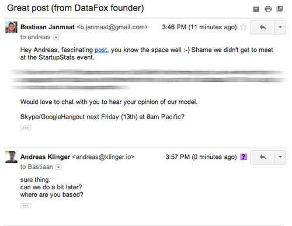

- The configuration uses Gmail's historical Multiple Inboxes lab, special stars, search queries, and right-side panels; the author's example combines `has:yellow-bang OR has:red-bang` for action, `has:purple-question` for awaited replies, `has:purple-star` for scheduled items, and `has:orange-guillemet` for delegated work.

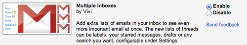

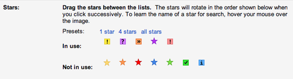

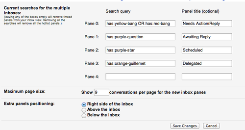

- The historical setup requires the default inbox, disabled importance overrides, minimal category tabs, and a compact layout so the side panels remain visible.

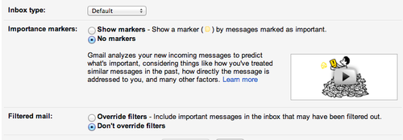

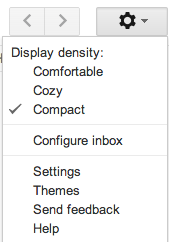

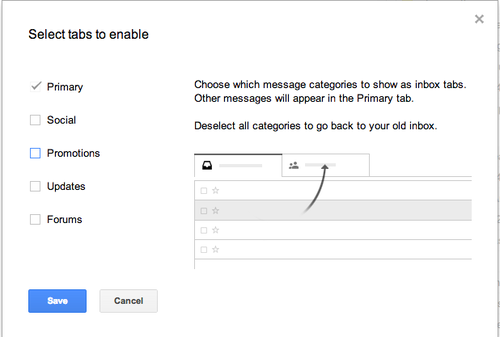

- A first-time reset can classify the recent pages of messages, apply action or follow-up states, then bulk-archive the remaining backlog; this clears the inbox without claiming that every old message was individually completed.

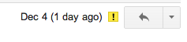

- Repetitive mail should be reduced or automated through unsubscribing and filters, including skip-inbox rules, labels, and forwarding where appropriate.

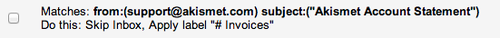

- Keyboard shortcuts and auto-advance reduce per-message handling overhead, while undo send adds a short recovery path after sending.

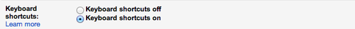

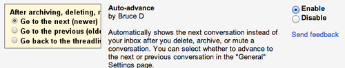

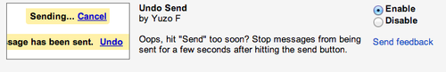

- Multiple accounts can be consolidated into one inbox if outbound mail uses the appropriate SMTP identity and replies default to the address that received the message.

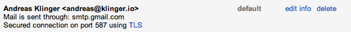

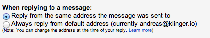

## Key Quotes
> "All done with 0 plugins, using only standard gmail features" - on implementing the core triage system with built-in Gmail controls.

> "You archive all emails" - on separating inbox arrival from the state of actionable work.

> "Now your inbox should at zero and your right areas full." - on moving visible work from the inbox into explicit state panels rather than erasing obligations.

## Connections
- [[AndreasKlinger]] - author and long-term user of the workflow.
- [[Gmail]] - product whose stars, search, filters, multiple inboxes, and account settings implement the method.
- [[EmailTaskManagement]] - broader practice of representing email as action and follow-up states rather than leaving every message in one queue.
- [[PersonalProductivity]] - the workflow externalizes tasks, delegation, waiting, and scheduled commitments.
- [[AttentionManagement]] - archiving and filtering reduce the number of messages competing in the default inbox.
- [[CommunicationMultitasking]] - the method organizes processing but does not by itself determine how often email should interrupt focused work.
- [[WorkHabits]] - rapid handling, state assignment, archiving, and follow-up review form a repeated operating loop.

## Contradictions
- [[blog-jeff-huang-my-productivity-app-is-a-never-ending-txt-file]] also uses a small email-flag system but explicitly does not make inbox zero the main goal; together the sources support explicit action states more strongly than any universal requirement to empty the inbox.
- The screenshots show an older Gmail product state, including Labs and historical Multiple Inboxes controls. They support the described workflow but should not be treated as current setup instructions without checking today's interface.
