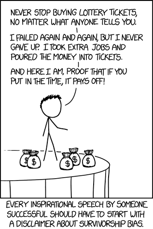
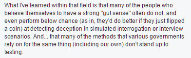

## Summary
SJO argues that motivational gurus turn visible winners into proof that belief, hustle, persistence, or intuition reliably causes success while hiding failed attempts, structural opportunity, and luck. The essay replaces unconditional perseverance with evidence-sensitive judgment: hard work is a baseline rather than a sufficient cause, practice quality matters, intuition must be trained through experience and feedback, and quitting can be rational when accumulated evidence no longer supports the current path. Its examples are polemical and selectively chosen, so they illustrate the mechanism without measuring how common guru harm is or establishing a universal stopping rule.

## Key Claims
- [[SurvivorshipBias]] makes a winner's visible effort, personality, and advice look causal because people who acted similarly and failed are far less visible.
- Hard work may be necessary for many forms of success but is not sufficient; birthplace, access, timing, talent, market conditions, and other opportunities materially affect outcomes.
- Persistence should respond to evidence. Repeating one approach for years is not automatically virtuous, while quitting a weak path can preserve resources for a better one.
- The popular 10,000-hour rule suppresses variation, practice quality, and people who practiced extensively without becoming elite; [[DeliberatePractice]] is more specific than accumulated time.
- Intuition is not an independent substitute for knowledge. Useful judgment develops from experience, precise practice, data, and feedback loops.
- Guru narratives can cause financial and psychological harm by encouraging high-risk leaps without a plan and making unsuccessful followers blame insufficient belief or effort.

The essay uses Tony Zaza's reported bicycle move from Detroit to Florida as an example of a dramatic commitment undertaken without a clear operating plan.

The adjacent monetization prompt supports the author's narrower criticism that inspirational attention can be converted directly into sales messaging.

The retained researcher quotation supplies the article's only concrete evidence against treating untrained intuition as reliable in a specialized judgment task.

## Key Quotes
> "Hard work is a necessary condition for success, not a sufficient one." - on why effort cannot explain outcomes by itself.

> "Your gut is something you train." - on intuition as learned judgment rather than innate authority.

> "It's OK to quit." - on revising a commitment after gaining evidence.

## Connections
- [[SurvivorshipBias]] - central error behind treating selected winners as proof of universal success formulas.
- [[LuckAndEffortInSuccess]] - connects effort with unequal opportunity, timing, talent, and other uncontrollable conditions.
- [[AdaptivePersistence]] - distinguishes learning and course correction from repeating the same behavior indefinitely.
- [[MetacognitiveFeedback]] - explains how data, practice, and feedback can train rather than merely obey intuition.
- [[DeliberatePractice]] - qualifies elapsed practice time by the structure and quality of the practice.
- [[RepeatableLearningFromHistory]] - asks which parts of a success story can transfer beyond the winner's circumstances.

## Contradictions
- The essay directly rejects motivational claims that wanting an outcome, working hard, persisting, or trusting one's gut is sufficient for success; existing wiki syntheses already qualify those claims through structural opportunity, luck, feedback, and changing direction.
- Its attack on gurus is broader than its evidence. The article supplies anecdotes, screenshots, linked commentary, and one quoted researcher, but no representative sample of coaches, followers, outcomes, or interventions.
- Its statement that data or science is the signal is directionally useful but too absolute: data can be incomplete, biased, noisy, or badly interpreted, and experienced intuition may encode relevant knowledge before it can be verbalized.
