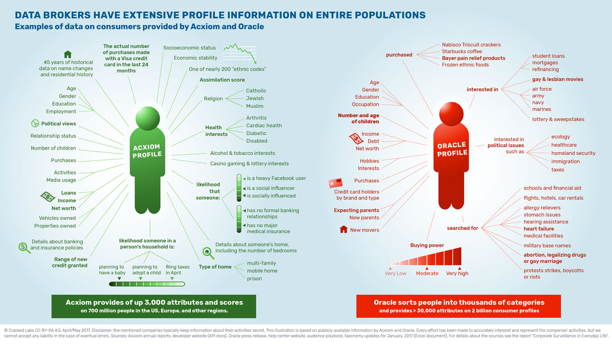
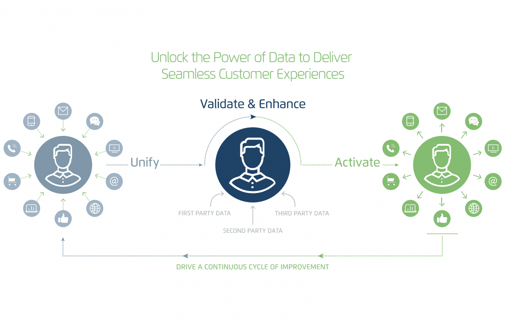
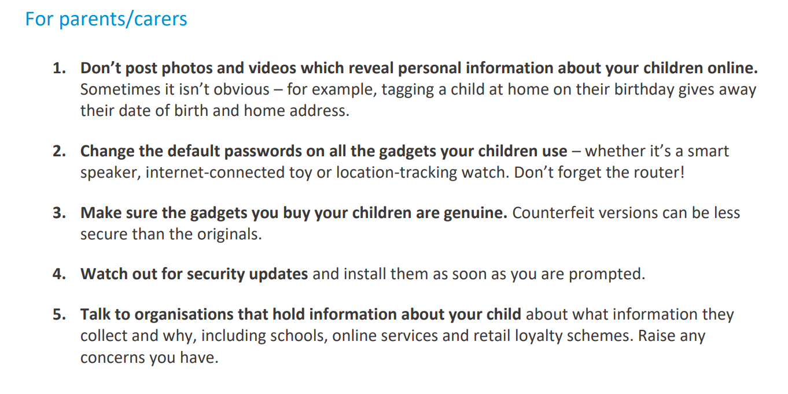

## Summary
The article argues that [[Sharenting]] gives platforms and data brokers material for a child's commercial profile before the child can consent, sometimes beginning before birth through parents' searches, purchases, relationships, and posts. Photos can expose birth dates, homes, schools, interests, relationships, device metadata, and security-question answers; combined or inferred data may then affect advertising, identity fraud, and consequential decisions. The author ultimately favors not sharing, while acknowledging that carefully governed uses of children's data can support public benefits such as identifying abuse risk.

## Key Claims
- A child's digital profile can begin before birth through the parents' browsing, purchases, reading, and social relationships, even without a post explicitly naming the child.
- Birthday, home, school, street-sign, location, device, and event details in family photos can reveal identity, routine, interests, and answers to common security questions.
- Platforms and brokers combine volunteered, observed, “given off,” and inferred data into profiles that may be inaccurate yet still used for targeting or decisions about credit, insurance, education, mortgages, or bail.
- The retained broker comparison attributes Acxiom and Oracle profiles with wide demographic, household, financial, health, search, purchase, political, and behavioral coverage rather than only direct identifiers.
- The retained Acxiom diagram depicts a continuous commercial cycle: unify signals from many channels, validate and enhance them with first-, second-, and third-party data, activate the resulting profile across channels, and feed responses back into the system.
- Oversharing may create identity-fraud risk when names, birth dates, addresses, schools, pets, vehicles, and family facts can be assembled over time.
- Children's data can have beneficial uses, but good intentions do not remove persistence, abuse, error, security, proportionality, and accountability risks.

## Key Quotes
> “Everything you do, however innocent it might seem, just adds up.” — on cumulative profiling

> “The easiest way ... is just don’t share.” — the author's precautionary conclusion

## Connections
- [[Sharenting]] — central practice whose privacy and consent risks the article examines.
- [[DataFactories]] — explains how many family, platform, broker, and device inputs become inferred profiles and decisions.
- [[Acxiom]] — data broker used to illustrate profile breadth and cross-channel activation.
- [[ChildrensCommissioner]] — institution whose report supplies the article's statistics, risk framing, and practical guidance.
- [[Facebook]] — named platform that can extract or infer information from family posts.
- [[Google]] — named platform and ecosystem participant in pre-birth and later profiling.
- [[Amazon]] — named company within the wider data-collection environment around families.
- [[Oracle]] — broker-profile example in the retained Cracked Labs comparison.
- [[IdentityResolution]] — mechanism for joining fragmented activity to a durable person-level profile.
- [[LocationDataPrivacy]] — risk created when photos or device metadata disclose home, school, or movement.
- [[AlgorithmicDecisionOpacity]] — downstream problem when assembled profiles influence consequential decisions without a contestable explanation.
- [[DataBrokerPersistence]] — related risk that copied or inferred records can remain available long after collection.

## Contradictions
- The author's categorical “don't share” conclusion is more restrictive than the article's own acknowledgment that not all data or collectors are equivalent and that governed analysis can protect children; the source does not compare selective-sharing controls with total abstention.
- The article treats profiling effects on mortgages, insurance, universities, and bail as plausible serious risks, but it does not trace a specific child's social-media data through a broker into a documented adverse decision.
- The cited claim that parents post 1,300 photos and videos by age thirteen is presented through a report rather than with the underlying study design, sample, or uncertainty.
- The discussion is a 2018 journalistic argument. It does not establish later regulation, enforcement, platform behavior, broker inventories, or the present effectiveness of GDPR rights.

## Image Notes
All five local embeds were opened. The two lead images are decorative variants of the same family photograph and were omitted. Three evidence-bearing images were retained once at their semantic positions: the Acxiom/Oracle attribute comparison, Acxiom's unify–enhance–activate cycle, and the Children's Commissioner guidance for parents and carers.
