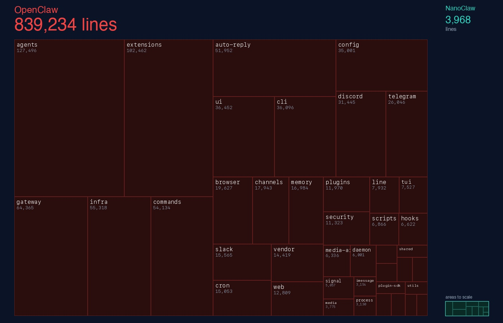

## Summary
[[GavrielCohen]] presents [[NanoClaw]] as an agent runtime designed around distrust: ephemeral per-agent containers, unprivileged execution, explicit mounts, read-only application code, and group-level separation are meant to contain a compromised or misbehaving agent. The vendor-authored comparison argues that [[OpenClaw]] relies too heavily on application checks, a shared optional sandbox, and a large difficult-to-audit codebase, while NanoClaw keeps a small core and adds reviewed functionality through [[LLMToolingSkills|skills]]. The article supports infrastructure-enforced containment but does not independently establish either product's security, and its prose and embedded treemap report materially different OpenClaw line counts.

## Key Claims
- AI agents should be treated as untrusted because prompt injection, hallucination, compromise, or unforeseen behavior can turn legitimate tool access into harmful action.
- [[NanoClaw]] gives each agent an ephemeral container, separate filesystem and session history, an unprivileged user, and only explicitly mounted directories.
- A mount allowlist outside the project, default blocks for sensitive paths, and read-only host application code add defense in depth without making the agent responsible for enforcing its own boundary.
- Group isolation is intended to prevent participants in one non-main chat from accessing other groups' data, messaging other chats, or scheduling work for them.
- [[OpenClaw]] is criticized for direct host execution by default and, when its optional sandbox is enabled, for placing multiple agents in one shared container.
- The source argues that small, reviewable cores plus opt-in skill code reduce attack surface compared with monolithic installations containing dormant integrations.
- Agent safety should be enforced outside the model through isolation and narrow capabilities; permission prompts and allowlists remain secondary controls rather than a hermetic boundary.

## Key Quotes
> "Don't trust the agent. Build walls around it." - the article's containment principle.

> "Security has to be enforced outside the agentic surface" - on making safety independent of model compliance.

## Connections
- [[GavrielCohen]] - author and NanoClaw builder making the comparative security case.
- [[NanoClaw]] - project whose isolation and small-core design the article advocates.
- [[OpenClaw]] - comparison target for host execution, shared isolation, complexity, and auditability claims.
- [[AgentPermissionModel]] - the article places permission checks behind infrastructure-enforced containment.
- [[ProductionAgentInfrastructure]] - per-agent ephemeral isolation narrows process, filesystem, and cross-agent blast radius.
- [[LLMToolingSkills]] - proposed mechanism for adding only reviewed integrations to a small installation.

## Contradictions
- The article's prose says OpenClaw has nearly half a million lines and more than 70 dependencies, while the embedded treemap labels OpenClaw as 839,234 lines and NanoClaw as 3,968 lines. The counting date, method, generated or vendored-code treatment, and dependency scope are not supplied.
- The claim that a container boundary cannot be escaped is stronger than the evidence presented. Container security still depends on the host kernel, runtime, configuration, mounted data, credentials, network access, and external side effects.

