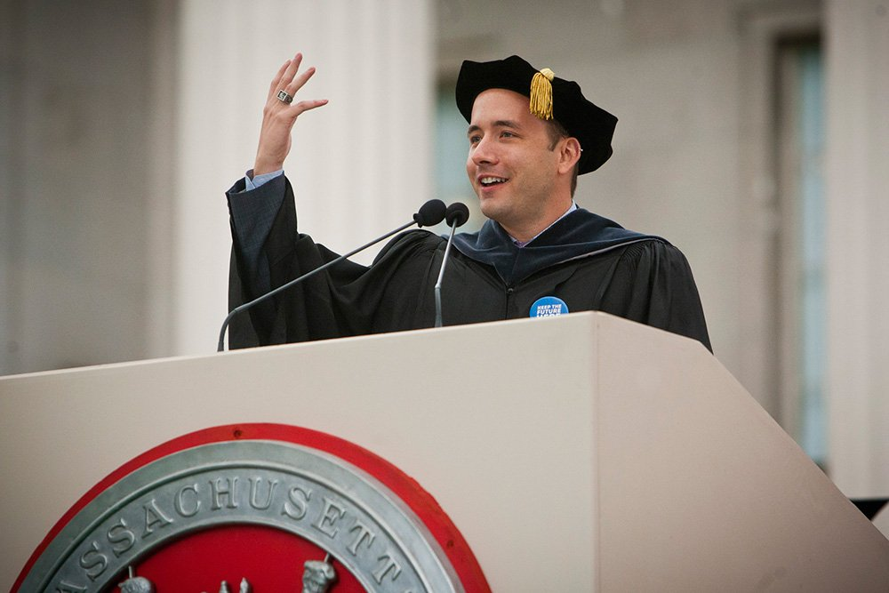

## Summary
In his 2013 [[MIT]] commencement address, [[DrewHouston]] offers a three-part life and career heuristic: find an important problem that pulls attention like a tennis ball, choose a formative circle of peers and heroes, and remember that a finite life rewards starting before one feels ready. His stories about Accolade, a poker bot, and [[Dropbox]] frame career direction as discovery through action rather than execution of a fixed post-graduation plan. Reader comments qualify the speech by challenging its proximity to elite, financially successful Silicon Valley narratives and arguing that meaningful work, relationships, and adventure can take other forms.

## Key Claims
- Durable effort often comes from being pulled by an exciting, important problem rather than repeatedly forcing discipline onto work that does not fit.
- A person's close peers, collaborators, heroes, and geographic environment can shape standards, opportunity, and ambition.
- After formal schooling, action and exposure to real consequences can teach faster than indefinite preparation.
- Mistakes need not accumulate like grades; in reversible work, failure can be evidence that enables faster learning and correction.
- Because life is finite, optimizing for a flawless record can be less valuable than building an interesting, self-directed life.
- [[Dropbox]] emerged from an initially distracting problem and was shaped by Houston's [[MIT]] relationships, including cofounder Arash Ferdowsi.

## Key Quotes
> "It's about finding your tennis ball, the thing that pulls you." - on problem-driven motivation.

> "The fastest way to learn is by doing." - on beginning before complete readiness.

> "Instead of trying to make your life perfect, give yourself the freedom to make it an adventure" - on finite time and experimentation.

## Connections
- [[DrewHouston]] - speaker reflecting on his path from MIT student and Accolade founder to Dropbox cofounder.
- [[MIT]] - venue, alumni community, and formative peer environment for the address.
- [[Dropbox]] - company Houston describes as his most exciting, fulfilling, frustrating, and painful learning environment.
- [[CareerPlanning]] - the speech rejects a fully knowable grand plan in favor of discovering direction through attention, action, and feedback.
- [[DeliberateNetworkBuilding]] - the “circle of five” and location advice treat peers, heroes, and place as a formative environment.
- [[ProlificPractice]] - starting before readiness turns concrete attempts and mistakes into learning.
- [[AdaptivePersistence]] - failure matters when it supports another attempt rather than permanent self-judgment.

## Contradictions
- No direct contradiction with existing wiki content. The speech reinforces experimental career planning, deliberate network choice, and learning by doing.
- Several reader comments dispute the address's implied success model, arguing that it overweights wealth, elite institutions, Silicon Valley, relentless work, and career achievement relative to ordinary relationships and forms of meaning outside the technology fast lane.
- The address is autobiographical and motivational rather than comparative evidence. Its “circle of five,” geographic concentration, 30,000-day estimate, and claim that failure does not matter are memorable heuristics, not universal findings; financial, health, family, structural, ethical, and irreversible-risk constraints can make experimentation much less forgiving.
