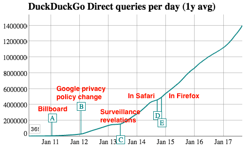

## Summary
Gennaro Cuofano presents [[DuckDuckGo]] as a privacy-oriented hybrid search engine and as a startup-growth case built around [[GabrielWeinberg]]'s experimentation, [[HackerNews]] community, and staged channel selection. The article connects privacy-preserving keyword advertising, instant answers, the [[BullseyeFramework]], and external events such as Google's privacy-policy change and the Snowden revelations to DuckDuckGo's early traction. Its business, traffic, market-share, and valuation figures are historical 2011–2017 snapshots, and the valuation discussion is explicitly speculative.

## Key Claims
- Weinberg moved from many side projects toward search, launched DuckDuckGo alone in September 2008, and used Hacker News feedback to improve the early product.
- DuckDuckGo combined its own crawling with outside sources, emphasized instant answers, and differentiated itself through [[PrivacyPreservingSearch]] rather than personalized tracking.
- The [[BullseyeFramework]] starts by considering all plausible channels, cheaply tests the most promising ones, then concentrates resources on the channel or channels that move the current growth stage.
- The article attributes successive growth inflections to community discovery, a 2011 privacy billboard, Google's 2012 privacy-policy change, the 2013 surveillance revelations, and inclusion in Safari and Firefox.

- DuckDuckGo's reported revenue model used keyword-context advertising and affiliate commissions, supporting the claim that search advertising need not depend on persistent behavioral profiles.
- Community support can contribute more than launch attention: early users supplied encouragement, product feedback, browser plugins, open-source work, and a path to later audiences.
- Switching costs remain substantial because incumbent quality, learned search habits, integrations, and ecosystem dependence can outweigh privacy motivation for many users.

## Key Quotes
> "ask first, what’s possible. Then, what’s probable. Eventually, stick with what’s working" - the article's compressed description of the Bullseye process.

> "you don’t need to track people to make money with advertising" - the privacy-oriented revenue claim attributed to Weinberg.

## Connections
- [[DuckDuckGo]] - company and search product at the center of the case.
- [[GabrielWeinberg]] - founder whose prior exit, side-project search, launch, and traction framework shape the narrative.
- [[BullseyeFramework]] - channel-discovery method presented as a repeated outer-ring, test, and focus cycle.
- [[GrowthHacking]] - stage-specific channel experimentation and concentration are the article's main growth lesson.
- [[PrivacyPreservingSearch]] - search and advertising model designed to limit stored personal data and search leakage.
- [[HackerNews]] - early launch community that supplied feedback, encouragement, extensions, and initial distribution.
- [[Google]] - incumbent comparator whose scale, advertising model, privacy policy, and entrenched user habits define the competitive context.

## Contradictions
- The article alternately says privacy was not DuckDuckGo's original mission, says it became a focus in 2007 before the 2008 launch, and includes an early user who remembers privacy being prominent before Snowden. The safest synthesis is that privacy was an early concern whose public salience and growth importance increased over time, not that it appeared only in 2013.
- The growth-stage chart and narrative align events with an aggregate query curve but do not isolate causal effects from continuing product work, publicity, browser defaults, general privacy awareness, or other channels.
- Traffic, market share, revenue, funding, and valuation estimates describe an older period. In particular, the article's US$500 million and possible US$1 billion valuation discussion is third-party speculation rather than a transaction or audited valuation.
