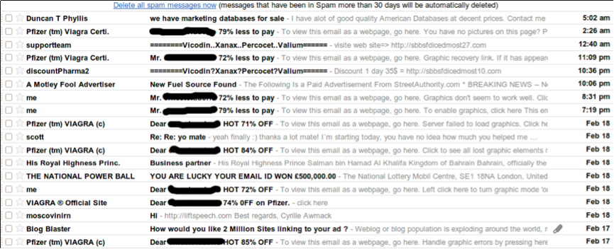
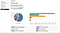
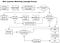
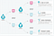

## Summary
[[AndreiRebrov]] presents [[Scentbird]]'s email program as a data and software system rather than a volume-only marketing channel. He separates mass campaigns from personalized trigger and drip messages, then connects segmentation, sender reputation, rendering quality, event and customer-state data, scheduled jobs, queues, monitoring, and synchronized unsubscribe state into one operating model. The article is a historical 2016 practitioner account whose product choices, prices, limits, and deliverability advice require current verification.

## Key Claims
- [[EmailLifecycleAutomation]] should use customer events and current flow state to send relevant messages, resume abandoned journeys, and avoid duplicate sends.
- Mass and trigger email need different execution paths: campaigns target segments, immediate transactional messages follow events, and scheduled drip messages try to return customers to an unfinished flow.
- [[ProductUserSegmentation]] can use acquisition source, region or time zone, subscription status, tenure, and engagement, but each segment should reflect the business and message purpose.
- [[EmailDeliverability]] depends on content, payload size, responsive HTML, link integrity, authenticated sending, domain or IP reputation, bounce and complaint handling, and recipient engagement—not copy alone.

- Scentbird's historical mass-email stack used self-hosted [[Sendy]] with Amazon SES, API-driven list updates, cron jobs, and SNS handling for bounces and complaints.

- Reliable drip execution needs independently controllable schedules, idempotent recipient marking, isolation from the main application, and separate queues for latency-sensitive transactional mail and large drip batches.

- Unsubscribe state should distinguish required transactional messages from optional marketing and remain synchronized across trigger and mass-mail systems.
- More sending can create short-term conversions while degrading long-term reach through unsubscribes, spam complaints, filters, disengagement, and damaged sender trust.

## Key Quotes
> "Email marketing is not about sending X amount of emails to bring Y clients" - Rebrov's argument for treating the channel as a data system.

> "Treat as a product" - the article's final operating principle for email quality and improvement.

## Connections
- [[AndreiRebrov]] - Scentbird CTO and author describing the company's 2016 email architecture and practices.
- [[Scentbird]] - company whose mass and trigger email systems provide the case.
- [[Sendy]] - self-hosted campaign tool used with Amazon SES for mass email.
- [[EmailLifecycleAutomation]] - connects customer state, message purpose, schedules, queues, and suppression rules.
- [[EmailDeliverability]] - covers the article's content, authentication, reputation, and list-health controls.
- [[EmailMarketingAtScale]] - links campaign growth to operational limits, queueing, monitoring, and reputation risk.
- [[MarketingOperations]] - campaign execution depends on data, measurement, configuration, and cross-system coordination.
- [[ProductUserSegmentation]] - campaign audiences are divided by source, geography, relationship, tenure, and engagement.
- [[Mailchimp]] - Scentbird's earlier mass-mail tool, replaced in this account because of perceived startup cost.

## Contradictions
- No direct contradiction identified. The source qualifies volume-led email growth by arguing that excess frequency can reduce future reach and sender trust.
- The article's concrete vendor pricing, performance estimate, cron configuration, authentication details, and Mandrill policy are historical 2016 advice rather than current implementation guidance.
