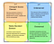

## Summary
[[AlexDanco]] proposes [[EmergentLayerTheory]] as a non-deterministic way to interpret explosive company growth. The framework joins a supply-side transition from scarcity through scalable abstraction to abundance with a demand-side transition from an overserved lower-order [[JobsToBeDone|job]] to an underserved higher-order one; incumbents lose their old friction-based profit pool while entrants that master the next scarce resource can gain power. WhatsApp, Tesla, Uber, Medium, Intel, Google, the iPhone, and especially [[Amazon]] serve as retrospective illustrations rather than comparative proof.

## Key Claims
- Explosive growth can follow when a scalable abstraction removes a scarce constraint that had prevented customers from reaching a higher-order job.
- Competition around the old constraint can overserve customers on features, saturation, or expense while leaving the underlying reason for use underserved.
- Removing the constraint makes the old performance measures and friction-based profit pools less valuable, encouraging incumbents to retreat upmarket while power shifts to the new layer.
- Abundance does not eliminate scarcity: it relocates advantage to a new bottleneck such as network effects, standards, routing, intent data, an ecosystem, or integrated infrastructure.
- Founders may discover the transition accidentally, as the article argues for Google and Uber, or pursue it deliberately through a capability-building playbook.
- [[Amazon]] is the most developed deliberate case: it converts internal costs and capabilities into reusable primitives, uses them to serve higher-order needs, and can progress from first-party wedge to service, moat, marketplace, and platform.
- The framework is intended for interpretation after unusual growth appears, not as a formula for predicting winners.

## Key Quotes
> "A new abstraction at level i eliminates some constraint, which previously prevented customers from being served at level j+1." - the article's compressed account of the transition.

> "Sometimes this process occurs randomly and unintentionally; other times it is done by design." - qualification on founder intent.

## Connections
- [[AlexDanco]] - author combining scarcity, abstraction, customer over-service, and higher-order jobs into the framework.
- [[EmergentLayerTheory]] - central interpretive model developed by the article.
- [[JobsToBeDone]] - demand-side lens distinguishing an overserved immediate job from an underserved higher-order purpose.
- [[ProductMarketFit]] - Danco calls alignment between the supply and demand transitions “mega product-market fit,” but offers no prospective test.
- [[FirstAndBestCustomer]] - Amazon's internal use and stress-testing of abstractions anticipates the anchor-demand mechanism.
- [[Amazon]] - main deliberate case spanning publishing, logistics, cloud infrastructure, Prime, entertainment, and voice commerce.
- [[WhatsApp]] - messaging example in which mobile data makes communication abundant and platform network effects become scarce.
- [[Tesla]] - identity-signaling example in which a premium electric vehicle serves a social and emotional job beyond transport specifications.
- [[Uber]] - marketplace example in which platform-mediated trust and liquidity connect transport and earning needs.
- [[Medium]] - publishing example in which feed-based discovery attempts to serve writers' need for readers and readers' need for relevant material.
- [[Google]] - search example in which PageRank makes web indexing scalable while intent understanding becomes strategically scarce.
- [[Apple]] - iPhone example in which mobile computing becomes widely available while the iOS ecosystem and integrated hardware become new control points.

## Contradictions
- The essay repeatedly presents selected success stories through the framework without failed cases, comparison groups, operational definitions, or a prospective falsification test; the same histories may admit other causal explanations.
- “Mega product-market fit,” natural-monopoly, incumbent-obsolescence, and winner-take-all language is rhetorical and retrospective. The article does not show that rapid growth implies durable economics, broad welfare gains, or permanent control of the next bottleneck.
- Several claims are bounded to April 2016, including competitive assessments of Tesla, Uber, Medium, Amazon, mobile ecosystems, and search. They should not be read as current company evaluations.
- The retained framework image is only 60×49 pixels in the supplied source. Its quadrant structure is visible, but the embedded text is too degraded for independent transcription; the surrounding prose supplies the usable content.
