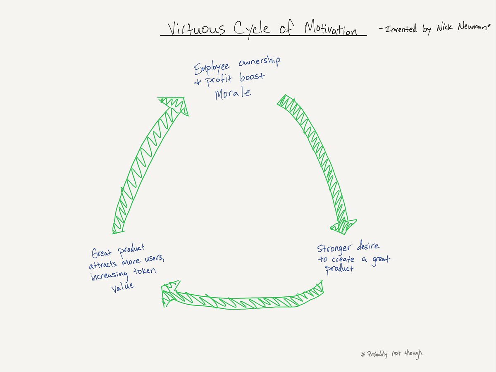

## Summary
[[NickNeuman]] argues that tradeable protocol or application tokens could give startup employees earlier liquidity, voluntary exposure after formal grant pools are exhausted, and an internal medium for peer rewards and task exchange. His 2017-2018 essay's proposed [[TokenizedEmployeeIncentives]] combine ownership, morale, product effort, adoption, and token value into a reinforcing loop, while [[EmployeeEquityRisk]] shifts rather than disappears: immediate trading can promote short-term price management, weak tokens may be illiquid, employee purchases put wages and capital at risk together, and insider-trading rules were unresolved in the source's period.

## Key Claims
- Stock options depend on board grants and a future liquidity event, while actively traded tokens could become saleable soon after creation, subject to vesting and lockups.
- Faster liquidity may attract blockchain talent but can shorten the incentive horizon by rewarding marketing and price increases before durable product value exists.
- Long vesting schedules, mission-aligned hiring, and emphasis on sustainable product use are proposed as safeguards against employee short-termism.
- Later employees could buy tokens from early employees or on public markets, creating exposure to company success without another company-granted option allocation.
- An internal token market could support peer payments, vacation coverage, project bonuses, or project staking, with blockchain visibility providing traceability but not replacing supervision.
- Employees who purchase tokens take direct downside risk; the essay hypothesizes that loss aversion may motivate them more strongly than recipients of free grants.
- The model depends on continued token value and adequate market liquidity, and it leaves taxation, securities treatment, insider trading, privacy-coin evasion, and decentralized-exchange enforcement unresolved.

## Key Quotes
> "participation becomes an individual choice" - on employees buying exposure rather than relying only on a company grant.

> "In a small and fragile startup, short-termism can be a deathblow." - on the danger of liquid employee incentives.

## Connections
- [[NickNeuman]] - author and creator of the retained motivation-cycle diagram.
- [[TokenizedEmployeeIncentives]] - central model combining liquid compensation, voluntary ownership, internal exchange, and governance risk.
- [[EmployeeEquityRisk]] - token liquidity removes one stock-option constraint while adding price, concentration, conduct, and regulatory risks.
- [[WorkplaceIncentiveDesign]] - the proposed token system changes the reward horizon and enables peer-to-peer task payments.
- [[InternalMarketManagement]] - internal token trades and task payments resemble a market for work and organizational resources.
- [[StartupEquityTransparency]] - employees need intelligible vesting, lockup, liquidity, price, and legal-risk disclosures before treating tokens as compensation.
- [[LossAversion]] - invoked as a hypothesized reason purchased tokens may motivate more than granted tokens.

## Contradictions
- The article's “immediate” liquidity claim is conditional: vesting, lockups, exchange access, market depth, and legal restrictions can prevent or degrade saleability.
- Its virtuous-cycle diagram and loss-aversion claim are mechanisms proposed by the author, not measured employee-outcome evidence; ownership can also concentrate financial risk and encourage short-term token-price behavior.
- The essay reflects late-2017 regulatory uncertainty. Its statement that there were no SEC rules for employee token insider trading should not be treated as current legal guidance.
- Transparent on-chain transfers can improve auditability, but pseudonymous addresses, off-chain arrangements, privacy tools, and unclear identity linkage limit the claim that all internal payments would be visible to everyone in the company.

## Image Notes
- Retained the hand-drawn “Virtuous Cycle of Motivation” because it makes the essay's causal model explicit: ownership and profit improve morale, morale strengthens product-building motivation, and product quality and adoption raise token value.
- Omitted the 30×22-pixel duplicate/thumbnail embedded near the internal-trading discussion because it contains no legible independent evidence.
