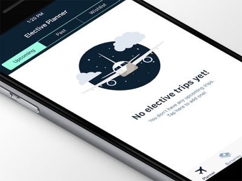
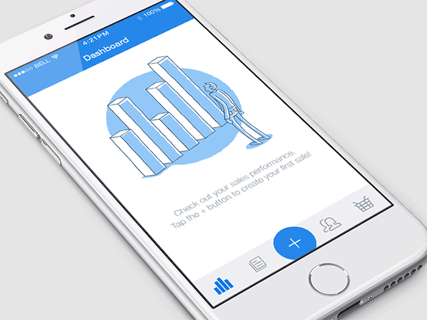
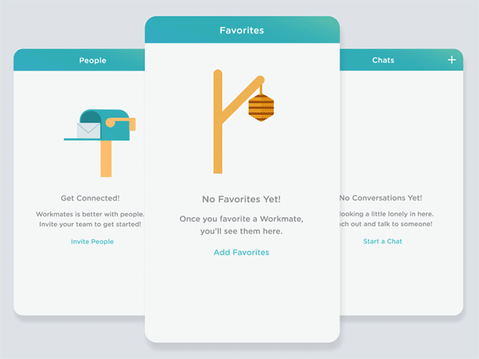

## Summary
[[NickBabich]] argues that an [[EmptyStateDesign|empty state]] is a functional product surface rather than leftover blank space: it should explain the current state, set expectations, and direct the user toward a useful next action. He groups successful treatments around education, delight, and prompting action, while distinguishing first use, failure, and user-cleared states. The article is a 2016 practitioner essay supported by selected mobile examples, not comparative evidence that these treatments cause retention.

## Key Claims
- Empty states occur during first use, errors, and after users remove content, and each state needs context appropriate to why no content is visible.
- A useful empty state explains what belongs in the section, where the user is, and what action or event will make content appear.
- Education, emotional tone, and action prompting are complementary goals, but clarity and recovery matter more than decorative personality when the user is blocked.
- Empty states can work like miniature landing pages: concise copy, a simple visual, a benefit, and one prominent call to action can move users toward value.
- Error states should explain what happened and how to recover rather than showing a generic failure message.
- When emptiness follows a completed or destructive user action, the response should acknowledge that context rather than treating every blank screen as first-time onboarding.

## Key Quotes
> “Think of an empty state as a miniature landing page.” — framing for combining explanation and one next action

> “UX is the sum of all parts working harmoniously.” — reason not to treat temporary states as peripheral design work

## Connections
- [[NickBabich]] - author of the empty-state design guidance.
- [[EmptyStateDesign]] - the article’s central pattern for informative, contextual, and actionable blank screens.
- [[FirstMileProductExperience]] - first-use empty states help newcomers understand purpose, expected content, and the next action.
- [[ProductFlowFriction]] - a direct recovery or creation action can reduce uncertainty and detours, while vague errors add cognitive effort.
- [[ProductLedRetention]] - the source proposes first impressions as a retention lever but does not isolate their causal effect.
- [[BehaviorDesign]] - motivation, prompting, and feedback shape whether users act from an empty screen.

## Contradictions
- No direct contradiction was found. The article strengthens [[FirstMileProductExperience]] while broadening empty states beyond onboarding to errors and user-cleared content.
- The opening 77% three-day and roughly 80% thirty-day loss figures are attributed to external mobile-retention analysis and are not substantiated within this source; cohort, app category, metric definition, and study period are unspecified here.
- The examples are curated illustrations rather than controlled comparisons. Humor, animation, emotional imagery, and a single call to action may distract, exclude, or misdirect when recovery is complex, accessibility needs differ, or several next steps are legitimately important.
- All 12 unique local image files were opened. Three legible, evidence-bearing product examples were retained at their semantic positions; eight 34–60-pixel thumbnails were too small for reliable independent interpretation, and one thumbnail duplicated the retained trip-planner image.
