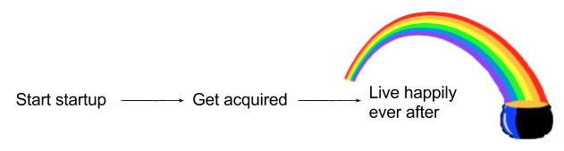
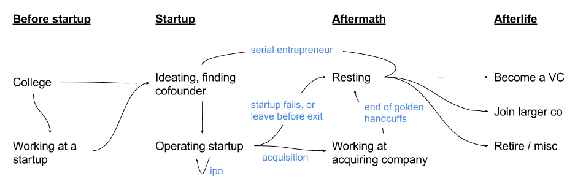

## Summary
[[AdamSmith]] argues that founders should plan across an entrepreneurial career rather than treating one startup acquisition as a permanent happy ending. The article and its diagrams replace a linear startup-to-exit story with branching paths through operating, failure or departure, acquisition employment, rest, another startup, venture capital, a larger company, or retirement, while preferring durable company-building without claiming one path is universally best.

## Key Claims
- [[EntrepreneurialCareerPaths]] should be planned beyond the horizon of a single startup because acquisition, failure, departure, and continued operation each create further choices rather than terminal outcomes.
- Treating acquisition as the goal can lower the standard for idea selection and company foundations by rewarding saleability over sustained commitment and scale.
- [[FounderExitTradeoff]] includes post-close culture, speed, product, customer, role, and identity changes; an acquisition honeymoon does not guarantee satisfying integration.
- Rest can be valuable after a startup, but the source argues that work also supplies growth, identity, confidence, purpose, structure, satisfaction, and social contact.
- Post-startup options include senior or non-senior work in a larger company, venture capital, another startup, and retirement, with fit depending on personal values and career stage.
- Operating and venture investing have materially different rhythms: founders make frequent operating decisions, while investors make relatively few investment decisions.
- Building one lasting company can offer evolving challenges, resources, and long-term leverage that repeated early-stage rebuilding does not.

## Key Quotes
> "exits aren’t magical outcomes for happiness" - on rejecting acquisition as a terminal life outcome.

> "there are no universally ‘best’ answers on career paths" - on matching choices to personal values and life stage.

## Connections
- [[AdamSmith]] - author reflecting on his path from Xobni to Kite.
- [[Xobni]] - earlier startup from which Smith says he carried lessons into another company.
- [[Kite]] - Smith's subsequent attempt to apply prior lessons and build at scale.
- [[EntrepreneurialCareerPaths]] - the article's branching model of founder work before, during, and after one startup.
- [[CareerPlanning]] - the article extends career planning across startup outcomes and later-stage role choices.
- [[FounderExitTradeoff]] - acquisition exchanges independent operation for new financial, organizational, and personal conditions.
- [[AcquisitionStrategy]] - autonomy, culture, product continuity, customers, speed, and founder roles are post-close design choices.
- [[DianeGreene]] - example of a founder moving into senior leadership after an acquisition.
- [[AndreessenHorowitz]] - firm used to illustrate a founder-to-venture-capital transition.
- [[PaulGraham]] - cited for the claim that indefinite leisure does not remain satisfying.

## Contradictions
- The preference for choosing a deeply felt idea and building one lasting company qualifies [[would-i-do-this-for-10-years]], which warns that early founders cannot reliably forecast decade-long interest. These views can be reconciled by treating long-term intent as a design orientation while using learning and lived evidence to update commitment.
- The article supplies no outcome data for its career map and labels its proposed one-third distribution across major post-startup options as a guess.
