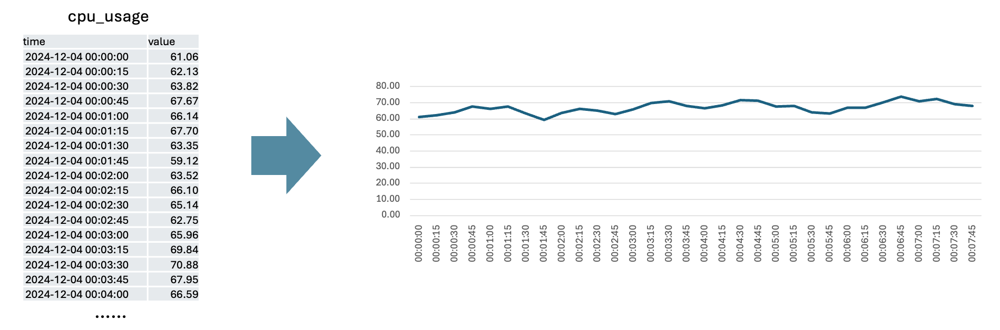
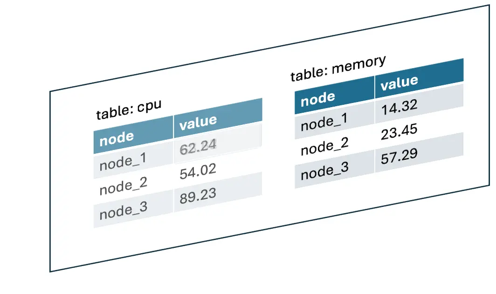
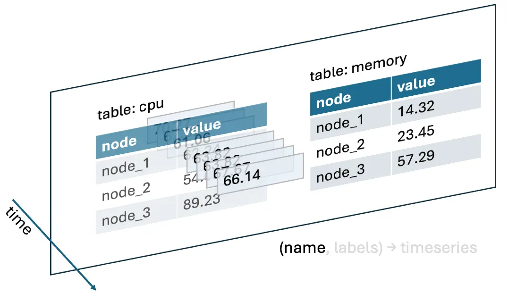
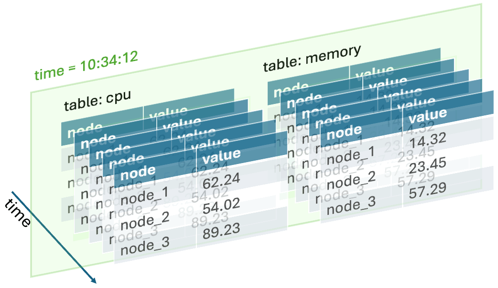
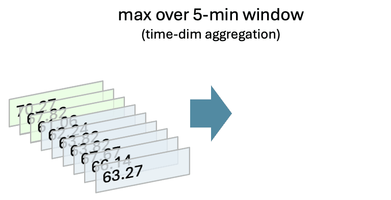
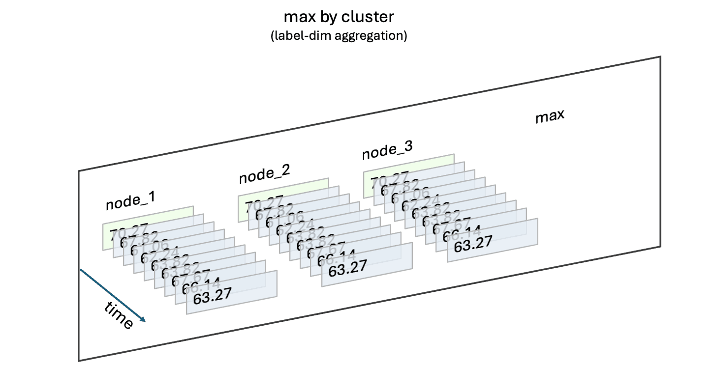

## Summary
[[EricFu]] defines a time series as timestamp-value pairs identified by a metric or table name plus a label set, then uses two equivalent views—whole-series vectors and repeated time snapshots—to explain querying and storage. The article distinguishes time-axis aggregation from label-axis aggregation, treats alignment as the central complication in joins, and compares six databases according to whether they specialize around time-series vectors or retain a more general relational model. Its definition is a useful modeling lens rather than an industry consensus, so its exclusion of [[TimescaleDB]] and [[QuestDB]] from the category should be read as a taxonomy choice, not a settled product classification.

## Key Claims
- A [[TimeSeriesDatabase]] data point is uniquely located by timestamp, metric or table name, and a label set; values for a fixed name-label combination form a time-series vector.
- The same model can be queried from a vector perspective, selecting series before transforming their points, or a snapshot perspective, repeating the same relational-style operation at each timestamp.

- Time-dimension aggregation maps one series to another and may change vector length or require gap filling, while label-dimension aggregation combines several series at aligned timestamps without changing the timestamp vector.

- Time-series joins must align both labels and timestamps; interval rounding and `AS OF JOIN` are two ways to associate observations that were not collected simultaneously.
- Specialized engines can exploit contiguous columnar timestamp and value vectors for compression, vectorized execution, and distinct time- versus label-aggregation operators.
- [[Prometheus]], [[InfluxDB]], [[GreptimeDB]], and [[TDengine]] broadly fit the author's model, whereas [[TimescaleDB]] and [[QuestDB]] are characterized as relational or append-mostly systems optimized for temporal workloads rather than vector-native time-series databases.

## Key Quotes
> “时序数据是一个由「时间戳 - 值」对组成的序列” — the article's starting definition.

> “时间和标签维度聚合是完全不同的算子实现” — the implementation consequence of the two aggregation axes.

## Connections
- [[EricFu]] — author proposing the data-model-centered taxonomy.
- [[TimeSeriesDatabase]] — central concept defined through timestamp-value vectors, metric names, and labels.
- [[Prometheus]] — snapshot-oriented system whose PromQL evaluates expressions at a query time.
- [[InfluxDB]] — vector-oriented system whose measurements and tags identify series.
- [[GreptimeDB]] — LSM and Parquet implementation discussed as a time-series-vector-oriented design.
- [[TDengine]] — tag-partitioned supertable design compared with InfluxDB's series partitioning.
- [[TimescaleDB]] — PostgreSQL extension classified by the author as relational rather than vector-native.
- [[QuestDB]] — append-mostly columnar database classified by workload optimization rather than the article's time-series model.
- [[DatabaseConsolidation]] — architectural counterweight to adopting a specialized database solely because data has timestamps.

## Contradictions
- The source creates a narrower category boundary than common market usage by excluding TimescaleDB and QuestDB. This does not contradict their ability to store and query temporal data; it distinguishes vector-native data modeling from workload-oriented product labeling.
- The claim about GreptimeDB's sort order balancing scans, updates, and point lookups is explicitly presented as the author's inference, not a benchmark result.
- The recommendation to prefer a specialized engine when data perfectly matches the model qualifies [[DatabaseConsolidation]] rather than overturning it: specialization still has to justify additional operational complexity.
