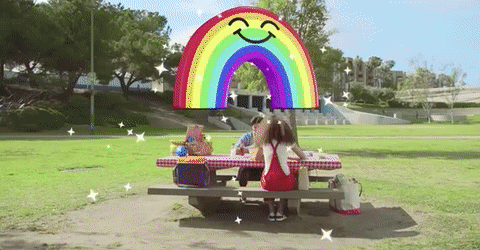

## Summary
This 2017 Product Hunt essay argues that [[EvanSpiegel]] and [[Snapchat]] repeatedly converted acquisitions into core product capabilities rather than relying only on internal invention. It uses Zenly for Snap Map, Vergence Labs for Spectacles, Looksery for augmented-reality lenses, Bitstrips for Bitmoji, Vurb for mobile search, Seene for computer vision, and an unnamed purchase behind Snapcodes, but it reports transactions and product associations without establishing how much integration, internal development, or post-deal performance each case involved.

## Key Claims
- The article presents acquisition selection and integration as an underappreciated part of [[EvanSpiegel]]'s product leadership.
- Snap reportedly bought Zenly for roughly US$250-350 million in May 2017, shortly before releasing Snap Map around a constant-location-sharing and social-map model.
- Vergence Labs is described as a foundation for Spectacles even though Zenly's location network fit Snap's “camera company” identity less directly.
- Looksery, reportedly acquired for about US$150 million in 2015, supplied technology associated with Snapchat's popular augmented-reality face lenses.
- Bitstrips, reportedly acquired for about US$100 million in 2016, brought Bitmoji into personal communication across Snapchat and the wider mobile ecosystem.
- Vurb, reportedly acquired for about US$110 million in 2016, addressed Snapchat's mobile-search gap, while Seene, reportedly acquired for about US$47 million, added computer-vision and 3D-selfie research capability.
- The article treats the acquisitions as a portfolio of product inputs, but supplies no comparative evidence that buying was faster, cheaper, or more successful than internal development.

The small screenshot visually supports the face-lens use case attributed to Looksery, though it does not establish the technical contribution or acquisition economics.

The app screenshot illustrates Bitmoji as personal visual communication, matching the article's post-acquisition product claim.

The animation shows a camera effect anchored into the surrounding scene, providing a product example for the article's expectation that acquired computer-vision capability would surface in Snapchat and Spectacles.

## Key Quotes
> "popularize constant location sharing" - Zenly cofounder Antoine Martin's description of the company's five-year mission.

> "connecting apps to bring people, places, and things together" - Vurb founder Bobby Lo's description of its mobile-experience mission.

## Connections
- [[EvanSpiegel]] - leader whose acquisition judgment is the article's central subject.
- [[Snapchat]] - product into which the article says acquired mapping, lens, avatar, search, computer-vision, and code capabilities were incorporated.
- [[AcquisitionStrategy]] - case for acquiring specific product capabilities and then turning them into visible user-facing features.

## Contradictions
- The source complements [[AcquisitionStrategy]]'s successful-endpoint cases but does not resolve their selection bias: it inventories visible associations without failed deals, integration costs, retention, counterfactual internal builds, or measured product outcomes.
- Product resemblance and acquisition timing do not by themselves prove that an acquired company wholly “powers” a later feature; the article provides no technical architecture, employee testimony, deal documents, or attribution from Snap.
- All six unique local images were opened. Two duplicate portrait/branding images and a repeated promotional phone GIF were omitted as decorative or non-specific; the three product examples above were retained once each under descriptive canonical filenames.
