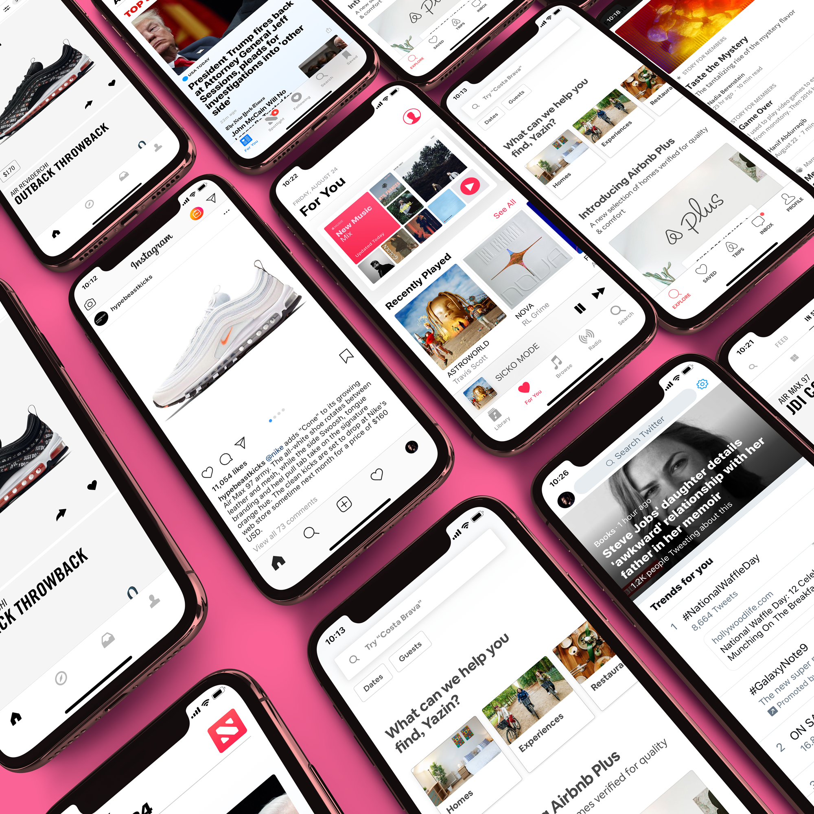

## Summary
[[YazinAkkawi]] argues that visual convergence among major mobile apps can reduce relearning and let designers spend more effort on content, task completion, and nonvisual experience. The article connects familiar interface conventions to [[Usability]] and [[UtilityOrientedUX]], while acknowledging that standardization can reduce visual creativity and that style still affects tolerance and experience. Its longer-term claim is that voice, artificial intelligence, augmented reality, and other less screen-bound interactions move design opportunity beyond visual differentiation.

The collage supports the article's descriptive observation: several 2018-era apps use white space, black text, restrained color, familiar bottom navigation, and content-led layouts. It shows resemblance, not the article's claimed effects on learning, retention, or task success.

## Key Claims
- Instagram, Airbnb, Apple Music, Twitter, Dropbox, Lyft, and the redesigned Gmail exemplified a 2018 shift toward sparse, white, low-color interfaces with bold sans-serif type.
- Familiar conventions can reduce the need to relearn common actions, as the article illustrates with the expected location of an ecommerce shopping cart.
- Standardized interface decisions can redirect design effort from ornamental differentiation toward useful content, task completion, testing, and iteration.
- A brand can differentiate through how well its product works and the experience it creates, not only through colors, typography, or animation.
- Visual style still matters because attractiveness can influence tolerance, emotion, trust, and the felt experience of use.
- Interface convergence may reduce near-term visual novelty while leaving substantial design work in voice, chat, augmented reality, attention, emotion, and other nonvisual interactions.
- The article uses Snapchat's 2018 redesign as a cautionary example, but its simultaneous sentiment, user, and share-price changes do not isolate unconventional navigation as the cause.

## Key Quotes
> "I don't want to focus my energies on an interface. I want to focus on the job." - [[DonNorman]], quoted on outcome-centered interaction.

> "Branding isn't just how it looks, but how it works." - the article's distinction between visual identity and product experience.

## Connections
- [[YazinAkkawi]] - author arguing that app-interface convergence can free attention for outcomes and broader experience design.
- [[InterfaceDesignConvergence]] - captures the tradeoff between learned conventions, lower relearning cost, visual differentiation, and innovation.
- [[Usability]] - familiar interaction patterns may improve learnability and reduce confusion, but require direct task evidence.
- [[UtilityOrientedUX]] - prioritizes completing the user's job over maximizing attention to the interface itself.
- [[DonNorman]] - quoted to frame the interface as subordinate to the user's intended job.
- [[MaterialDesign]] - Google's 2018 redesign is presented as joining the sparse, color-reduced trend.
- [[Snapchat]] - redesign case used to argue that unconventional navigation can create adoption risk.

## Contradictions
- The article concedes that visual sameness can reduce creativity and innovation, qualifying its own claim that convergence is beneficial.
- Its app-deletion statistic, decision-fatigue analogy, and claims about visual appeal are secondary assertions without enough method in the captured article to establish causal effects.
- The reported 73% Snapchat sentiment drop coincided with user-count and share-price changes, but the article does not separate interface causality from product, market, measurement, or company factors.
- The fourth effective local image is a 60-by-36-pixel thumbnail linked to a mobile-design comparison article. It is materially relevant in topic but too small to interpret reliably, so no visual details from it were treated as evidence.
