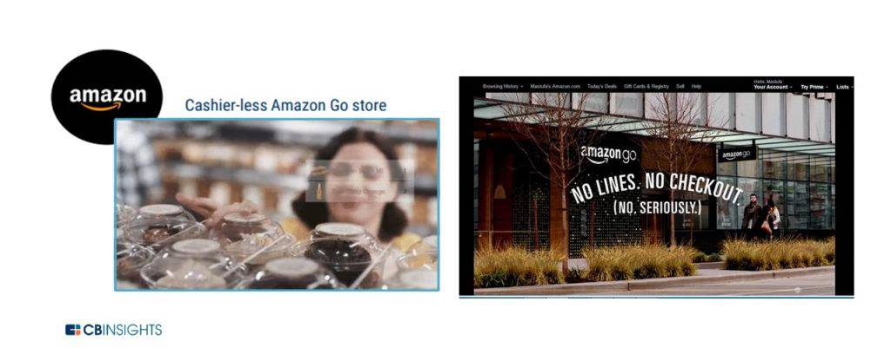
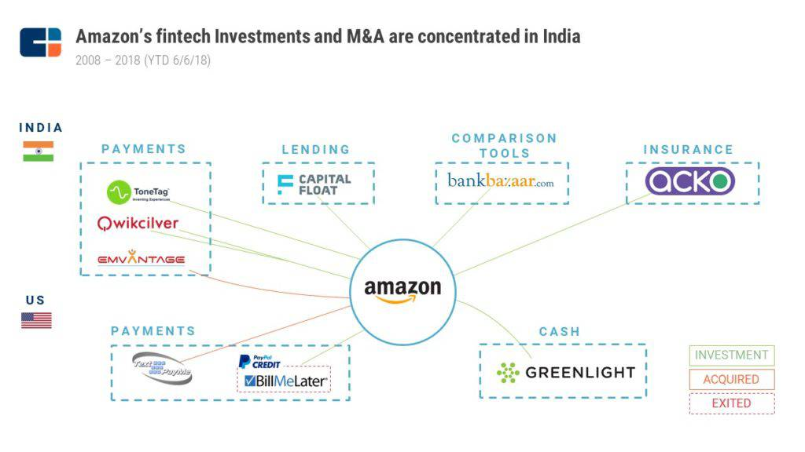

## Summary
[[CBInsights]] presents [[Amazon]]'s mid-2018 financial-services activity as ecosystem infrastructure rather than evidence that the company was becoming a conventional deposit-taking bank. Payments, cash loading, merchant and consumer lending, cards, and early insurance activity were designed mainly to reduce transaction friction, bring more buyers and sellers onto Amazon, and increase their activity, while partner banks and local fintech investments supplied regulated or market-specific capabilities. The article's strongest durable contribution is [[PlatformEmbeddedFinancialServices]]: financial products can serve a platform's commerce strategy even when finance is not the operator's standalone end market.

## Key Claims
- Amazon's financial-services strategy centered on increasing buyer and seller participation, spending, and transaction ease inside its broader ecosystem rather than serving everyone as a traditional bank.
- Amazon Pay extended Amazon's checkout and wallet capabilities to online and physical merchants, but the failed Amazon Local Register showed that lower fees could not overcome merchant concern about sharing operating data with a powerful retail competitor.
- Amazon Cash, Coinstar loading, Allowance, and Mexico's Amazon Recargable connected cash-dependent or underbanked customers to online commerce through retail partners and bank-issued products.
- Amazon Lending and Prime-linked cards used merchant working capital, rewards, and partner-bank risk capacity to support marketplace sales and membership loyalty.
- The retained Amazon Go image reinforces checkout removal as the payment experience: app identity, computer vision, sensors, and machine learning let shoppers leave without a conventional till.
- The retained investment map shows Amazon's 2008-June 2018 fintech investments and acquisitions concentrated in India across payments, lending, comparison tools, and insurance, with a smaller U.S. set in payments and youth-oriented cash products.
- The checking-account, mortgage, home-insurance, health-insurance, cryptocurrency, regulatory-charter, and bank-acquisition sections were rumors or prospective scenarios, not launched products established by the source.

## Key Quotes
> "Amazon is the most formidable." - Andreessen Horowitz partner Alex Rampell on large technology companies entering financial services.

> "Amazon isn't building a traditional bank that serves everyone." - the report's distinction between ecosystem finance and universal banking.

## Connections
- [[CBInsights]] - research publisher framing Amazon's financial products and investments as one strategic portfolio.
- [[Amazon]] - company using payments, cash access, credit, rewards, and insurance partnerships to deepen commerce participation.
- [[AmazonPrime]] - membership system reinforced by exclusive card rewards and everyday-spending ambitions.
- [[AmazonGo]] - cashierless-store example where identity, sensing, and payment are combined into one low-friction retail flow.
- [[AmazonCapabilityLedExpansion]] - internal payment and commerce capabilities become adjacent products and cross-business infrastructure.
- [[PlatformEmbeddedFinancialServices]] - general pattern of financial tools serving a platform's primary marketplace or ecosystem goals.
- [[PayPal]] - payment competitor and acquirer of Bill Me Later, used as a contrast to Amazon's experiments.
- [[WholeFoods]] - physical-retail channel tied to card rewards and potential cash-loading distribution.

## Contradictions
- No direct contradiction found. The source strengthens the wiki's capability-led Amazon synthesis but narrows any simple “Bank of Amazon” interpretation: most described products depended on partner banks, retailers, insurers, or fintech companies, and several proposed expansions were explicitly rumors.
- The report is a mid-2018 market snapshot. Its customer counts, loan volumes, investment totals, product availability, planned store openings, regulatory discussion, and forward-looking scenarios are historical claims and require later sources before being treated as current.
