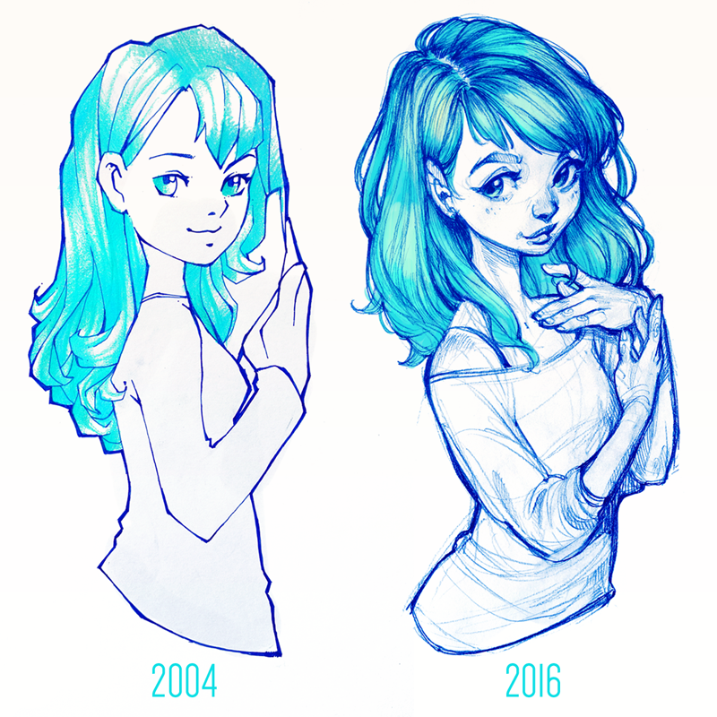
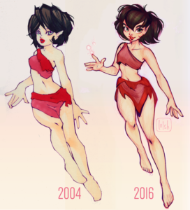

## Summary
This Talk Illustration article uses [[Loish]]'s paired 2004 and 2016 drawings to connect visible long-term improvement with a practical response to [[ArtBlock]]. It argues that creators often overlook progress because they inspect current flaws against professional standards, while revisiting old work can restore perspective. The author and Loish recommend lowering the stakes of the next piece, making for enjoyment, and treating imperfect output as part of [[ProlificPractice]] rather than evidence of failure.

## Key Claims
- Comparing current work with one's own older work can make accumulated artistic progress visible and counter flaw-focused self-assessment.
- Unrealistically high expectations can turn ambition into anxiety, stress, fear of failure, and [[ArtBlock]].
- Comparing unfinished or developing work with established professionals can hide meaningful personal improvement.
- Accepting that the next piece may be poor lowers performance pressure and can make playful experimentation possible again.
- Repeatedly showing up and making work supports artistic development, although the article does not isolate practice from time, feedback, instruction, or selection effects.

## Key Quotes
> "It really helps put your skills into perspective!" - Loish on revisiting older drawings during art block.

> "Accepting the idea that your next work might be rubbish is what actually saves the day." - the author on reducing creative pressure.

## Connections
- [[Loish]] - artist whose retrospective drawings and advice anchor the article.
- [[ArtBlock]] - the central creative difficulty, linked here to expectations, comparison, and fear of failure.
- [[CreatorAnxiety]] - high standards and flaw-focused self-evaluation can turn improvement goals into debilitating pressure.
- [[ProlificPractice]] - repeated making and permission to produce imperfect work create opportunities for visible development.
- [[CreativePresence]] - drawing for fun and without commitment restores a less constrained creative state.

## Contradictions
- No direct contradiction with existing wiki content. The source strengthens existing anti-perfectionism and learning-through-making claims, but its evidence is a selected artist retrospective and personal testimony rather than a causal study of practice or treatment for creative block.
