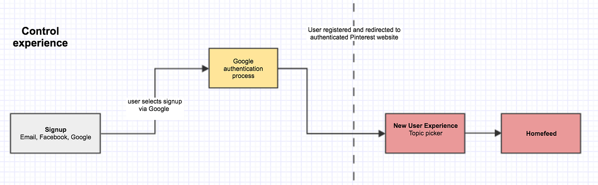

## Summary
[[SophiaFeng]] reports a sequence of more than twenty [[Pinterest]] Growth Activation experiments on collecting profile signals during signup and onboarding. Asking Google-authenticated users for gender before registration improved activation among those who continued but sharply reduced signup completion; moving a redesigned explanation into post-signup onboarding increased both activation and onboarding completion. The article's broader [[ContextualSignalCollection]] lesson is that the timing, context, and communicated value of an information request can matter as much as the signal itself.

## Key Claims
- Missing user signals can weaken cold-start personalization; Pinterest prioritized gender because many Google-authenticated signups lacked that field and the recommendation system used it to select Pins.
- Inserting a gender question after Google authentication but before registration reportedly raised new-user activation by about 7% among the treatment population while reducing Google signups by 30%.
- Moving the request to post-signup onboarding, with an explanation that it would improve content relevance, reportedly increased activation and engagement and raised onboarding completion by 11% despite adding a step.
- Repeating the explanatory step for Facebook signups increased onboarding completion by 8% even though that cohort already had complete gender coverage, suggesting that product education contributed independently of new data collection.
- Signal requests should be timed where users understand the product context and tied to a clear user benefit rather than optimized only for the shortest possible flow.
- Pinterest generalized the pattern across Facebook, Google, and email signup on iOS, Android, and web, then began exploring country, locale, and age as additional personalization signals.

## Key Quotes
> "Shortening the onboarding flow to provide a quick experience isn't necessarily better." - one of the team's experiment-level conclusions.

> "Out-of-context collection is disruptive to the user's experience." - explanation for moving the signal request out of the authentication-to-registration boundary.

## Connections
- [[Pinterest]] - company whose Growth Activation team ran the onboarding and signal-coverage experiments.
- [[SophiaFeng]] - Pinterest software engineer and author of the experiment retrospective.
- [[ContextualSignalCollection]] - captures the timing, value explanation, and coverage tradeoffs demonstrated by the experiments.
- [[ProductFlowFriction]] - the added step hurt conversion in one context but improved completion in another, qualifying simple step-count rules.
- [[ProductEngagementLadder]] - product education and personalization setup can belong in onboarding when they help users understand later value.
- [[BehavioralData]] - follows, hides, topic choices, and profile attributes are inputs to recommendation, though the source centers declared profile signals.

## Contradictions
- The results contradict a simple claim that shorter onboarding always performs better: an added post-signup step reportedly increased completion, while a similar pre-registration step caused substantial abandonment.
- The article is a first-party retrospective without sample sizes, absolute rates, confidence intervals, experiment durations, segmentation details, or long-term retention results. Its gender framing is binary and dated, and it does not address consent quality, privacy, sensitive-attribute governance, misclassification, or users who prefer not to disclose.
