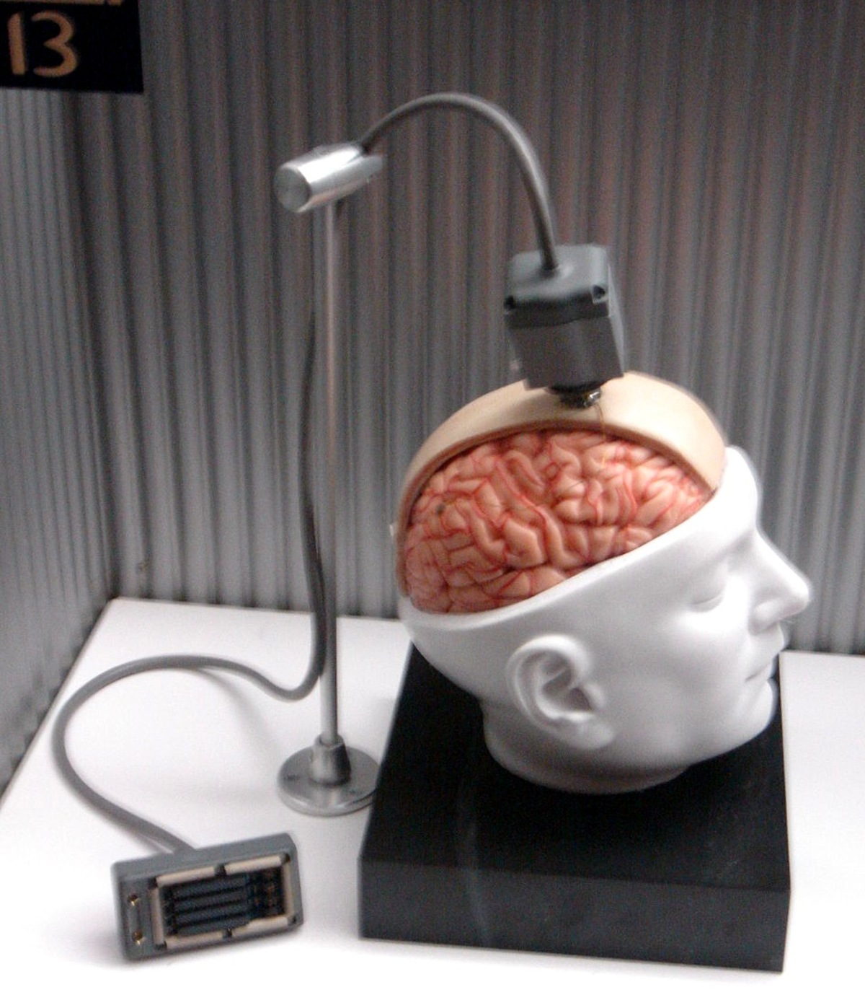

## Summary
[[ChristianTietze]] argues that [[ZettelkastenMethod]] needs both durable note storage and deliberate interconnection: storage supplies external memory, while links let material from different texts return in unexpected combinations. The article presents timestamp IDs, personally meaningful links, broad topic coverage, and long-term accumulation as a non-AI [[SecondBrain]] that can deepen understanding and support [[LearningByWriting]], while offering analogy and practitioner experience rather than measured evidence.

## Key Claims
- Durable written notes preserve thoughts that working memory may not reproduce later and keep reference material available in the author's own compressed language.
- Storage alone behaves like a reference archive: it can return what was deposited but does not by itself create new understanding.
- Manually linking notes creates a web adapted to the user's own models and can reveal similarities, oppositions, and combinations across decomposed texts.
- Unexpected retrieval matters more for creative thought than obvious associations because surprise can interrupt habitual lines of reasoning.
- Stable timestamp identifiers give each note an address that can be used to create direct connections.
- A useful Zettelkasten can span unrelated subjects because cross-topic searches and long accumulation increase opportunities for rediscovery.
- Reading notes can support later writing and citation only when captured ideas are filed, connected, and kept accessible over time.

## Key Quotes
> "Both permanent storage and interconnectedness are necessary" - on the two properties the author treats as foundational.

> "Surprise is the key ingredient here" - on unexpected retrieval as a proposed source of new thought.

## Connections
- [[ChristianTietze]] - author of the 2013 practitioner essay.
- [[ZettelkastenMethod]] - the central method, defined here through durable storage and a manually constructed web of notes.
- [[SecondBrain]] - the archive externalizes memory and returns linked material for later thinking.
- [[LearningByWriting]] - capturing interpretations and comparing decomposed texts turns reading material into reusable thought.
- [[PersonalKnowledgeManagement]] - stable IDs, offline reference notes, broad topic coverage, and search support long-lived personal knowledge custody.
- [[ReadingNoteWorkflow]] - reading notes supply an accessible example of how relations within and across texts can be preserved.

## Contradictions
- No direct contradiction with existing wiki content. The source reinforces the distinction between mere accumulation and a connected thinking system, while its endorsement of heavy linking remains compatible with [[OrphanNotes]] only if links are semantically justified rather than added for appearance.
- Claims that connected notes improve understanding, creativity, memory, and writing are grounded in analogy and the author's experience, not comparative or causal evidence. Stable storage can also fail through tool loss, format decay, weak retrieval practice, or poor note quality.
- The retained BrainGate photograph is an illustrative exhibit supporting the article's tool-extension metaphor; it is not evidence that a Zettelkasten resembles a brain-computer interface functionally or produces measured cognitive gains.
