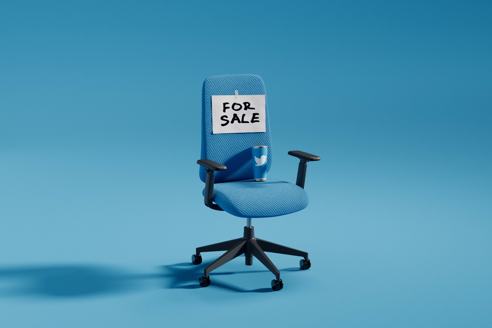
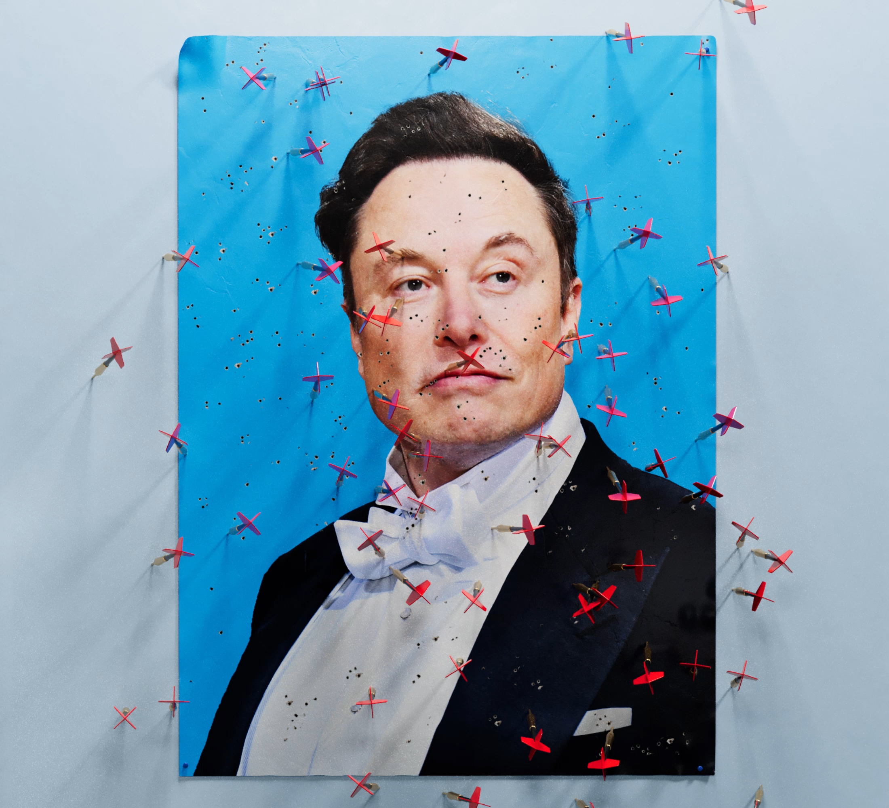

## Summary
Zoe Schiffer, Casey Newton, and Alex Heath reconstruct the first three months of [[ElonMusk]]'s ownership of [[Twitter]] through accounts from more than two dozen current and former employees. They describe a rapid, highly centralized restructuring that cut more than half the workforce, used improvised evaluation and compressed deadlines, reversed remote-work commitments, and launched paid verification despite trust-and-safety warnings. The platform continued operating with far fewer people, but the article argues that this narrow survival test obscured damage to culture, safety capacity, advertiser confidence, institutional knowledge, and employee trust.

## Key Claims
- Musk's acquisition followed dissatisfaction with Twitter's slow product cadence and perceived moderation bias, but his early decisions concentrated authority while limiting internal dissent and two-way communication.
- The transition team requested printed code, imposed an undefined stack-ranking exercise, restricted large meetings, and relied on inconsistent judgments about who was "technical" or essential.

- Twitter dismissed roughly half of its 7,500 employees in the first major round, then sought to rehire some people after critical teams were left understaffed.
- A rushed $8 paid-verification launch proceeded despite a P0 impersonation warning, produced fake verified accounts, was withdrawn, and contributed to advertiser distrust.
- The ownership change weakened [[PsychologicalSafety]]: criticism, questions, or refusal to accept abruptly changed working conditions could lead to dismissal, while communication often arrived through public tweets, rumors, or unsigned messages.

- Musk revoked Twitter's indefinite [[RemoteWork]] policy with little notice and later asked remaining employees to accept "long hours at high intensity" through an "extremely hardcore" pledge; hundreds declined.

- Trust-and-safety policy became less predictable: reported hate speech rose after the takeover, promised expert governance gave way to a public poll on Donald Trump's reinstatement, and journalists and flight-tracking accounts were suspended under rules applied to protect Musk personally.
- Twitter mostly remained online after severe staffing and data-center cuts, but outages, skeletal teams, unpaid bills, legal disputes, and active job searches among survivors qualified claims that reduced headcount proved the restructuring sound.

## Key Quotes
> "You build trust by being transparent, predictable, and thoughtful." - a former employee on why the paid-verification launch failed.

> "news articles aren't comms. Tweets ... aren't comms." - a departing employee on the transition's information vacuum.

> "only exceptional performance will constitute a passing grade." - Musk's standard in the "extremely hardcore" ultimatum.

## Connections
- [[ElonMusk]] - owner and decision-maker whose first three months at Twitter form the article's central case.
- [[Twitter]] - company and platform undergoing layoffs, product changes, moderation disputes, and infrastructure cuts.
- [[JackDorsey]] - former chief executive whose delegated, slow-moving leadership is presented as part of the pre-acquisition context.
- [[RapidOrganizationalRestructuring]] - the case combines speed, concentrated authority, staffing cuts, improvised assessment, and weakened feedback loops.
- [[RemoteWork]] - Twitter's indefinite remote-work policy was abruptly revoked and treated as a resignation boundary.
- [[PlatformAbuseResponse]] - trust-and-safety warnings, hate-speech changes, account suspensions, and policy inconsistency show the governance consequences of the takeover.
- [[PsychologicalSafety]] - fear of dismissal narrowed employee dissent, questions, and upward communication.
- [[SystemReliability]] - the service largely survived deep cuts but became less stable and more dependent on skeletal teams.
- [[ProductShippingCredibility]] - the paid-verification launch shows that visible speed can reduce credibility when warnings and reversibility are neglected.

## Contradictions
- The article complicates simple claims that high headcount was necessary for Twitter to function: the service mostly stayed online after deep cuts, although sporadic outages and operational strain increased and longer-term capability was not measured.
- It also complicates claims that speed alone demonstrates execution quality. Rapid decisions shipped changes, but paid verification was withdrawn after predictable impersonation failures and some dismissed employees were immediately sought for rehire.
- The report is a contemporaneous January 2023 reconstruction based heavily on current and former employee accounts, some anonymous. It documents early transition effects rather than Twitter/X's later trajectory, and its strongest causal judgments remain journalistic interpretations rather than controlled comparisons.
