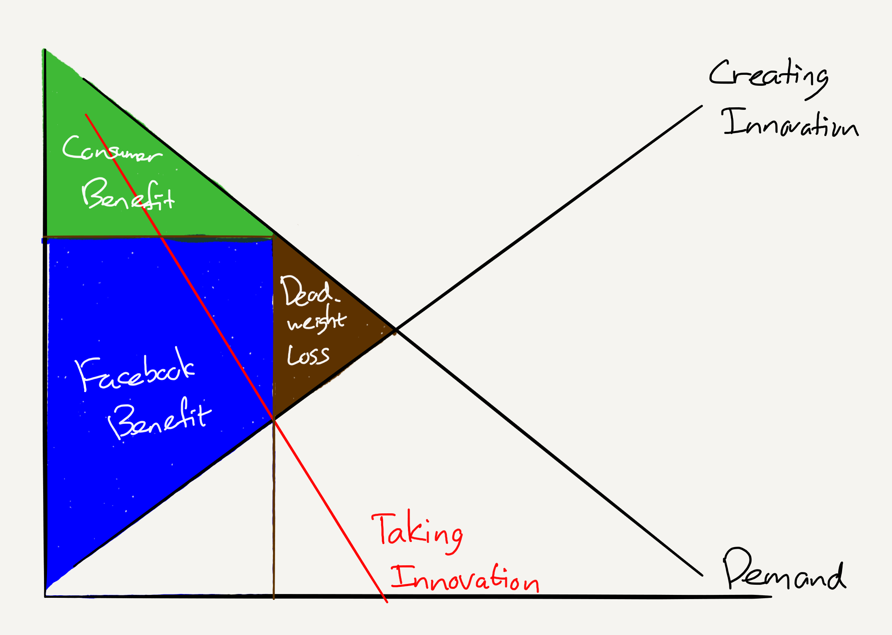

## Summary
[[BenThompson]] argues that [[Facebook]]'s demand aggregation and social graph let it extend power from users into publisher distribution, advertising, and product competition. Because users pay no monetary price and Facebook's marginal cost for another user is near zero, a conventional consumer-price test can miss the costs: publishers may receive less revenue, advertisers may face deliberately constrained inventory, and entrants such as [[Snapchat]] may have their innovations copied into a much larger incumbent network. The article treats this as [[AggregatorMonopolyPower]], while leaving the advertising-price effect conditional and offering a strategic argument rather than a legal or empirical antitrust finding.

## Key Claims
- [[AggregationTheory]] tends toward concentrated markets because demand-side network effects make the largest aggregator more useful to users and suppliers.
- A zero-price, near-zero-marginal-cost social network can create little conventional user-market deadweight loss while still exercising power elsewhere in a multi-sided market.
- Facebook's control of attention weakened publishers' bargaining position: Instant Articles improved reader experience, but Facebook had limited incentive to share enough advertising revenue when publishers still needed its distribution.
- Facebook's planned 2017 cap on News Feed ad load could reveal differentiated advertising power if constrained inventory raised prices, although flat prices would instead suggest advertisers had substitutes.
- Copying Snapchat Stories across Instagram, Facebook, WhatsApp, and Messenger reduced the contest to network strength rather than feature novelty.
- Monopoly profits can finance ambitious research, but established incumbents may also substitute copying and demonstrations for product innovation when they need not earn returns from the innovation itself.
- New firms seeking temporary monopoly rewards and established monopolists defending power are different cases; examples of old monopolies eventually being displaced do not show that their intervening rents and innovation costs were harmless.

## Key Quotes
> "Monopolists seek to maximize profit, not revenue." — on why slower growth can coexist with market power

> "Facebook is the only winner." — the article's judgment on copying Snap's vision

## Connections
- [[BenThompson]] - author applying monopoly-surplus analysis to Facebook's multi-sided market.
- [[Facebook]] - incumbent whose social graph, attention, publisher distribution, and advertising position anchor the argument.
- [[Snapchat]] - challenger whose Stories format and camera-first vision Facebook copied across its networks.
- [[AggregationTheory]] - explains why demand control and reinforcing network effects can produce concentrated equilibrium.
- [[AggregatorMonopolyPower]] - concept for costs that appear across suppliers, advertisers, and innovation rather than only in a user-facing price.
- [[PlatformPublisherRevenue]] - publisher surplus can shrink when a dominant traffic source has little need to share its advertising revenue.
- [[PlatformDistributionDependence]] - publishers continue posting links even when native monetization disappoints because audience attention remains concentrated.
- [[FacebookAdvertisingCosts]] - complements the later historical benchmark page with a market-structure hypothesis about ad scarcity and pricing.
- [[PeterThiel]] - supplies the creative-monopoly counterargument that Thompson disputes.
- [[Microsoft]] - historical analogy for using platform position and imitation against a product innovator.

## Contradictions
- The article challenges [[CorporateGiantFragility]] only in time horizon, not logic: incumbents may eventually fall while still extracting rents or suppressing innovation for years.
- The ad-market claim is explicitly unresolved. A capped ad load would indicate differentiated market power only if prices rose rather than spending moving to substitutes.
- The innovation diagram and Microsoft, IBM, and AT&T examples illustrate a mechanism; they do not measure Facebook's counterfactual effect on total innovation or prove that copied features harmed users overall.
- The source is a 2017 strategy essay, not a market-definition exercise, causal study, or legal finding. Its traffic shares, product behavior, and ad-load expectations are historical.

## Image Notes
The sole effective local image reference was opened and retained at the innovation argument. It diagrams an incumbent taking innovation, a large Facebook-benefit region, reduced consumer benefit, and deadweight loss. The Markdown prose refers to several earlier surplus, publisher, and advertising graphs, but the export contains no effective image references or files for them, so those visuals could not be independently inspected or retained.
