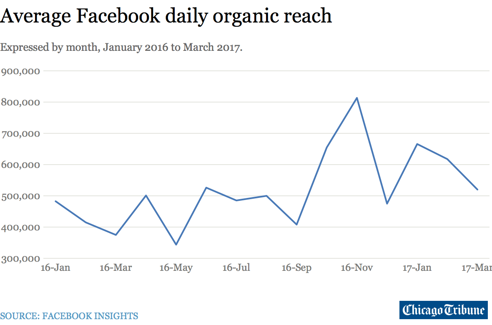
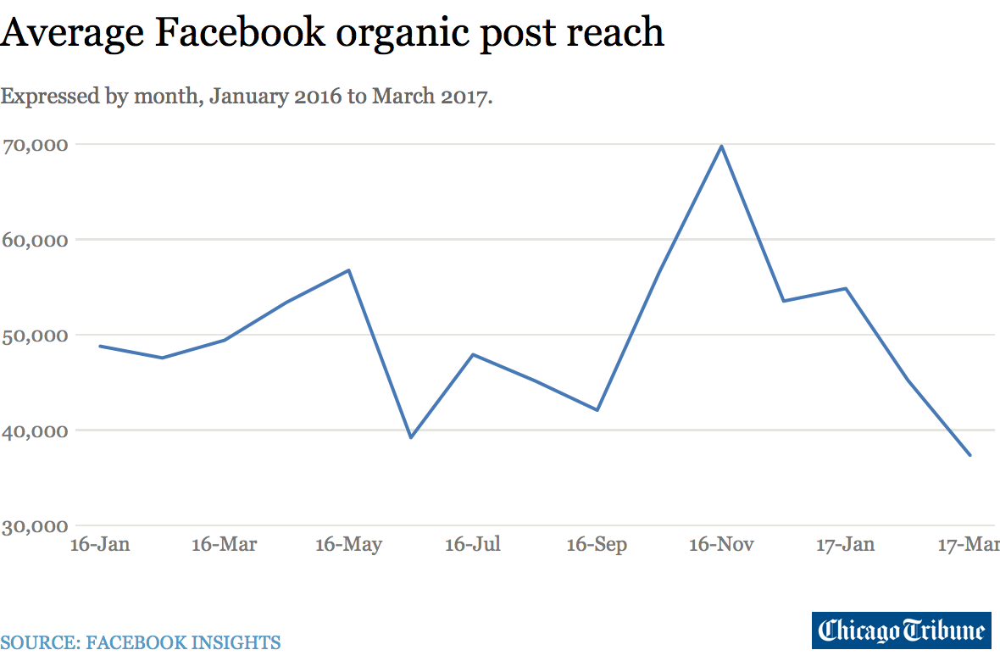

## Summary
[[KurtGessler]] reports that the [[ChicagoTribune]]'s Facebook page developed a sharply worse lower tail of organic post reach from January through March 2017 even though its audience grew and its posting strategy changed little. Daily average reach remained volatile and average per-post reach declined, but the median and reach buckets were more diagnostic: posts reaching at most 10,000 people increased from 8 in December 2016 to 242 in March 2017. Gessler considers posting frequency, link-heavy content, and non-adoption of Instant Articles, but cannot isolate a cause and treats a change in [[Facebook]]'s ranking system as a hypothesis rather than a finding.

## Key Claims
- The Tribune's average daily organic reach fluctuated between roughly 350,000 and 810,000 during the 15-month window and did not reveal the severity of the growing number of poorly distributed posts.
- Average organic reach per post fell from about 55,000 in January 2017 to about 38,000 in March, while median reach fell to a record low and exposed a broader deterioration hidden by outliers.
- Posts reaching 10,000 people or fewer rose from 8 in December 2016 to 80 in January 2017, 159 in February, and 242 in March—about one-third of posts—while posts reaching 25,001–50,000 fell from 248 in January 2016 to 141 in March 2017.
- The decline occurred while the page added more than 130,000 fans, weakening the assumption that follower growth reliably produces organic distribution.
- Posting increased from roughly 20 to 24 times daily, but the Tribune remained below many peer newspapers and within Facebook's reported guidance, so frequency is a possible contributor rather than an established cause.
- The Tribune posted links 97.2% of the time, near the high end of comparable newspapers, but its content mix had not materially changed during the measurement window.
- Facebook's January 31, 2017 “authentic and timely” ranking update was temporally nearby, but it followed the observed shift and the source offers no platform data or experiment proving that it caused the decline.

## Key Quotes
> “The middle was falling precipitously.” — on why median reach was more revealing than the average

> “Maybe it’s a little of everything.” — on the unresolved cause

## Connections
- [[KurtGessler]] - Chicago Tribune digital editor who assembled and analyzed 15 months of Facebook Insights data.
- [[ChicagoTribune]] - publisher whose Facebook page supplies the historical case.
- [[Facebook]] - platform controlling the ranked distribution whose change is suspected but not established.
- [[PlatformDistributionDependence]] - the publisher could grow followers while losing reliable access to them through the feed.
- [[AlgorithmicFeastAndFamine]] - worsening reach was concentrated in far more severe misses, not simply a uniform decline in the average.
- [[VanityMetrics]] - fan growth and average daily reach concealed deterioration in the median and distribution buckets.
- [[MobilePlatformDiscovery]] - News Feed ranking determined whether the Tribune's posts became visible.

## Contradictions
- The source challenges any inference that a larger follower count guarantees greater organic reach: the Tribune added more than 130,000 fans while many posts reached fewer people.
- It also qualifies simple average-based performance monitoring. Daily average reach looked broadly familiar even while the lower tail worsened dramatically.
- The cause remains unresolved. The analysis is one publisher's observational time series without post-level controls, a platform-side counterfactual, or evidence that the pattern generalized to other publishers.

## Image Notes
All nine unique local image files were opened. The two full-resolution charts were retained once each at their semantic positions; one of them appeared twice in the source. Two 60×40 files are degraded thumbnails of retained charts, while five more 60×40 charts cover median reach, reach buckets, fan growth, daily posting, and monthly posting. Those seven thumbnails were omitted because their labels and values are not reliably legible and their material trends or figures are repeated in the prose. No unreadable visual detail was used as evidence.
