## Summary
[[HitenShah]] argues that [[Facebook]] copied [[Snapchat]] Stories across [[Instagram]], [[WhatsApp]], [[FacebookMessenger]], and its core app as a deliberate defense of younger users' attention, not as an isolated lapse in originality. The essay turns that case into [[ProductImitationStrategy]]: teams should study competitors and copy a valuable feature when doing so closes a strategically important customer gap, while continuing to execute and innovate. Shah contrasts Facebook's response with [[KISSmetrics]], whose early product-analytics lead eroded as it discounted moves by [[Mixpanel]] and [[Heap]].

## Key Claims
- Facebook's 2012-2017 camera and Stories efforts are presented as a sustained response to Snapchat's hold on younger users, after standalone experiments such as Poke and Slingshot failed.
- Copying can be rational when a competitor has discovered a feature customers value and an incumbent can distribute it through products with strong existing adoption.
- Facebook's internal long-horizon framing paired a 30-year destination with six-month reassessment, treating self-disruption and short-cycle execution as complements.
- The source reports that Instagram Stories reached 200 million daily users, above Snapchat's 160 million, and that WhatsApp Status reached 175 million daily users soon after launch.
- KISSmetrics initially solved funnel creation, implementation debugging, and identity-linked behavioral analysis with a fast one-month MVP, but later slowed its execution and ignored competitive evidence.
- Mixpanel's free plan, more demonstrative real-time view, and mobile focus, plus Heap's automatic event capture, are presented as missed opportunities for KISSmetrics to learn, respond, and preserve customer value.
- Product teams should combine customer research with competitor observation; imitation without contextual fit is insufficient, but refusing to imitate can leave a known customer need unanswered.

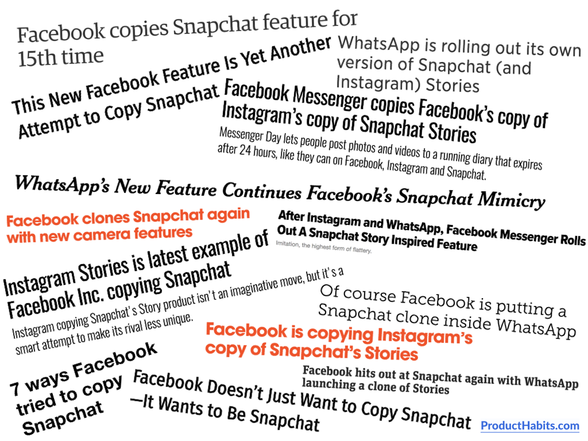

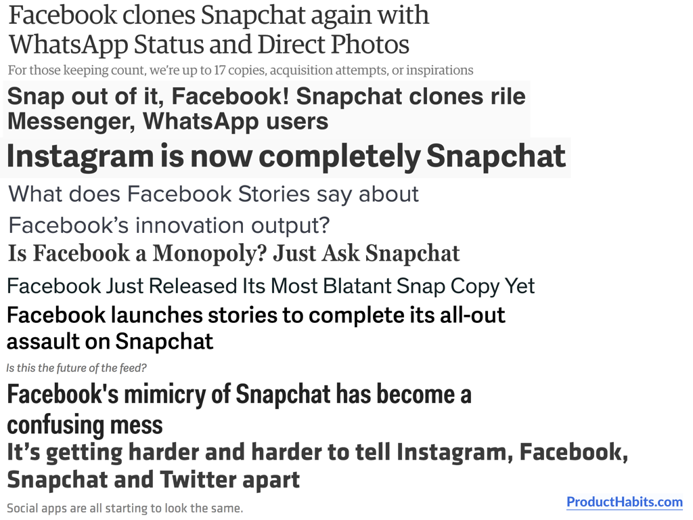

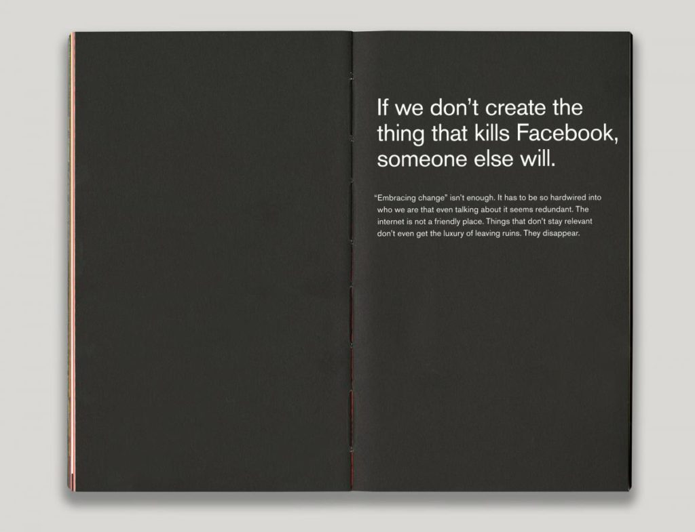

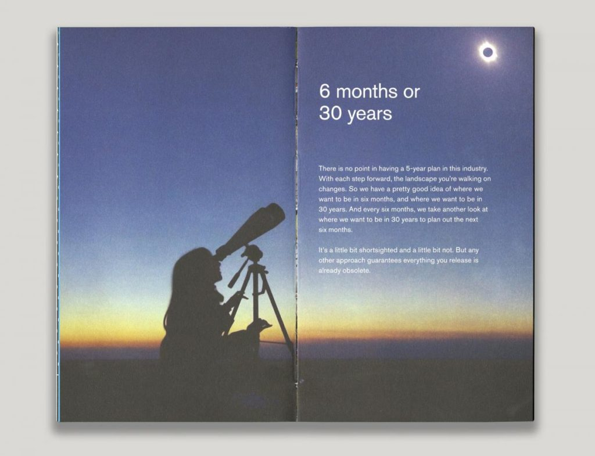

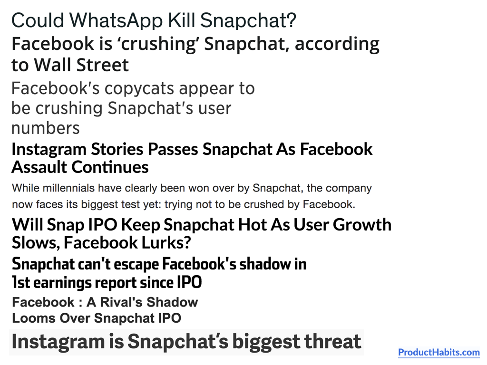

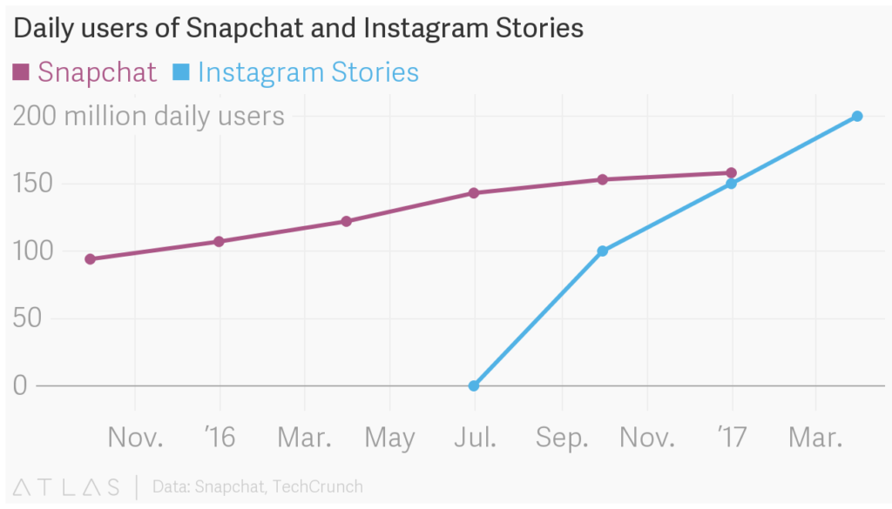

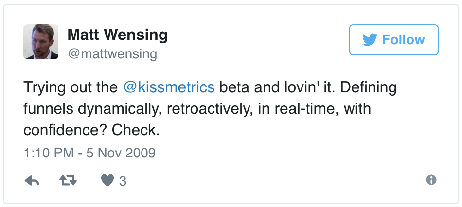

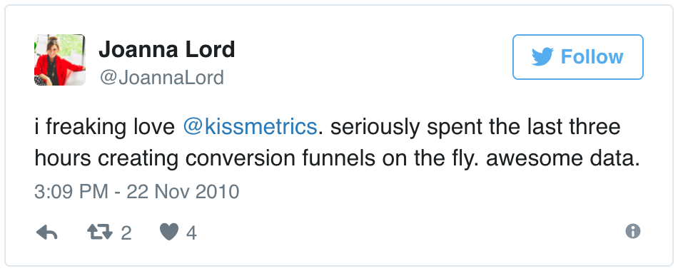

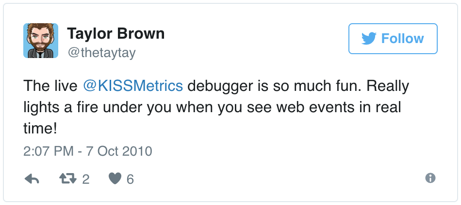

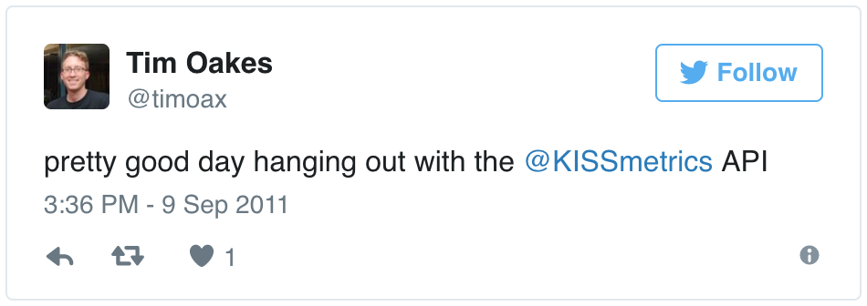

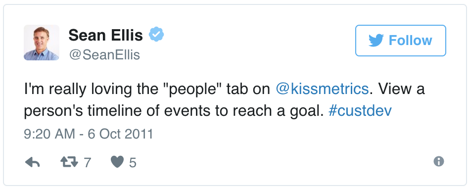

## Key Quotes
> "If we don’t create the thing that kills Facebook, someone else will." - Facebook's internal self-disruption maxim reproduced by the source.

> "You shouldn’t be afraid to copy if you need to." - the essay's product-strategy conclusion.

## Connections
- [[HitenShah]] - Product Habits author using Facebook and his KISSmetrics experience to argue for competition-aware execution.
- [[ProductHabits]] - publication context for the essay.
- [[Facebook]] - incumbent presented as copying Stories across its portfolio to defend generational relevance.
- [[Snapchat]] - challenger whose disappearing media, filters, augmented reality, and Stories format changed social sharing.
- [[Instagram]] - Facebook product through which the Stories response first achieved the source's reported adoption advantage.
- [[WhatsApp]] - Facebook product whose Status feature extended the Stories response to messaging.
- [[FacebookMessenger]] - Facebook product that launched the Stories-style Messenger Day feature.
- [[KISSmetrics]] - founder retrospective showing the cost of ignoring competitive product and pricing signals after early innovation.
- [[Mixpanel]] - competitor whose free plan, mobile focus, and sales-friendly real-time display are presented as missed signals.
- [[Heap]] - later competitor whose automatic event capture is presented as a feature KISSmetrics could have answered earlier.
- [[ProductImitationStrategy]] - central claim that copying can be a legitimate customer and competitive response.
- [[CompetitiveIntelligence]] - competitor observation should complement direct customer research and update the product team's market hypothesis.
- [[MinimumViableProduct]] - KISSmetrics is presented as a one-month, imperfect MVP that solved three researched pain points.
- [[AggregatorMonopolyPower]] - supplies the countervailing view that copying through a stronger network can weaken innovation competition.

## Contradictions
- The source praises Facebook's portfolio-wide copying as strategically effective, while [[design-conflicts-in-messenger-day-quora-design-medium]] argues that Messenger Day mismatched audience norms, graph structure, ranking, and interface. Strategic portfolio success therefore does not establish contextual fit in every host product.
- Its customer-first defense of imitation differs in perspective from [[facebook-and-the-cost-of-monopoly-stratechery-by-ben-thompson]], which treats network-leveraged copying as a possible cost of platform power. The source supplies company-strategy logic, not evidence that the competitive or consumer-welfare effects were benign.
- The reported adoption counts are historical company and secondary-source figures, and the chart compares all Snapchat daily users with Instagram Stories daily users rather than identical product scopes; it does not isolate copying as the cause of either trajectory.
